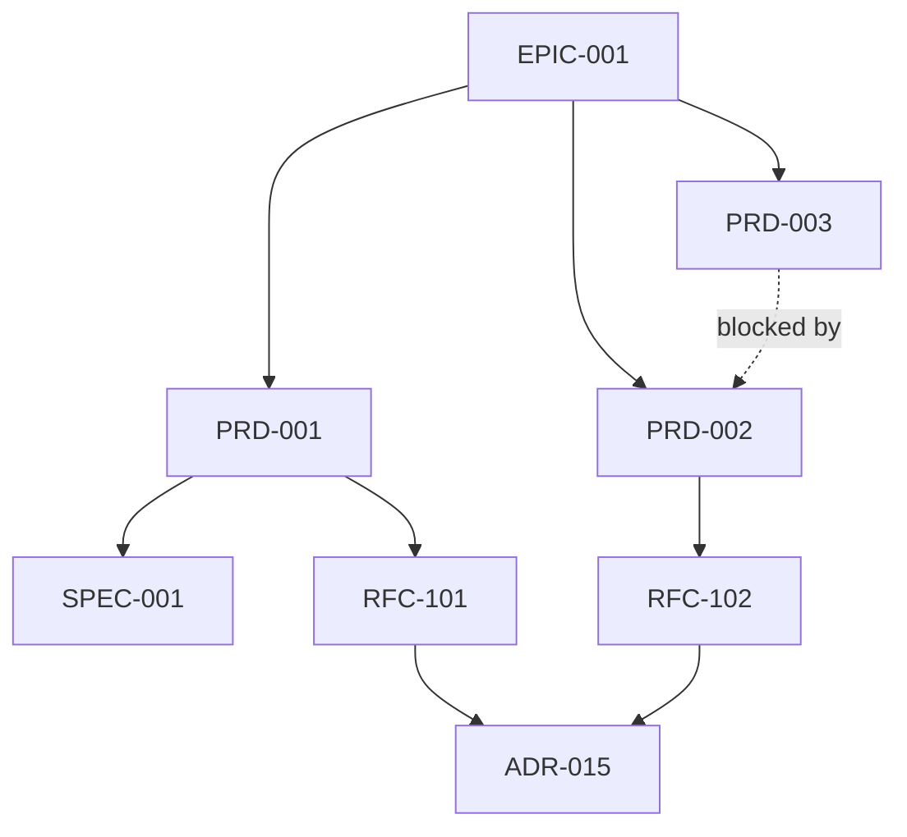

---
id: EPIC-001
title: "Forgeplan v1.0 — Real Methodology Engine"
status: Draft
owner:
created: 2026-03-24
updated: 2026-03-24
target: "Q{N} YYYY"
depth: standard / deep / critical
---

# EPIC-001: Forgeplan v1.0 — Real Methodology Engine

## Progress (Aggregated)

```
PRD-001  ████████████████████████  8/8   (100%) DONE
PRD-002  ██████████████░░░░░░░░░░  7/12  ( 58%)
PRD-003  ░░░░░░░░░░░░░░░░░░░░░░░░  0/6   (  0%)
─────────────────────────────────────────────────
TOTAL                              15/26 (57.7%)
```

---

## Vision

Одно предложение — что хотим достичь этой инициативой.

## Outcomes (Measurable)

1. **Outcome 1**: metric -> target value
2. **Outcome 2**: metric -> target value
3. **Outcome 3**: metric -> target value

## Problem Space

Какие проблемы объединяет этот эпик. Почему их нужно решать вместе.

## Scope

### In Scope
- ...

### Out of Scope
- ...

## Children (PRDs, RFCs, ADRs)

| Type | ID | Title | Status | Owner |
|------|------|-------|--------|-------|
| PRD | PRD-001 | ... | Approved | ... |
| PRD | PRD-002 | ... | Draft | ... |
| SPEC | SPEC-001 | ... | Approved | ... |
| RFC | RFC-101 | ... | Implemented | ... |
| RFC | RFC-102 | ... | Draft | ... |
| ADR | ADR-015 | ... | Accepted | ... |

## Dependency Graph



## Phases

### Phase 1: Foundation
- PRD-001 -> SPEC-001 -> RFC-101
- ADR-015

### Phase 2: Core
- PRD-002 -> RFC-102

### Phase 3: Enhancement
- PRD-003 (depends on Phase 2)

## Risks

| Risk | Impact | Mitigation |
|------|--------|------------|
| ... | High | ... |

## Timeline

| Phase | Start | End | Status |
|-------|-------|-----|--------|
| Phase 1 | 2026-03-24 | 2026-03-24 | Done |
| Phase 2 | 2026-03-24 | 2026-03-24 | In Progress |
| Phase 3 | 2026-03-24 | 2026-03-24 | Not Started |

## Implementation Log

<!-- Add entries as phases complete:

### Phase 1 Complete — 2026-03-24
| Artifact | Status | Key Outcome |
|----------|--------|-------------|
| PRD-001 | Done | Requirements locked |
| RFC-101 | Done | Architecture implemented |
-->

## Related

- Epic-001: {link}
- Roadmap: {link}

