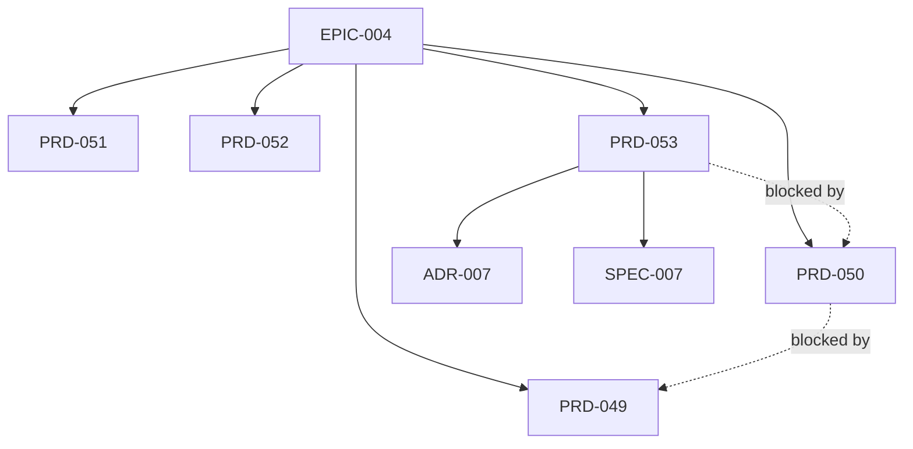

---
id: EPIC-004
title: "CLI Discoverability and Enterprise Readiness"
status: Draft
owner: ForgePlan Team
created: 2026-04-17
updated: 2026-04-17
target: "Q2 2026"
depth: deep
---

# EPIC-004: CLI Discoverability and Enterprise Readiness

## Progress (Aggregated)

```
PRD-049  ░░░░░░░░░░░░░░░░░░░░░░░░  0/0   (  0%) Grouped Help + Meta Commands
PRD-050  ░░░░░░░░░░░░░░░░░░░░░░░░  0/0   (  0%) Doctor + Estimate Table Default
PRD-051  ░░░░░░░░░░░░░░░░░░░░░░░░  0/0   (  0%) Discover Quickstart + FPF Explain
PRD-052  ░░░░░░░░░░░░░░░░░░░░░░░░  0/0   (  0%) Audit Report MVP (markdown)
PRD-053  ░░░░░░░░░░░░░░░░░░░░░░░░  0/0   (  0%) LLM Provider Trait
ADR-007  ░░░░░░░░░░░░░░░░░░░░░░░░  0/0   (  0%) LLM Provider Dispatch
─────────────────────────────────────────────────
TOTAL                              0/0   (  0%)
```

---

## Vision

Сделать 45+ уже реализованных CLI-команд видимыми через grouped help + meta-commands, добавить 3 enterprise-unblocker'а (doctor, audit-report, LLM provider trait) без написания новых backend-фич.

## Outcomes (Measurable)

1. **Visibility**: grep README для 12 ключевых команд (`estimate`, `calibrate`, `discover`, `blindspots`, `decompose`, `journal`, `drift`, `coverage`, `tag`, `remember`, `recall`, `fpf`) → с 0 до 12 упоминаний в CLI `--help` grouped output (через `help_heading`).
2. **Enterprise doors**: `forgeplan provider list/set/test` работает для Anthropic/OpenAI/Gemini/Ollama (4 провайдера вместо 1 hard-coded Gemini).
3. **Compliance**: `forgeplan audit-report --standard eu-ai-act --format md` генерит non-empty markdown-отчёт со всеми per-artifact metadata (author, dates, evidence chain, R_eff history, supersession lineage) — покрывает **EU AI Act Art.11 (Technical Documentation) + Art.12 (Record-keeping)**. НЕ претендует на Art.9 (Risk Management System = отдельный RMS process, не artifact-based export).
4. **Binary delta**: LLM trait refactor adds ≤ 1 MB to 43 MB baseline (measured on release build).
5. **Test suite**: current 1194 tests + ≥ 40 new integration tests across 5 PRDs, 0 flaky, 0 warnings.

## Problem Space

- **60 рабочих команд, ~10k LOC CLI**, но README упоминает ~15 → grep=0 для 12 killer-features (`estimate`, `calibrate`, `discover`, `blindspots`, `decompose`, `journal`, `drift`, `coverage`, `tag`, `remember`, `recall`, `fpf`).
- **ROADMAP признаёт дефицит**: Docs 60%, UX 70%, Distribution 65%.
- **5★ на GitHub при 1194 тестах** = launch не произошёл; маркет не знает про существующий functionality.
- **LlmClient — concrete struct** с `if/else` по provider → нельзя подменить на Anthropic/Ollama для enterprise клиентов (EU fintech/health/HR ML-компании с existing contracts).
- **Нет compliance-export** → EU AI Act 2026-08-02 effective date приближается; enterprise-buyer не может предоставить Art.11 technical documentation без ручной сборки 50+ файлов.

Все пять пунктов — не отсутствие фич, а дефицит **упаковки и разблокировки**. Одна инициатива вместо пяти, потому что outcomes завязаны друг на друга (doctor валидирует provider trait; audit-report использует grouped help discoverability; demo ссылается на новые meta-commands).

## Scope

### In Scope

- **Sprint 1 — Presentation Fix (PRD-049, PRD-050)**:
  - grouped `--help` через clap `help_heading` (8 категорий: CORE, QUALITY, REASONING, LIFECYCLE, DISCOVERY, ESTIMATE, AUDIT, PRO);
  - `forgeplan commands` (grouped command tree, `--json`, `--category`);
  - `forgeplan demo` (sandbox walkthrough в `TempDir`, `--skip-semantic` по умолчанию);
  - `forgeplan doctor` (config / lance / LLM / embed cache / orphans / stale health check, `--ci`, `--fix`);
  - `forgeplan estimate <id>` — default output переключается на compact table, `--verbose` возвращает breakdown.
- **Sprint 2 — UX + Compliance MVP (PRD-051, PRD-052)**:
  - `forgeplan discover --quickstart <path>` (scan + auto-tag + seed PRD из T1 файла);
  - `forgeplan fpf explain <rule-id>` + `forgeplan fpf examples <section>`;
  - `forgeplan audit-report --standard eu-ai-act --format md|json` (MVP: EU AI Act **Art.11 + Art.12** mapping via Annex IV, per-artifact metadata + evidence chain + R_eff history + supersession lineage).
- **Sprint 3 — Enterprise Unblocker (ADR-007, PRD-053)**:
  - ADR-007: выбор dispatch strategy для LLM provider (trait object / enum / generics);
  - Trait `LlmProvider` + 4 реализации (Anthropic, OpenAI-compatible, Gemini, Ollama);
  - `forgeplan provider list/set/test` (+ `--mock` для CI);
  - Backwards compat для legacy `config.yaml` с `provider: gemini`.

### Out of Scope

- `forgeplan serve --http` REST wrapper (отдельный RFC — требует auth, rate-limit, API surface design).
- VS Code / JetBrains extension, Tauri desktop, Web UI (отдельные Epic).
- Cargo publish / Docker image / npm wrapper (Distribution Epic, не в этом Epic).
- Telemetry opt-in, Team/permissions model, Delta-specs (OpenSpec merge conflicts).
- PDF generation для audit-report (markdown-only MVP, PDF → NOTE follow-up).
- SOC 2 / ISO 42001 / GDPR Art.22 стандарты (MVP covers EU AI Act only, остальные → NOTE follow-ups).
- README / website rewrite (отдельный Distribution sprint).
- Launch materials (HN / Хабр / Twitter → после v0.20.0 release).

## Children (PRDs, RFCs, ADRs)

| Type | ID | Title | Status | Owner |
|------|------|-------|--------|-------|
| PRD | PRD-049 | Grouped Help and Meta Commands | Draft | ForgePlan Team |
| PRD | PRD-050 | Doctor and Estimate Table Default | Draft | ForgePlan Team |
| PRD | PRD-051 | Discover Quickstart and FPF Explain | Draft | ForgePlan Team |
| PRD | PRD-052 | Audit Report MVP Markdown | Draft | ForgePlan Team |
| PRD | PRD-053 | LLM Provider Trait | Draft | ForgePlan Team |
| ADR | ADR-007 | LLM Provider Dispatch | Draft | ForgePlan Team |
| SPEC | SPEC-002 | LLM Provider trait contract (error taxonomy, retry, auth, mock) | Draft | ForgePlan Team |

## Dependency Graph



Note: PRD-053 depends on PRD-050 because its FR-006 edits `doctor.rs` (introduced in PRD-050) to add legacy provider migration warning. PRD-052 is independent of PRD-053 (no code coupling).

## Phases

### Phase 1: Presentation Fix (Sprint 1)
- PRD-049 → PRD-050
- Branch flow: `feat/prd-049-grouped-help` → merge → `feat/prd-050-doctor` (dependent — PRD-050 использует help_heading паттерн из PRD-049).
- Outcome: grouped help + commands + demo + doctor + estimate table default.

### Phase 2: UX + Compliance MVP (Sprint 2)
- PRD-051 + PRD-052 (parallel, разные модули — `discover`/`fpf` vs `audit_report`).
- Outcome: quickstart onboarding для brownfield + EU AI Act Art.11/Art.12 audit trail exporter.

### Phase 3: Enterprise Unblocker (Sprint 3)
- ADR-007 → PRD-053 (ADI обязателен для ADR-007, решает dispatch strategy).
- Outcome: 4 LLM providers через trait object, runtime switching, backwards-compat с legacy config.

## Risks

| Risk | Impact | Mitigation |
|------|--------|------------|
| Clap `help_heading` v4 API mismatch | Medium | Verify in PRD-049 first commit; fallback = manual help template |
| Demo BGE-M3 60s first-run blocks | Low | Default `--skip-semantic`; separate `demo --with-semantic` for opt-in |
| LLM trait breaking config.yaml | High | Serde default + migration warning in doctor; legacy config test required |
| Provider test live API flakiness in CI | Low | `--mock` mode with stubbed responses |
| Binary size bloat from dispatch refactor | Medium | Measured in ADR-007; reject if > 1 MB delta |
| Parallel PRD conflicts | Low | Strict file ownership; dependent-sprint rule enforced |

## Timeline (rebudgeted after audit 2026-04-17)

| Phase | Estimate | Status | Scope |
|-------|----------|--------|-------|
| Phase 1 (Sprint 1, PRD-049 + PRD-050) | 6-8 дней | Not Started | 60 `help_heading` + 3 new commands (`commands`, `demo`, `doctor`) + `estimate` table refactor. Doctor alone has 7 checks + `--fix` + `--ci` + JSON schema. |
| Phase 2 (Sprint 2, PRD-051 + PRD-052) | 5-6 дней | Not Started | `discover --quickstart`, `fpf explain`, `fpf examples`, `audit-report --standard eu-ai-act` with Art.11/12 Annex IV mapping. Parallel tracks — 2 independent modules. |
| Phase 3 (Sprint 3, ADR-007 + SPEC-002 + PRD-053) | 7-8 дней | Not Started | LLM trait refactor + 4 providers (Anthropic/OpenAI/Gemini/Ollama) + runtime switch + legacy compat + ≥12 integration tests. Spec contract now separate (SPEC-002) — frees PRD-053 from signature-design overhead. |

**Total: 18-22 рабочих дня**, ~4-5 календарных недель включая audit/review/fixes. Release target: v0.20.0.

**Budget flex**: if Sprint 3 over-runs (providers often slip on auth/rate-limit edge cases), Ollama provider → NOTE follow-up, v0.20.0 ships with 3 providers (Anthropic, OpenAI, Gemini). If Sprint 1 over-runs, `doctor --fix` → follow-up v0.20.1 hotfix.

**Original estimate (11-14 days) was rejected by audit F3** as unrealistic. Root causes of the optimism: (1) doctor complexity underestimated, (2) 4-provider LLM integration requires separate HTTP clients + per-provider error mapping ≈ 2 days each.

## Implementation Log

## Related

- Parent context: ROADMAP gap analysis (Docs 60%, UX 70%, Distribution 65%).
- Upstream methodology: CLAUDE.md `/forge` workflow, Unified Workflow Protocol.
- Release: v0.20.0 (target Q2 2026).
