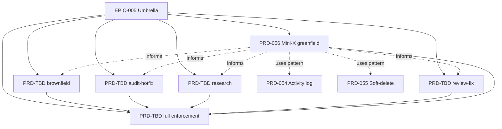

---
id: EPIC-005
title: "Phase state machine and workflow-aware methodology — umbrella"
status: Draft
owner: gogocat
created: 2026-04-18
updated: 2026-04-18
target: "Q2 2026"
depth: standard
---

# EPIC-005: Phase state machine and workflow-aware methodology — umbrella

## Progress (Aggregated)

```
PRD-056 (Mini-X greenfield)     ░░░░░░░░░░░░░░░░░░░░░░░░  0/14  (  0%) Draft
PRD-future (brownfield)         ░░░░░░░░░░░░░░░░░░░░░░░░  0/0   (  0%) Planned
PRD-future (audit-hotfix)       ░░░░░░░░░░░░░░░░░░░░░░░░  0/0   (  0%) Planned
PRD-future (research)           ░░░░░░░░░░░░░░░░░░░░░░░░  0/0   (  0%) Planned
PRD-future (review-fix)         ░░░░░░░░░░░░░░░░░░░░░░░░  0/0   (  0%) Planned
PRD-future (full enforcement)   ░░░░░░░░░░░░░░░░░░░░░░░░  0/0   (  0%) Planned
─────────────────────────────────────────────────────────────────────
TOTAL                           0/14  (  0%)
```

---

## Vision

Forgeplan помогает на **всех** этапах работы — не только greenfield, но
и brownfield, audit-hotfix, research, review-fix — через видимую фазу
каждого артефакта в соответствующем workflow, постепенно переходя от
advisory-видимости к полному enforcement, блокирующему пропуск этапов.

## Outcomes (Measurable)

1. **O1 — Phase visibility**: 100% новых artifacts имеют `current_phase`
   в state.yaml после завершения PRD-056 (Mini-X greenfield).
2. **O2 — Workflow coverage**: 5 workflow-типов (greenfield, brownfield,
   audit-hotfix, research, review-fix) имеют свои phase enumerations,
   каждый под отдельным child-PRD.
3. **O3 — Phase-skip detection**: `forgeplan_health` выявляет artifacts
   с несоответствием status ↔ phase (advisory warning в Mini-X, hard
   failure в Full Enforcement).
4. **O4 — Zero regression**: существующие 45+ MCP tools продолжают
   работать с тем же поведением (feature-flag `phase.enabled=false`
   отключает полностью).

## Problem Space

Forgeplan сегодня:
- имеет lifecycle для `status` (`draft → active → superseded`)
- имеет `_next_action` hints (v0.20.0)
- имеет R_eff gate на активации
- **не имеет** записи "где я в методологическом цикле"
- **не различает** workflow-типы — считает всё greenfield
- **не ловит** phase-skip'ы (PRD активирован, но Validate/ADI/Evidence
  пропущены) иначе как через manual review

Session 2026-04-18 продемонстрировала: 3 раза наблюдался "Code без
полного Shape", компенсированный post-ship audit'ом (который сам по
себе — workflow без formalized phases). Цена: 2 CRITICAL + 5 HIGH
findings, 1 extra release (v0.22.1). Если бы audit-hotfix workflow
был formalized — каждый post-ship audit проходил бы через одни и
те же фазы автоматически.

## Scope

### In Scope

- Advisory phase tracking для всех workflow-типов
- Auto-advancement на известных tool events (new → shape, validate PASS
  → validate, activate → done, etc.)
- Per-workflow phase enum (каждый PRD-child определяет свой)
- Health integration: surface phase-status mismatches
- Config gate: `phase.enabled: bool` в `.forgeplan/config.yaml`

### Out of Scope

- Full enforcement (tools refuse работать не в своей фазе) — это
  финальный child PRD в Epic, не первый
- Multi-agent phase locks (see PRD про multi-agent state machine —
  отдельный Epic)
- Phase-aware dashboards / UI (наблюдается через MCP tools и markdown)
- Historical backfill существующих ~100 artifacts без явного запроса
  (есть команда `forgeplan_phase_backfill`, opt-in)

## Children (PRDs)

| Type | ID | Title | Status | Workflow |
|------|------|-------|--------|----------|
| PRD | PRD-056 | Phase state machine (advisory) — greenfield | Draft → active (this sprint) | greenfield |
| PRD | TBD | Brownfield modification workflow phases | Planned | brownfield |
| PRD | TBD | Audit-hotfix workflow phases (formalizes v0.22.1 pattern) | Planned | hotfix |
| PRD | TBD | Research / spike workflow phases | Planned | research |
| PRD | TBD | Review-fix workflow phases | Planned | review |
| PRD | TBD | Full Phase Enforcement (hard gates) | Planned, depends on all above | all |

**Red Line #6 compliance**: child PRDs не создаются как stubs. Real PRDs
создаются только когда начинаем работу над каждым. Эта таблица — план,
не список артефактов.

## Dependency Graph



## Phases (Epic-level)

### Phase 1: Advisory Foundation (current)
- PRD-056 ships — greenfield phase tracking visible, non-blocking

### Phase 2: Workflow Coverage (next ~2-3 sprints)
- Brownfield PRD ships — modification workflow phases
- Audit-hotfix PRD ships — formalizes v0.22.1 workflow pattern
- Research PRD ships — spike/exploration phases
- Review-fix PRD ships — PR feedback workflow

### Phase 3: Enforcement (last child)
- Full Phase Enforcement PRD — tools block skip, hard gates
- Config flag `phase.strict: bool` toggles advisory ↔ enforced
- Migration from advisory → strict documented in CHANGELOG

## Risks

| Risk | Impact | Mitigation |
|------|--------|------------|
| Workflow types multiply без контроля | Medium | Epic требует adversarial review каждого child PRD (BMAD principle) |
| Advisory phase игнорируется агентами, как и `_next_action` | Medium | Phase visibility в response → видно при каждом tool call; не приводит к скрытой деградации |
| Breaking change существующих автоматизаций | High | Feature flag `phase.enabled=false` — exact pre-v0.23.0 behavior |
| Phase auto-advancement логика неправильная | Low | Auto-advance только на explicit events (new, validate PASS, activate); manual override через `phase_advance` |

## Timeline

| Phase | Start | End (target) | Status |
|-------|-------|-----|--------|
| Phase 1 (Mini-X) | 2026-04-18 | 2026-04-20 | In Progress |
| Phase 2 (Workflow Coverage) | 2026-04-21 | 2026-05-15 | Planned |
| Phase 3 (Enforcement) | 2026-05-16 | 2026-05-30 | Planned |

## Implementation Log

### 2026-04-18 — Epic created, PRD-056 Shape phase

Epic создан вместе с PRD-056 (Mini-X greenfield). Mini-X получает
priority P0 как foundation для всех остальных workflow child-PRDs.
Red Line #6 respected: child PRDs не созданы как stubs.

## Related

- CLAUDE.md Red Lines #5–#7 (discipline-by-rule, workflow enforcement aspiration)
- PRD-054 Activity log (pattern reused for phase audit trail)
- PRD-055 Soft-delete / undo (file durability pattern reused)
- RIPER-5 methodology (mode-enforcement inspiration)
- BMAD adversarial review principle (apply to each child PRD)
