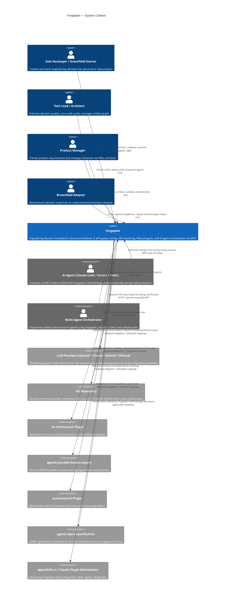

# C4 Context Level: System Context

## System Overview

### Short Description

Forgeplan is a local-first engineering decision framework that guides projects from raw idea to proven implementation through structured, quality-scored artifacts with native AI-agent integration.

### Long Description

Forgeplan is a Rust-based CLI tool and MCP server that brings structure, evidence, and decay-honest quality scoring to engineering decisions. It replaces decisions scattered across Slack threads, emails, and Linear tickets with git-tracked, validated artifacts — PRDs, RFCs, ADRs, Epics, Specs, Evidence, Problems, and Notes — each linked in a dependency graph.

The system solves three interrelated problems: (1) decisions are made but never recorded, making "why did we choose X?" unanswerable six months later; (2) AI agents produce work without a methodological paper trail, making their output shallow and unverifiable; (3) documentation exists in theory but never gets written because the friction is too high.

Forgeplan's core value is its **methodological layer**: the R_eff weakest-link trust formula, FPF trust calculus, ADI (Abduction–Deduction–Induction) reasoning cycles, lifecycle gates that prevent activating unproven decisions, typed inter-artifact links, and evidence decay that honestly marks stale artifacts. Local semantic search via BGE-M3 embeddings runs entirely offline — no network, no API keys.

As an orchestrator, Forgeplan does not generate documents itself for complex analysis tasks. Instead, it delegates to specialized plugins (c4-architecture, autoresearch, ddd-domain-expert, sparc:specification) through Playbook/Mapping primitives, then ingests their outputs into the artifact graph with scoring and lifecycle tracking.

The system is distributed as a single binary (brew, install.sh, cargo) and a stdio-transport MCP server that any MCP-compatible AI agent (Claude Code, Cursor, Aider, Continue) can connect to through 47 tools.

### System Scope

**Inside the system boundary:**
- Artifact CRUD with markdown-first storage and LanceDB derived index
- Quality scoring (R_eff, F-G-R), validation gates, and evidence decay
- Task depth routing and artifact pipeline selection
- ADI reasoning cycles (3+ hypothesis generation)
- Lifecycle state machine (draft → active → superseded/deprecated/stale)
- Typed dependency graph with link traversal
- Local semantic search (BGE-M3, fastembed, offline)
- MCP server (stdio transport, 47 tools)
- Multi-agent dispatch: file-overlap detection, skill-based routing, parallel/serial bucketing
- Playbook runtime for orchestrating external plugin delegations
- Ingest engine for mapping external plugin outputs to forge artifacts
- CLI (58 commands, alias `fpl`)

**Outside the system boundary:**
- LLM inference (delegates to external providers via config)
- Code generation, CI/CD, deployment pipelines
- Project management task tracking (complementary to tools like Orchestra)
- Document generation for structural/domain analysis (delegates to c4-architecture, autoresearch, ddd-domain-expert)
- Team synchronization or notification systems

---

## Personas

### Solo Developer

- **Type**: Human User
- **Description**: An individual engineer or indie developer working on a personal or small-team project who wants to stop losing decisions to chat history.
- **Goals**: Record architectural choices without bureaucratic overhead; answer "why did I do this?" months later; get AI agents to follow a consistent methodology.
- **Key Features Used**: Route, Shape (PRD/ADR/Note), Validate, Score, Activate, Search, MCP integration with Claude Code

### Tech Lead / Architect

- **Type**: Human User
- **Description**: A senior engineer or architect responsible for technical direction on a team, who needs to ensure decisions are reasoned, documented, and traceable.
- **Goals**: Enforce ADI reasoning before irreversible decisions; track R_eff across all active PRDs/RFCs; detect drift between code and decisions; run adversarial audit cycles.
- **Key Features Used**: Route, ADI Reasoning, Spec/RFC/ADR, Score, Coverage, Drift detection, Audit cycle, Multi-agent dispatch

### Product Manager / Product Owner

- **Type**: Human User
- **Description**: A non-technical or semi-technical stakeholder who frames the "what and why" of features and initiatives.
- **Goals**: Capture product requirements with validated completeness; group features into Epics; understand quality readiness before handoff to engineering.
- **Key Features Used**: New PRD, New Epic, Validate, Status dashboard

### Brownfield Adopter

- **Type**: Human User
- **Description**: An engineer or team lead joining an existing codebase (potentially large — tens of thousands of lines) with no prior documentation, who needs to quickly reconstruct the decision map.
- **Goals**: Extract ADRs and bounded contexts from existing code and git history; build an artifact graph from scratch without manual artifact-by-artifact creation; identify undocumented decisions.
- **Key Features Used**: Scan-import, Playbook runtime (brownfield migration playbooks), Ingest engine (c4-to-forge, ddd-to-forge, git-to-forge mappings), Search

### Greenfield Starter

- **Type**: Human User
- **Description**: An engineer or team beginning a new project from a raw idea, who wants to use Forgeplan from day one to shape the project with structure.
- **Goals**: Route the initial idea to the right artifact pipeline; create a validated PRD before writing code; ensure evidence backs every activation.
- **Key Features Used**: Init, Route, Shape (full cycle), Validate, Reason, Evidence, Activate

### AI Agent via MCP (Claude Code / Cursor / Aider)

- **Type**: Programmatic User
- **Description**: An AI coding agent connected to the Forgeplan MCP server over stdio. The agent issues tool calls during a coding session to read context, create artifacts, validate quality, and follow the Shape → Validate → Code → Evidence → Activate methodology without human micro-management.
- **Goals**: Understand which ADRs govern the current code area; follow the correct artifact pipeline for the task depth; detect drift after code changes; stamp agent identity on artifacts it creates or modifies.
- **Key Features Used**: All 47 MCP tools — most frequently: `forgeplan_route`, `forgeplan_new`, `forgeplan_validate`, `forgeplan_reason`, `forgeplan_score`, `forgeplan_activate`, `forgeplan_search`, `forgeplan_drift`, `forgeplan_dispatch`

### Multi-Agent Orchestrator

- **Type**: Programmatic User
- **Description**: An orchestrating agent (or human-in-the-loop supervisor) that coordinates 2–5 sub-agents sharing one Forgeplan workspace, assigning work to minimize file conflicts and respect dependencies.
- **Goals**: Dispatch a batch of draft artifacts across N agents with no double-work, no merge conflicts, and correct serial/parallel ordering; monitor claims; release stale claims.
- **Key Features Used**: `forgeplan_dispatch`, `forgeplan_claim`, `forgeplan_release`, `forgeplan_claims`

---

## System Features

### Task Routing and Depth Calibration

- **Description**: Analyzes a task description and determines the appropriate work depth (Tactical / Standard / Deep / Critical) and the resulting artifact pipeline (e.g., Note only; ADR; PRD → RFC; Epic → PRD → Spec → RFC → ADR). Prevents over-documenting trivial changes and under-documenting irreversible ones.
- **Users**: Solo Developer, Tech Lead, AI Agent via MCP, Greenfield Starter

### Artifact Lifecycle Management

- **Description**: Full CRUD for 10 artifact types with a formal state machine (draft → active → superseded/deprecated/stale). Validation gates prevent activation without evidence. Lifecycle transitions are explicit commands (`activate`, `supersede`, `deprecate`, `renew`, `reopen`).
- **Users**: All human personas, AI Agent via MCP

### Quality Scoring (R_eff and F-G-R)

- **Description**: Computes artifact trust as the minimum evidence score across all linked evidence items (weakest-link formula). Applies congruence-level penalties (CL0–CL3) and evidence decay (expired `valid_until` → score 0.1). F-G-R measures formality, granularity, and reliability independently.
- **Users**: Tech Lead, AI Agent via MCP, Multi-Agent Orchestrator

### ADI Reasoning Cycles

- **Description**: Forces 3+ competing hypotheses through Abduction → Deduction → Induction before recording a decision. Available via `forgeplan reason <id>` and the `forgeplan_reason` MCP tool. Mandatory for Deep and Critical depth artifacts.
- **Users**: Tech Lead, AI Agent via MCP

### Semantic Search

- **Description**: Local vector search over all artifacts using BGE-M3 embeddings (1024 dimensions) via fastembed. Runs entirely offline with no external API calls. Supports hybrid text + semantic queries.
- **Users**: All personas, AI Agent via MCP

### Typed Dependency Graph

- **Description**: Artifacts are connected through typed links (informs, based_on, supersedes, blocks, etc.). Graph traversal powers coverage analysis, drift detection, and blocking-artifact identification.
- **Users**: Tech Lead, AI Agent via MCP

### Evidence and Decay Management

- **Description**: EvidencePacks attach test results, benchmarks, and measurements to artifacts. Each evidence item carries a `valid_until` TTL. Expired evidence forces artifacts to stale. Structured fields (`verdict`, `congruence_level`, `evidence_type`) are required for R_eff to register non-zero scores.
- **Users**: Tech Lead, Solo Developer, AI Agent via MCP

### MCP Server Integration

- **Description**: Full MCP server over stdio transport exposing 47 tools to any MCP-compatible AI agent. Tools cover the complete methodology workflow — from routing through activation — plus multi-agent dispatch and identity stamping.
- **Users**: AI Agent via MCP, Multi-Agent Orchestrator

### Multi-Agent Dispatch

- **Description**: Given a list of draft artifacts and N agents with optional skill profiles, produces a conflict-free assignment: parallel buckets (no file overlap) and a serial queue. Uses Jaccard similarity on affected file sets for overlap detection.
- **Users**: Multi-Agent Orchestrator, Tech Lead

### Brownfield Migration (Playbook + Ingest)

- **Description**: Declarative Playbooks define multi-step migration strategies that delegate structural analysis, domain modeling, and history mining to specialized plugins. The Ingest engine applies Mapping files to translate plugin outputs (C4-Documentation/, domain-model.md, git log) into draft Forgeplan artifacts with line-level source links.
- **Users**: Brownfield Adopter, Tech Lead

### Health and Drift Monitoring

- **Description**: `forgeplan health` surfaces blind spots (code areas without covering ADRs), orphaned artifacts, and stale decisions. `forgeplan drift` detects when recent code changes appear to violate an active ADR.
- **Users**: Tech Lead, AI Agent via MCP, QA / Reviewer

---

## User Journeys

### Journey 1: Solo Developer Creates First PRD

A solo developer starts a new feature and wants to record their decision trail.

1. **Install**: `brew install ForgePlan/tap/forgeplan` — single binary, no server required
2. **Initialize workspace**: `forgeplan init -y` — creates `.forgeplan/` directory in the project root
3. **Route the task**: `forgeplan route "Add OAuth2 authentication"` — system returns depth=Standard, pipeline=PRD → RFC
4. **Shape the PRD**: `forgeplan new prd "OAuth2 Authentication"` — receives a pre-filled markdown template with required sections
5. **Fill required sections**: Problem, Goals, Non-Goals, Target Users, Functional Requirements — directly in the markdown file
6. **Validate**: `forgeplan validate PRD-001` — gate checks all MUST sections are present; PASS or error list
7. **Run ADI reasoning**: `forgeplan reason PRD-001` — system generates 3+ competing implementation hypotheses
8. **Implement the feature** — writes code following the chosen hypothesis
9. **Record evidence**: `forgeplan new evidence "18 tests pass, auth flow p95=180ms"` → `forgeplan link EVID-001 PRD-001`
10. **Score**: `forgeplan score PRD-001` — verifies R_eff > 0 (evidence structured fields are valid)
11. **Activate**: `forgeplan activate PRD-001` — artifact transitions from draft to active; becomes immutable

### Journey 2: AI Agent via Claude Code MCP

An AI coding agent (Claude Code) handles a sprint, following the Forgeplan methodology through MCP tools.

1. **Connect**: Forgeplan MCP server starts via stdio; Claude Code discovers 47 tools
2. **Check workspace health**: `forgeplan_health` — agent reads blind spots and stale artifacts before starting
3. **Route the task**: `forgeplan_route` with the sprint description — receives depth, artifact pipeline, and reasoning
4. **Read existing context**: `forgeplan_search` to find any existing PRDs/ADRs covering the work area
5. **Create artifact**: `forgeplan_new` with kind=prd — agent receives template; fills sections programmatically
6. **Validate**: `forgeplan_validate` — must return PASS before proceeding to code
7. **Reason**: `forgeplan_reason` — generates ADI hypotheses; agent presents options to human for decision
8. **Implement**: writes code; after changes runs `forgeplan_drift` to detect any ADR violations
9. **Create and link evidence**: `forgeplan_new` (kind=evidence) → `forgeplan_link` with relation=informs
10. **Score and activate**: `forgeplan_score` checks R_eff; `forgeplan_activate` transitions the artifact
11. **Stamp identity**: each write tool call stamps `last_modified_by` with the agent's MCP client identity (Claude Code / version)

### Journey 3: Team Runs Brownfield Migration Audit Cycle

A tech lead joins a 100K-LOC codebase with no prior documentation and needs to build a decision map.

1. **Initialize**: `forgeplan init -y` in the existing repository root
2. **Run health check**: `forgeplan health` — reveals 0 artifacts, all code is "blind modules"
3. **Detect installed plugins**: Forgeplan detects c4-architecture, ddd-domain-expert, sparc:specification in the local plugin cache
4. **Select brownfield playbook**: `forgeplan playbook list` → selects `brownfield-migration` playbook
5. **Run structural analysis step**: Playbook delegates to `c4-architecture` — generates `C4-Documentation/` with container and component diagrams
6. **Run domain analysis step**: Playbook delegates to `ddd-domain-expert` — generates bounded context map
7. **Ingest C4 output**: `forgeplan ingest --mapping c4-to-forge.yaml --source C4-Documentation/` — produces draft ADRs, Epics, and Notes from the C4 artifacts
8. **Ingest domain model**: `forgeplan ingest --mapping ddd-to-forge.yaml --source domain-model.md` — produces draft PRDs per bounded context
9. **Dispatch audit to agents**: `forgeplan dispatch --agents 3` — assigns draft artifacts across 3 agents without file conflicts
10. **Agents validate and enrich**: each agent runs `forgeplan_validate`, adds evidence, runs `forgeplan_reason` on key ADRs
11. **Tech lead reviews**: `forgeplan score` across all artifacts; activates those with R_eff > 0 threshold
12. **Health re-check**: `forgeplan health` now shows coverage across all previously blind modules

---

## External Systems and Dependencies

### LLM Providers (OpenAI, Anthropic Claude, Google Gemini, Ollama, OpenRouter)

- **Type**: External API / Local service
- **Description**: Language model providers used for ADI reasoning generation, task routing classification (L1/L2), and FPF KB semantic assistance. All are optional — the system degrades gracefully to rule-based routing when no LLM is configured.
- **Integration Type**: HTTP API (OpenAI-compatible endpoint for all providers including Claude and Gemini via compat shim; Ollama via local HTTP)
- **Purpose**: Generate multi-hypothesis ADI reasoning, assist with depth calibration for ambiguous tasks, power FPF semantic search when configured

### LanceDB (Embedded)

- **Type**: Embedded database (co-located, not a network service)
- **Description**: A columnar vector database embedded directly in the Forgeplan process. Stores derived artifact records and BGE-M3 embeddings for semantic search. The `.forgeplan/lance/` directory is gitignored — it is rebuilt from markdown source files via `forgeplan scan-import`.
- **Integration Type**: In-process library (lancedb Rust crate)
- **Purpose**: Power semantic search across artifacts; serve as a fast query layer over the markdown source of truth (per ADR-003 — markdown is authoritative, LanceDB is derived)

### Git (Local Repository)

- **Type**: Version control system
- **Description**: The underlying storage mechanism for Forgeplan artifact markdown files. Artifact history, authorship, and collaboration are handled entirely through standard git operations. The `.forgeplan/` directory (excluding `lance/`, `config.yaml`, `.fastembed_cache/`) is committed to the repository.
- **Integration Type**: Filesystem (git-tracked markdown files); `git log` read for brownfield history mining
- **Purpose**: Provide artifact versioning, collaboration via PRs, and the `git-to-forge` history mining input for brownfield migration

### fastembed / BGE-M3 Model (Local)

- **Type**: Local ML model (offline, bundled)
- **Description**: The fastembed library with the BGE-M3 embedding model (1024 dimensions) provides fully offline semantic embedding for all artifacts. Model weights are cached in `.forgeplan/.fastembed_cache/` (gitignored). No network calls are made during embedding.
- **Integration Type**: In-process library (fastembed Rust crate, feature-gated)
- **Purpose**: Enable semantic similarity search across artifacts without external API keys or data egress

### c4-architecture Plugin

- **Type**: External agent plugin (claude-code-workflows marketplace)
- **Description**: A Claude Code plugin that generates C4 model documentation (Context, Container, Component, Code levels) from codebase analysis. Forgeplan integrates with it through the `c4-to-forge.yaml` mapping, ingesting its output into the artifact graph.
- **Integration Type**: Filesystem output mapping (Forgeplan reads `C4-Documentation/` produced by the plugin)
- **Purpose**: Structural architecture analysis for brownfield migration — produces the container and component view that Forgeplan ingests as ADRs and Epics

### autoresearch Plugin

- **Type**: External agent plugin (Karpathy-derived)
- **Description**: A multi-phase research and reasoning pipeline that includes deep research, adversarial reasoning swarms, and goal-capture interviews. Forgeplan delegates document-generation research steps to it via Playbook.
- **Integration Type**: Filesystem output mapping
- **Purpose**: Research synthesis and adversarial reasoning swarm for Critical-depth artifacts; goal capture interview pattern for PRD shaping

### agents-pro:ddd-domain-expert Plugin

- **Type**: External agent plugin (agents-pro marketplace)
- **Description**: An agent that extracts DDD bounded contexts, aggregates, and use cases from existing code. Forgeplan integrates through the `ddd-to-forge.yaml` mapping.
- **Integration Type**: Filesystem output mapping (domain-model.md, bounded-contexts.md)
- **Purpose**: Domain model extraction for brownfield migration — Forgeplan ingests the output as draft PRDs per bounded context

### agents-sparc:specification Plugin

- **Type**: External agent plugin (agents-sparc marketplace)
- **Description**: Implements the SPARC specification workflow — structured requirements capture with acceptance criteria and constraints. Forgeplan delegates Spec artifact content generation to it.
- **Integration Type**: Filesystem output mapping
- **Purpose**: Formal specification generation for API contracts and data models that Forgeplan ingests as Spec artifacts

### agentskills.io / Claude Code Plugin Marketplace

- **Type**: External distribution platform
- **Description**: Marketplaces for distributing Forgeplan Packs (Playbook + Skill + Agent + Mapping bundles). Users install Packs from these marketplaces to extend Forgeplan's playbook capabilities.
- **Integration Type**: Package installation (agent-skills standard, `skills-lock.json`)
- **Purpose**: Distribution channel for Forgeplan methodology Packs and the plugins Forgeplan orchestrates

### Homebrew Tap / install.sh / cargo (Distribution)

- **Type**: Package distribution channels
- **Description**: The three installation paths for the Forgeplan binary. Homebrew provides macOS/Linux formula; install.sh is a curl-pipe script; cargo provides source builds.
- **Integration Type**: Binary distribution
- **Purpose**: Deliver the single forgeplan binary to end users without requiring a Rust toolchain

---

## System Context Diagram

---

## Related Documentation

- [Container Documentation](./c4-container.md)
- [Component Documentation](./c4-component.md)
- [Methodology Guide](../docs/methodology/FORGEPLAN-GUIDE.md)
- [Usage by Role](../docs/methodology/USAGE-BY-ROLE.md)
- [Multi-Agent Workflow](../docs/operations/MULTI-AGENT.md)
- [ADR-009: Forgeplan as Orchestrator](../.forgeplan/adrs/ADR-009-forgeplan-as-orchestrator-playbook-skill-agent-mapping-pack-marketplace-model.md)
- [ADR-003: Markdown as Source of Truth](../.forgeplan/adrs/ADR-003-markdown-files-as-source-of-truth-lancedb-as-index-layer.md)
