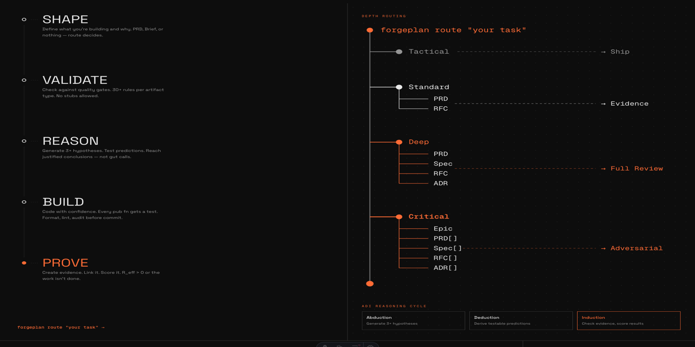
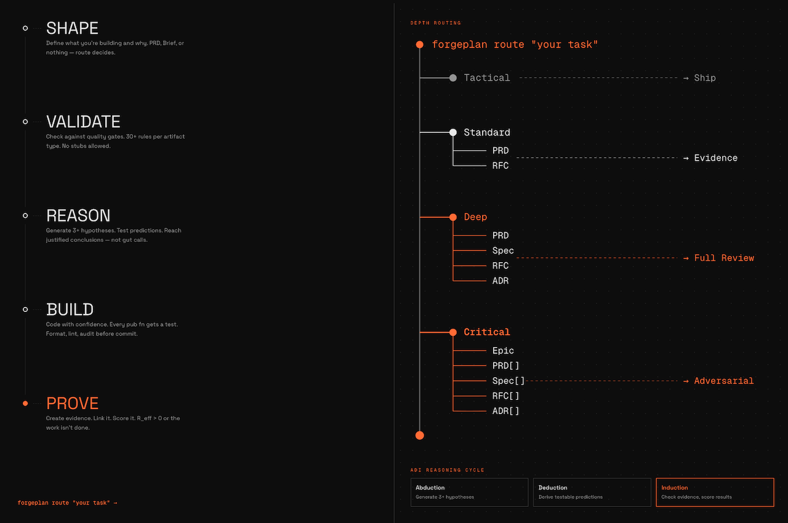
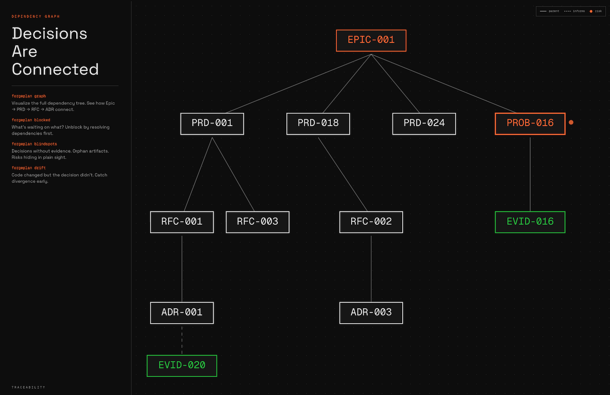

<div align="center">

# ForgePlan



### From raw idea to proven decision

An **engineering decision framework** for teams that want their ideas to leave a paper trail.
Structured artifacts (PRD, RFC, ADR, Epic, Spec), quality scoring, evidence, and native AI-agent integration.

<br>

[](LICENSE)
[](https://github.com/ForgePlan/forgeplan/releases)
[](https://github.com/ForgePlan/forgeplan/actions)
[](.forgeplan/)

**[Website](https://forgeplan.dev)** ·
**[Documentation](docs/README.md)** ·
**[Methodology](docs/methodology/FORGEPLAN-GUIDE.md)** ·
**[Releases](https://github.com/ForgePlan/forgeplan/releases)** ·
**[Marketplace](https://github.com/ForgePlan/marketplace)**

<br>

[English](README.md)  **·**  [Русский](README.ru.md)

<br>

</div>

---

<div align="center">

```
    ┌─────────┐    ┌────────┐    ┌────────┐    ┌───────┐    ┌────────┐    ┌──────┐
    │ OBSERVE │ ─▶ │ ROUTE  │ ─▶ │ SHAPE  │ ─▶ │ BUILD │ ─▶ │ PROVE  │ ─▶ │ SHIP │
    └─────────┘    └────────┘    └────────┘    └───────┘    └────────┘    └──────┘
     health        depth          PRD/RFC       code+test    evidence      activate
```

**Every decision leaves a trail. Every trail has proof. Every proof decays honestly.**

</div>

---

## Why ForgePlan

<table>
<tr>
<td width="50%">

### Before
- Decisions scattered in Slack, Linear, email
- "Why did we pick X?" — silence six months later
- AI agents produce plausible-but-shallow work
- ADRs exist in theory, never get written
- Research never reaches the implementation

</td>
<td width="50%">

### After
- Every decision is a git-tracked artifact
- Full `Problem → Decision → Consequence` trail
- Depth calibration forces appropriate rigor
- `forgeplan new adr` — one command, done
- ADI reasoning demands 3+ hypotheses

</td>
</tr>
</table>

## Install

```bash
# Homebrew (macOS, Linux)
brew install ForgePlan/tap/forgeplan
# Homebrew 6.0+: if install is refused with "untrusted tap",
# run `brew trust ForgePlan/tap` once, then re-run the line above.

# Install script
curl -fsSL https://raw.githubusercontent.com/ForgePlan/forgeplan/main/install.sh | sh

# From source
git clone https://github.com/ForgePlan/forgeplan.git && cd forgeplan
cargo install --path crates/forgeplan-cli
```

### After installing: three steps that are not automatic

The binary gives you routing, artifacts, validation, scoring, the graph and
keyword search. Three more capabilities need one command each — and **each one
fails quietly if you skip it**. Nothing crashes; you just get a worse answer
with no sign that you did.

| Step | Command | Cost of skipping |
|---|---|---|
| **1. Embedding model** (~2.1 GB) | `forgeplan setup` | `search --semantic` degrades to keyword matching |
| **2. FPF knowledge base** | `/plugin install fpf@ForgePlan-marketplace`, then `forgeplan fpf ingest` | `fpf search` returns "no matches"; `reason --fpf` loses its grounding |
| **3. Agent harness** | 5 marketplace plugins ([list](https://forgeplan.dev/docs/getting-started/installation/)) | `/smith`, `/forge-cycle`, `/audit` do not exist |

**1 — the model.** Semantic search ships in every binary; the engine is
`tract`, pure Rust, so there is no platform where the feature is in the source
but missing from the build. What is *not* in the binary is the 2.1 GB of
weights. `forgeplan setup` downloads them with a progress bar and, on a
`cargo install`, creates the `fpl` alias that brew and `install.sh` get for
free from cargo-dist. Both steps are idempotent; `--skip-model` and
`--skip-alias` opt out of either.

Weights are cached in the platform cache directory
(`~/Library/Caches/forgeplan/models` on macOS, `~/.cache/forgeplan/models` on
Linux) — shared across all your projects, not one copy per repository. Override
with `FORGEPLAN_MODEL_CACHE`; `HF_HOME`, if set, takes precedence over both.

`forgeplan init` offers the same download interactively. It never downloads
under `-y`, so agents and CI runners cannot pull gigabytes by accident; pass
`--with-model` when a scripted install wants it. Until the model is present,
`forgeplan search --semantic` falls back to keyword search and says so — easy
to miss, and keyword search will not find "how do we handle auth failures" in a
document that says "retry policy for rejected credentials". To see which state
you are in, run `forgeplan embed`; `forgeplan --version` does not report it.

**2 — FPF.** The First Principles Framework spec is a 204-section corpus that
ships as a separate skill, not inside the binary. It is what `forgeplan reason`
uses for ADI reasoning — the step that makes an artifact produce real
alternatives instead of restating your first idea, required at Standard depth
and above. Skipping ingest gives a closed loop that looks like a working
system: search says "no matches, run ingest", and an empty corpus is
indistinguishable from a missing one. `forgeplan fpf status` tells them apart.

**3 — the harness.** Everything above works from a plain shell, but Forgeplan
is designed to be driven by an agent, and the driving commands live in
marketplace plugins. Without them you have a well-organised filing system and
nobody to run it.

Everything else — routing, artifacts, scoring, validation, the graph, keyword
search — works identically on every build.

## 60-Second Demo

```console
$ forgeplan init -y
  ✓ Workspace initialized at .forgeplan/

$ forgeplan route "Add OAuth2 authentication"
  Depth:      Standard
  Pipeline:   PRD → RFC
  Confidence: 92%

$ forgeplan new prd "OAuth2 Authentication"
  ID:    PRD-001
  Next:  fill Problem, Goals, Non-Goals, Target Users, FR

$ forgeplan validate PRD-001
  Result: PASS (0 errors, 0 warnings)

$ forgeplan reason PRD-001
  Hypothesis 1: Session-based flow   (confidence: 0.6)
  Hypothesis 2: JWT with refresh     (confidence: 0.8)  ← best supported
  Hypothesis 3: OAuth proxy service  (confidence: 0.4)

$ forgeplan new evidence "15 tests pass, 180ms p95 on benchmark"
$ forgeplan link EVID-001 PRD-001 --relation informs
$ forgeplan score PRD-001
  R_eff: 1.00  (Adequate)

$ forgeplan activate PRD-001
  ✓ PRD-001 (draft → active)
```

<div align="center">

</div>

## The seven things that matter

| | |
|:---|:---|
| **📝 Markdown-first** | All artifacts are plain markdown in git. LanceDB is a derived index — you can rebuild it from the files. |
| **🎯 Quality scoring** | `R_eff` (weakest-link evidence trust) and `F-G-R` (formality, granularity, reliability), automatic. |
| **🧭 Smart routing** | Analyzes your task, picks the right depth and artifact pipeline. No over-documenting typo fixes. |
| **🧠 ADI reasoning** | Abduction → Deduction → Induction. Forces 3+ hypotheses before every decision. |
| **🤖 MCP-native** | 73 tools for Claude Code, Cursor, Aider, Continue. Agents speak the methodology natively. |
| **🔍 Local semantic search** | BGE-M3 (1024 dims) on `tract` — pure-Rust inference, no C++ runtime. No network, no API keys, no egress. |
| **⏰ Evidence decay** | Expired `valid_until` → artifact goes stale. Trust decays honestly, nothing rots in the dark. |

## Artifacts at a glance

<table>
<tr>
<th>Artifact</th>
<th>Answers</th>
<th>When</th>
</tr>
<tr>
<td><b>PRD</b></td>
<td>What are we building and why?</td>
<td>New feature, product decision</td>
</tr>
<tr>
<td><b>RFC</b></td>
<td>How will we build it?</td>
<td>Architecture, API design</td>
</tr>
<tr>
<td><b>ADR</b></td>
<td>Why did we choose this way?</td>
<td>Irreversible technical decisions</td>
</tr>
<tr>
<td><b>Spec</b></td>
<td>What are the exact contracts?</td>
<td>API contracts, data models</td>
</tr>
<tr>
<td><b>Epic</b></td>
<td>What is the bigger picture?</td>
<td>Cross-cutting, multi-PRD initiatives</td>
</tr>
<tr>
<td><b>Evidence</b></td>
<td>Does it actually work?</td>
<td>After implementation, before activation</td>
</tr>
</table>

See [`docs/methodology/PRD-RFC-ADR-FLOW.md`](docs/methodology/PRD-RFC-ADR-FLOW.md) for the full decision tree.

<div align="center">

</div>

## Documentation

Three entry points — pick the one that matches what you need right now.

| I want to... | Start here |
|---|---|
| **Learn the methodology** | [`docs/methodology/FORGEPLAN-GUIDE.md`](docs/methodology/FORGEPLAN-GUIDE.md) |
| **Browse all docs** | [`docs/README.md`](docs/README.md) |
| **Work with AI agents** | [`CLAUDE.md`](CLAUDE.md) · [`AGENTS.md`](AGENTS.md) |

## Dogfood

<table>
<tr>
<td align="center"><b>394</b><br>tracked artifacts</td>
<td align="center"><b>3290</b><br>tests passing</td>
<td align="center"><b>82</b><br>CLI commands</td>
<td align="center"><b>73</b><br>MCP tools</td>
</tr>
</table>

This repository uses ForgePlan to manage itself. Every PRD, RFC, ADR, and Evidence lives in
[`.forgeplan/`](./.forgeplan/) — browse them or run `forgeplan list` locally.

## Contributing

See **[CLAUDE.md](CLAUDE.md)** for the full guide. Short version:

```bash
# Branch from dev
git checkout dev && git pull
git checkout -b feat/my-feature

# Work the cycle: Route → Shape → Validate → Build → Evidence → Activate
# cargo fmt + cargo test before every commit
# PR → dev (main is touched only via release branches)
```

### Cargo features

| Feature | Default | Purpose |
|---|---|---|
| `semantic-search` | **on** in released binaries | BGE-M3 vector search on the pure-Rust `tract` engine. Model downloads on first use: **~2.1 GB**, cached per machine (override: `FORGEPLAN_MODEL_CACHE`) — see [Install](#first-run-fetch-the-embedding-model). Off by default in a plain `cargo build`. |
| `test-helpers` | off | **Test fixtures only** — exposes `*_for_test` escape hatches on `LanceStore` that bypass the projection pipeline. **MUST NOT be enabled in production binaries.** Internally gated on `cfg(debug_assertions)` so release builds with the feature accidentally enabled still keep the ADR-003 lockdown. Downstream test crates that need direct DB seeding should enable it under `[dev-dependencies]` only (see `forgeplan-mcp/Cargo.toml` for the canonical example). |

## License

MIT — see [LICENSE](LICENSE).

<br>

<div align="center">

### Structure. Evidence. Trust.

**[→ Install now](#install)** and run `forgeplan route "your next task"`.

<br>

Built on top of [Quint-code](https://github.com/m0n0x41d/quint-code) · [BMAD](https://github.com/bmadcode/BMAD-METHOD) · [OpenSpec](https://github.com/Fission-AI/OpenSpec) · [FPF](https://github.com/ailev/FPF) · [LanceDB](https://lancedb.com/) · [tract](https://github.com/sonos/tract)

<sub>Made with care by <a href="https://github.com/ForgePlan">@ForgePlan</a> · <a href="README.ru.md">Русская версия</a></sub>

</div>
