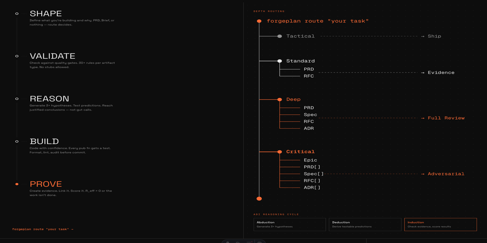
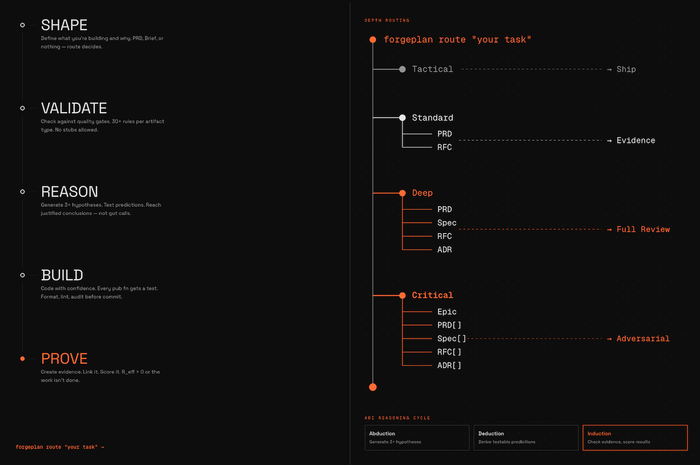
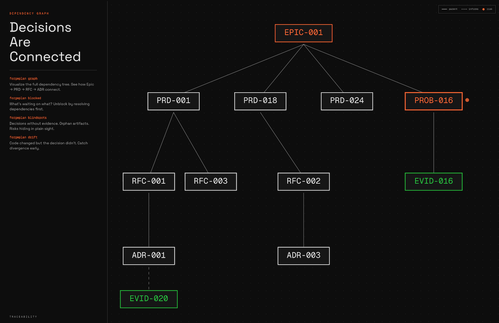

<div align="center">

# ForgePlan



### От сырой идеи до проверенного решения

**Engineering decision framework** для команд, которые хотят, чтобы их идеи оставляли след.
Структурированные артефакты (PRD, RFC, ADR, Epic, Spec), автоматический scoring качества, evidence и нативная интеграция с AI-агентами.

<br>

[](LICENSE)
[](https://github.com/ForgePlan/forgeplan/releases)
[](https://github.com/ForgePlan/forgeplan/actions)
[](.forgeplan/)

**[Сайт](https://forgeplan.dev)** ·
**[Документация](docs/README.md)** ·
**[Методология](docs/methodology/FORGEPLAN-GUIDE.md)** ·
**[Релизы](https://github.com/ForgePlan/forgeplan/releases)** ·
**[Marketplace](marketplace/)**

<br>

[English](README.md)  **·**  [Русский](README.ru.md)

<br>

</div>

---

<div align="center">

```
    ┌─────────┐    ┌────────┐    ┌────────┐    ┌───────┐    ┌────────┐    ┌──────┐
    │ OBSERVE │ ─▶ │ ROUTE  │ ─▶ │ SHAPE  │ ─▶ │ BUILD │ ─▶ │ PROVE  │ ─▶ │ SHIP │
    └─────────┘    └────────┘    └────────┘    └───────┘    └────────┘    └──────┘
     health        depth          PRD/RFC       code+test    evidence      activate
```

**Каждое решение оставляет след. Каждый след имеет доказательство. Каждое доказательство честно устаревает.**

</div>

---

## Зачем

<table>
<tr>
<td width="50%">

### До
- Решения теряются в Slack, Linear, почте
- «Почему мы выбрали X?» — тишина через полгода
- AI-агенты выдают правдоподобную, но поверхностную работу
- ADR существуют в теории, но не пишутся
- Ресёрч не доходит до реализации

</td>
<td width="50%">

### После
- Каждое решение — git-трекаемый артефакт
- Полный трейл `Problem → Decision → Consequence`
- Depth calibration заставляет нужный уровень строгости
- `forgeplan new adr` — одна команда, готово
- ADI reasoning требует 3+ гипотезы

</td>
</tr>
</table>

## Установка

```bash
# Homebrew (macOS, Linux)
brew install ForgePlan/tap/forgeplan

# Install script
curl -fsSL https://raw.githubusercontent.com/ForgePlan/forgeplan/main/install.sh | sh

# Из исходников
git clone https://github.com/ForgePlan/forgeplan.git && cd forgeplan
cargo install --path crates/forgeplan-cli
```

## Демо за 60 секунд

```console
$ forgeplan init -y
  ✓ Workspace initialized at .forgeplan/

$ forgeplan route "Добавить OAuth2 авторизацию"
  Depth:      Standard
  Pipeline:   PRD → RFC
  Confidence: 92%

$ forgeplan new prd "OAuth2 Authentication"
  ID:    PRD-001
  Next:  fill Problem, Goals, Non-Goals, Target Users, FR

$ forgeplan validate PRD-001
  Result: PASS (0 errors, 0 warnings)

$ forgeplan reason PRD-001
  Hypothesis 1: Session-based flow   (confidence: 0.6)
  Hypothesis 2: JWT with refresh     (confidence: 0.8)  ← лучшая
  Hypothesis 3: OAuth proxy service  (confidence: 0.4)

$ forgeplan new evidence "15 тестов проходят, 180ms p95 на benchmark"
$ forgeplan link EVID-001 PRD-001 --relation informs
$ forgeplan score PRD-001
  R_eff: 1.00  (Adequate)

$ forgeplan activate PRD-001
  ✓ PRD-001 (draft → active)
```

<div align="center">

</div>

## Семь вещей, которые важны

| | |
|:---|:---|
| **📝 Markdown-first** | Все артефакты — обычный markdown в git. LanceDB — производный индекс, пересобирается из файлов. |
| **🎯 Quality scoring** | `R_eff` (доверие по weakest link) и `F-G-R` (formality, granularity, reliability) — автоматически. |
| **🧭 Smart routing** | Анализирует задачу, подбирает depth и pipeline. Не надо документировать фикс тайпо. |
| **🧠 ADI reasoning** | Abduction → Deduction → Induction. Требует 3+ гипотезы перед каждым решением. |
| **🤖 MCP-native** | 37 инструментов для Claude Code, Cursor, Aider, Continue. Агенты говорят на языке методологии. |
| **🔍 Локальный семантический поиск** | fastembed (BGE-M3, 1024 dims). Без сети, без API-ключей, без утечек. |
| **⏰ Evidence decay** | Истёк `valid_until` → артефакт помечается stale. Доверие честно угасает. |

## Артефакты одним взглядом

<table>
<tr>
<th>Артефакт</th>
<th>Отвечает на</th>
<th>Когда</th>
</tr>
<tr>
<td><b>PRD</b></td>
<td>Что мы делаем и зачем?</td>
<td>Новая фича, продуктовое решение</td>
</tr>
<tr>
<td><b>RFC</b></td>
<td>Как будем делать?</td>
<td>Архитектура, API design</td>
</tr>
<tr>
<td><b>ADR</b></td>
<td>Почему выбрали именно так?</td>
<td>Необратимые технические решения</td>
</tr>
<tr>
<td><b>Spec</b></td>
<td>Какие точные контракты?</td>
<td>API контракты, data models</td>
</tr>
<tr>
<td><b>Epic</b></td>
<td>Какая большая картина?</td>
<td>Cross-cutting, мульти-PRD инициативы</td>
</tr>
<tr>
<td><b>Evidence</b></td>
<td>Это реально работает?</td>
<td>После реализации, перед активацией</td>
</tr>
</table>

Полное decision tree: [`docs/methodology/PRD-RFC-ADR-FLOW.md`](docs/methodology/PRD-RFC-ADR-FLOW.md).

<div align="center">

</div>

## Документация

Три точки входа — выбери ту, что соответствует твоей задаче сейчас.

| Я хочу... | Начать отсюда |
|---|---|
| **Изучить методологию** | [`docs/methodology/FORGEPLAN-GUIDE.md`](docs/methodology/FORGEPLAN-GUIDE.md) |
| **Посмотреть всю доку** | [`docs/README.md`](docs/README.md) |
| **Работать с AI-агентами** | [`CLAUDE.md`](CLAUDE.md) · [`AGENTS.md`](AGENTS.md) |

## Dogfood

<table>
<tr>
<td align="center"><b>138</b><br>tracked артефактов</td>
<td align="center"><b>728+</b><br>тестов проходят</td>
<td align="center"><b>33</b><br>CLI команды</td>
<td align="center"><b>37</b><br>MCP tools</td>
</tr>
</table>

Этот репозиторий использует ForgePlan для управления самим собой. Каждый PRD, RFC, ADR и Evidence лежит в
[`.forgeplan/`](./.forgeplan/) — можно просматривать напрямую или через `forgeplan list`.

## Contributing

Полный гайд — **[CLAUDE.md](CLAUDE.md)**. Краткая версия:

```bash
# Ветка из dev
git checkout dev && git pull
git checkout -b feat/my-feature

# Проходи цикл: Route → Shape → Validate → Build → Evidence → Activate
# cargo fmt + cargo test перед каждым коммитом
# PR → dev (main трогаем только через release ветки)
```

## License

MIT — см. [LICENSE](LICENSE).

<br>

<div align="center">

### Structure. Evidence. Trust.

**[→ Установить сейчас](#установка)** и запустить `forgeplan route "твоя следующая задача"`.

<br>

Построен на [Quint-code](https://github.com/m0n0x41d/quint-code) · [BMAD](https://github.com/bmadcode/BMAD-METHOD) · [OpenSpec](https://github.com/Fission-AI/OpenSpec) · [FPF](https://github.com/ailev/FPF) · [LanceDB](https://lancedb.com/) · [fastembed](https://github.com/qdrant/fastembed)

<sub>С заботой от <a href="https://github.com/ForgePlan">@ForgePlan</a> · <a href="README.md">English version</a></sub>

</div>
