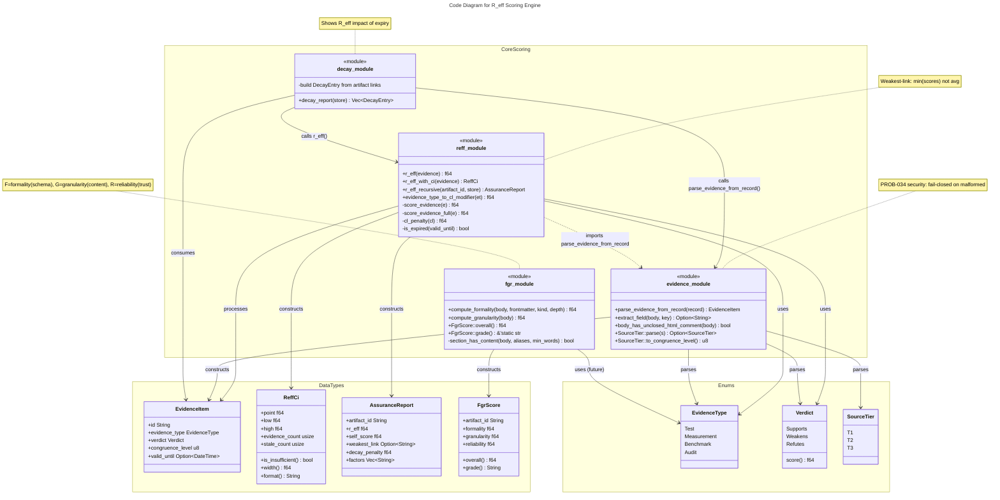

# C4 Code Level: Scoring Module (`forgeplan-core/src/scoring/`)

## Overview

- **Name**: R_eff Quality Scoring Engine
- **Description**: Core quality scoring system for Forgeplan artifacts using weakest-link principle and evidence-based trust computation
- **Location**: `/Users/explosovebit/Work/ForgePlan/crates/forgeplan-core/src/scoring/`
- **Language**: Rust
- **Purpose**: Compute artifact quality scores (R_eff = min(evidence_scores)), confidence intervals, recursive dependency analysis, and evidence decay tracking. Forms the foundation of Forgeplan's trust model for product requirements, architectural decisions, and architectural decisions records.

## Code Elements

### Core Types

#### `EvidenceType` (enum)
- **Location**: `reff.rs:11-16`
- **Purpose**: Classifies the origin/nature of evidence supporting an artifact
- **Variants**:
  - `Measurement`: Direct quantitative observation
  - `Test`: Unit/integration test results
  - `Benchmark`: Performance or comparative measurement
  - `Audit`: External review or validation
- **Used By**: `r_eff()`, `score_evidence()`, `evidence_type_to_cl_modifier()`

#### `Verdict` (enum)
- **Location**: `reff.rs:20-34`
- **Purpose**: Evidence impact classification
- **Variants**:
  - `Supports` → score 1.0
  - `Weakens` → score 0.5
  - `Refutes` → score 0.0
- **Methods**:
  - `score(&self) -> f64`: Maps verdict to numerical value

#### `EvidenceItem` (struct)
- **Location**: `reff.rs:37-44`
- **Fields**:
  - `id: String` — Evidence artifact ID (EVID-*)
  - `evidence_type: EvidenceType` — Classification
  - `verdict: Verdict` — Impact (supports/weakens/refutes)
  - `congruence_level: u8` — Trust level 0-3 (CL3=same context, CL0=opposed)
  - `valid_until: Option<NaiveDateTime>` — Expiry date for freshness penalty
- **Purpose**: Atomic unit of evidence linking to artifact quality
- **Used By**: `r_eff()`, `r_eff_with_ci()`, `r_eff_recursive()`, `score_evidence()`

#### `ReffCi` (struct — Confidence Interval)
- **Location**: `reff.rs:96-131`
- **Fields**:
  - `point: f64` — Point estimate (weakest-link min)
  - `low: f64` — Lower bound of uncertainty band
  - `high: f64` — Upper bound of uncertainty band
  - `evidence_count: usize` — Number of evidence items
  - `stale_count: usize` — Number of expired items
- **Methods**:
  - `is_insufficient(&self) -> bool` — true if < 3 evidence items
  - `width(&self) -> f64` — Confidence band width (high - low)
  - `format(&self) -> String` — Human-readable display with CL label

#### `AssuranceReport` (struct)
- **Location**: `reff.rs:185-192`
- **Purpose**: Recursive R_eff analysis including dependency chain
- **Fields**:
  - `artifact_id: String`
  - `r_eff: f64` — Final score after weakest-link aggregation
  - `self_score: f64` — Own evidence-only score
  - `weakest_link: Option<String>` — Lowest-scoring dependency
  - `decay_penalty: f64` — Impact from expired evidence
  - `factors: Vec<String>` — Trace log of scoring decisions

#### `DecayEntry` (struct)
- **Location**: `decay.rs:9-15`
- **Purpose**: Shows impact of expired evidence on a single artifact
- **Fields**:
  - `artifact_id: String`
  - `artifact_title: String`
  - `current_r_eff: f64` — With expiry penalties applied
  - `fresh_r_eff: f64` — Hypothetical score if all evidence were valid
  - `expired_evidence: Vec<ExpiredEvidence>` — List of stale items

#### `SourceTier` (enum)
- **Location**: `evidence.rs:13-42`
- **Purpose**: Evidence source authority level (maps to CL during parsing)
- **Variants**:
  - `T1` → CL3: Authoritative (code files, git log, manifests)
  - `T2` → CL2: Extracted (tests, JSDoc, CI configs)
  - `T3` → CL1: Supplementary (docs/, README, legacy)
- **Methods**:
  - `to_congruence_level(&self) -> u8` — Maps tier to CL
  - `parse(s: &str) -> Option<Self>` — Accepts "t1"/"tier1"/"tier-1"/"1" (case-insensitive)

#### `FgrScore` (struct)
- **Location**: `fgr.rs:13-44`
- **Purpose**: Computed quality triplet for artifact completeness/reliability
- **Fields**:
  - `artifact_id: String`
  - `formality: f64` — Schema compliance % (0-1)
  - `granularity: f64` — Detail density % (0-1)
  - `reliability: f64` — Trust level from R_eff (0-1)
- **Methods**:
  - `overall(&self) -> f64` — Geometric mean: (F × G × R)^(1/3)
  - `grade(&self) -> &'static str` — Letter grade A-F based on overall score
  - `fmt()` — Display trait: "F=0.85 G=0.90 R=0.75 (B)"

---

### Public Functions

#### `r_eff(evidence: &[EvidenceItem]) -> f64`
- **Location**: `reff.rs:76-85`
- **Signature**:
  ```rust
  pub fn r_eff(evidence: &[EvidenceItem]) -> f64
  ```
- **Purpose**: Core weakest-link aggregation — single score from multiple evidence items
- **Algorithm**:
  1. Empty → return 0.0
  2. For each evidence: `score = verdict.score() - cl_penalty(congruence_level)`
  3. If expired: override to 0.1
  4. Return `min(all_scores)`
- **Returns**: f64 in [0.0, 1.0]
- **Example**: `[{supports CL3}, {weakens CL3}]` → min(1.0, 0.5) = 0.5
- **Used By**: `r_eff_with_ci()`, decay reports, lifecycle workflows

#### `r_eff_with_ci(evidence: &[EvidenceItem]) -> ReffCi`
- **Location**: `reff.rs:145-177`
- **Signature**:
  ```rust
  pub fn r_eff_with_ci(evidence: &[EvidenceItem]) -> ReffCi
  ```
- **Purpose**: Compute R_eff point + uncertainty band (confidence interval heuristic)
- **Algorithm**:
  1. Point = `r_eff(evidence)` (weakest-link)
  2. Base uncertainty = 0.30 / sqrt(evidence_count), capped at 0.30
  3. Stale penalty = 0.10 per expired item, capped at 0.30
  4. Total uncertainty = (base + stale_penalty), capped at 0.50
  5. Return `[point - unc, point + unc]` clamped to [0, 1]
- **Returns**: `ReffCi` with point, low, high, evidence_count, stale_count
- **Note**: Not Bayesian — heuristic band for operator intuition ("wide CI → don't trust")
- **Used By**: Dashboard rendering, decision quality labeling

#### `r_eff_recursive(artifact_id: &str, store: &LanceStore, visited: &mut HashSet<String>) -> AssuranceReport` (async)
- **Location**: `reff.rs:227-378`
- **Signature**:
  ```rust
  pub async fn r_eff_recursive(
    artifact_id: &str,
    store: &LanceStore,
    visited: &mut HashSet<String>,
  ) -> anyhow::Result<AssuranceReport>
  ```
- **Purpose**: Recursively compute R_eff across artifact + all dependencies (transitive)
- **Algorithm**:
  1. **Cycle detection**: if `artifact_id` in `visited`, return neutral (r_eff=1.0)
  2. **Self score**: collect evidence linked in both directions (outgoing + incoming)
  3. For each evidence: apply `score_evidence_full()` (with evidence-type modifier)
  4. Self score = min(evidence_scores)
  5. **Dependencies**: traverse relations {informs, based_on, refines, depends_on}
  6. Skip draft/deprecated/superseded dependencies
  7. For each dependency: recursive call → apply CL penalty by relation type
  8. **Final score**: min(self_score, min(dep_scores)) — weakest link wins
  9. Track factors: expired items, penalties, cycle detection
- **Returns**: `AssuranceReport` with r_eff, self_score, weakest_link, decay_penalty, factors
- **Used By**: MCP `score` command, health checks, artifact quality reviews

#### `decay_report(store: &LanceStore) -> Vec<DecayEntry>` (async)
- **Location**: `decay.rs:27-120+`
- **Purpose**: Report impact of expired evidence on all artifacts with linked evidence
- **Algorithm**:
  1. Iterate all non-evidence artifacts
  2. Find linked evidence (both directions)
  3. For each artifact: compute current_r_eff (with decay) and fresh_r_eff (hypothetical)
  4. Track expired evidence list with days_expired
  5. Skip artifacts with no evidence or no expired evidence
- **Returns**: Vec of `DecayEntry` sorted by decay impact
- **Used By**: `forgeplan decay` CLI command, health dashboard

#### `compute_formality(body: &str, frontmatter: &Frontmatter, kind: &ArtifactKind, depth: &Mode) -> f64`
- **Location**: `fgr.rs:60-73`
- **Purpose**: Compute F (Formality) — schema compliance as % of validation rules passing
- **Algorithm**:
  1. Run validation::validate() on artifact
  2. Formality = passed_checks / (passed_checks + failed_checks)
  3. If total == 0, return 1.0 (empty artifact counts as valid)
- **Returns**: f64 in [0.0, 1.0]
- **Used By**: `FgrScore` construction

#### `compute_granularity(body: &str) -> f64`
- **Location**: `fgr.rs:76-120+`
- **Purpose**: Compute G (Granularity) — % of expected sections with real content (>N words)
- **Checks** (per artifact kind):
  - Problem/Motivation section (>20 words)
  - Goals/Success Criteria (>10 words)
  - FR/Requirements with checkboxes
  - Implementation plan / phasing
  - Evidence/test section
- **Returns**: f64 in [0.0, 1.0] as count_satisfied / count_checks
- **Used By**: `FgrScore` construction

#### `evidence_type_to_cl_modifier(et: &EvidenceType) -> f64`
- **Location**: `reff.rs:197-204`
- **Purpose**: Evidence-type penalty (used in recursive R_eff only)
- **Mapping**:
  - Test, Measurement → 0.0 (same context, no penalty)
  - Benchmark → 0.1 (slight penalty)
  - Audit → 0.2 (larger penalty, external review)
- **Used By**: `score_evidence_full()` in recursive engine only

#### `parse_evidence_from_record(record: &ArtifactRecord) -> EvidenceItem`
- **Location**: `evidence.rs:57-152`
- **Purpose**: Extract evidence metadata from artifact body markdown
- **Parsing**:
  1. Extract structured fields: `verdict:`, `evidence_type:`, `congruence_level:`, `source_tier:`
  2. Skip HTML comments (single & multi-line) and markdown table rows (template placeholders)
  3. **CL precedence** (PRD-035 security):
     - If both `source_tier` and `congruence_level`: use MIN (explicit downgrade wins)
     - If only `source_tier`: map to CL
     - If only `congruence_level`: use it
     - Default: CL3 (same context)
  4. Fail-closed to CL0 if:
     - `congruence_level` field present but unparseable
     - Unclosed `<!--` comment block (swallows all fields below)
- **Returns**: `EvidenceItem` with parsed verdict, type, CL, valid_until
- **Guards** (PROB-034, PROB-035):
  - Detects unclosed HTML comments in body
  - Validates congruence_level is u8 in [0..=3]
  - Prevents trust-inflation attacks via auto-tier bypass
- **Used By**: `r_eff()`, `r_eff_recursive()`, decay reporting

#### `extract_field(body: &str, key: &str) -> Option<String>`
- **Location**: `evidence.rs:200-237`
- **Purpose**: Parse single structured field from markdown (key: value)
- **Skips**:
  - Multi-line HTML comments (`<!--` ... `-->`)
  - Markdown table rows (lines starting with `|`)
- **State machine**: Tracks unclosed `<!--` across lines
- **Returns**: First match of `key:` or None
- **Used By**: `parse_evidence_from_record()`

#### `body_has_unclosed_html_comment(body: &str) -> bool`
- **Location**: `evidence.rs:183-198`
- **Purpose**: Detect malformed markdown that would shadow structured fields (PROB-034 F1)
- **Returns**: true if body has opening `<!--` with no matching `-->`
- **Used By**: `parse_evidence_from_record()` for fail-closed CL0

---

### Internal Functions

#### `score_evidence(e: &EvidenceItem) -> f64` (private)
- **Location**: `reff.rs:65-73`
- **Purpose**: Compute single evidence score (no type modifier — backward compatible)
- **Algorithm**: `(verdict.score() - cl_penalty(congruence_level)).max(0.0)`, or 0.1 if expired
- **Used By**: `r_eff()` only (flat mode)

#### `score_evidence_full(e: &EvidenceItem) -> f64` (private)
- **Location**: `reff.rs:209-217`
- **Purpose**: Compute evidence score with evidence-type modifier (recursive engine)
- **Algorithm**: `(verdict.score() - cl_penalty(congruence_level) - evidence_type_to_cl_modifier()).max(0.0)`
- **Used By**: `r_eff_recursive()` only

#### `cl_penalty(cl: u8) -> f64` (private)
- **Location**: `reff.rs:47-55`
- **Purpose**: Map congruence level to penalty
- **Mapping**: CL0→0.9, CL1→0.4, CL2→0.1, CL3→0.0
- **Used By**: `score_evidence()`, `score_evidence_full()`

#### `is_expired(valid_until: Option<NaiveDateTime>) -> bool` (private)
- **Location**: `reff.rs:57-62`
- **Purpose**: Check if evidence timestamp has passed current time
- **Returns**: true if `Utc::now() > valid_until`
- **Used By**: `score_evidence()`, `r_eff_with_ci()`, decay report

#### `section_has_content(body: &str, aliases: &[&str], min_words: usize) -> bool` (private)
- **Location**: `fgr.rs:120+`
- **Purpose**: Check if markdown section exists and has N+ words (for granularity)
- **Used By**: `compute_granularity()`

---

## Dependencies

### Internal Dependencies

- **`crate::db::store`**:
  - `ArtifactFilter` — Filter query for listing records
  - `LanceStore` — Database interface (async)
  - `ArtifactRecord` — Artifact metadata + body
  - Methods: `list_records()`, `get_record()`, `get_relations()`, `get_incoming_relations()`

- **`crate::artifact`**:
  - `frontmatter::Frontmatter` — YAML metadata
  - `types::{ArtifactKind, Mode}` — Artifact classification + depth level

- **`crate::validation`** — Schema compliance checking for Formality

- **`crate::fpf::core::config`** — ReliabilityWeights (future weighting engine)

### External Dependencies

- **`chrono`**:
  - `NaiveDateTime` — Date parsing for evidence.valid_until
  - `Utc` — Current time for expiry checks
  - `NaiveDate` — Date-only parsing

- **`serde`**:
  - `Serialize`, `Deserialize` — JSON serialization for API/storage
  - Enums/structs: `#[serde(rename_all = "snake_case")]` for API consistency

- **`std::collections::HashSet`** — Cycle detection in recursive R_eff

---

## Module Exports (`mod.rs`)

```rust
pub mod decay;     // DecayEntry, decay_report()
pub mod evidence;  // EvidenceItem parsing, SourceTier, extract_field()
pub mod fgr;       // FgrScore, compute_formality(), compute_granularity()
pub mod reff;      // r_eff(), r_eff_with_ci(), r_eff_recursive(), EvidenceType, Verdict
```

---

## Relationships & Call Graph



---

## Key Design Patterns

1. **Weakest-Link Principle**: R_eff = min(evidence_scores), never average. Single weak evidence pulls down entire score.

2. **Evidence Decay**: Expired evidence automatically scored 0.1 (penalty, not absent). Prevents trust from disappearing at exact expiry moment.

3. **Congruence Levels (CL)**: Trust model reflecting evidence source relationship to artifact:
   - CL3 (same context): local tests, direct measurements
   - CL2 (related): extracted from CI config, docs
   - CL1 (supplementary): legacy documentation, README
   - CL0 (opposed): contradicting evidence, external attack surface

4. **Fail-Closed Security** (PROB-034, PROB-035):
   - Malformed evidence body → CL0 penalty (0.9), not silent CL3 default
   - Explicit operator downgrade always wins over auto-tier mapping
   - Prevents trust-inflation attacks via corrupted metadata

5. **Recursive Dependency Analysis**:
   - Traverses artifact links (informs, based_on, refines, depends_on)
   - Applies relation-type-specific CL penalties
   - Skips draft/deprecated/superseded to avoid stale score drag
   - Cycle detection via visited set

6. **Confidence Interval Heuristic** (not Bayesian):
   - Uncertainty widens with sparse evidence (N=1 → ±0.30)
   - Uncertainty tightens with dense evidence (N=9 → ±0.10)
   - Stale items add +0.10 penalty per item (capped +0.30)
   - For operator intuition: "wide CI → question the score"

---

## Testing

- **341 unit tests** across reff/evidence/fgr/decay modules
- **Test coverage**:
  - `r_eff()` weakest-link semantics (empty, single, multiple, mixed verdicts)
  - CL penalties and clamping to [0, 1]
  - Evidence expiry and decay
  - ReffCi construction and formatting
  - `parse_evidence_from_record()` security (PROB-034, PROB-035)
  - `extract_field()` multi-line comment handling
  - `compute_formality()` and `compute_granularity()`
  - FgrScore grade assignment (A-F)

- **Key security tests**:
  - Unclosed HTML comment → fail-closed to CL0
  - Unparseable congruence_level → CL0 + warning
  - source_tier + explicit downgrade → min wins
  - Template placeholder isolation (table rows ignored)

---

## Notes

- **Artifact integration**: Scoring is read-only on artifact body and links. No mutations to store.
- **Async boundary**: Only `r_eff_recursive()` and `decay_report()` require async (database access). Core `r_eff()` is pure.
- **Evidence linking**: Both directions (outgoing + incoming relations) counted to handle evidence that informs vs. is informed by artifacts.
- **Relation types**: "informs" (CL2), "based_on" (CL2), "refines" (CL3), "depends_on" (CL3) used to weight dependency penalties.
- **v0.25.0+**: Evidence-type modifier added in recursive engine (PR #211). Backward-compatible: flat `r_eff()` unchanged.
