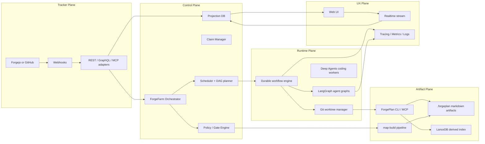
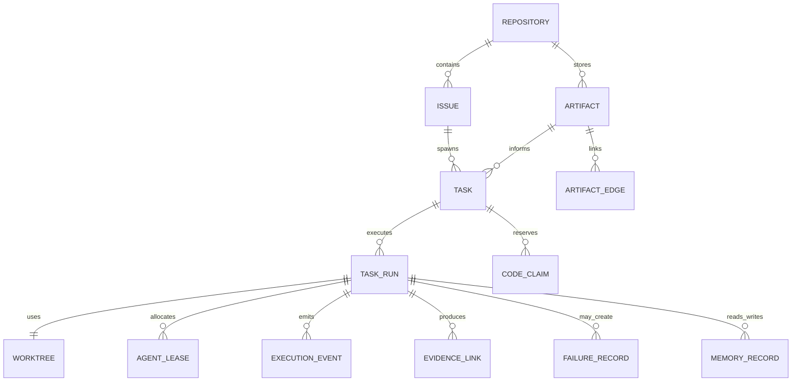
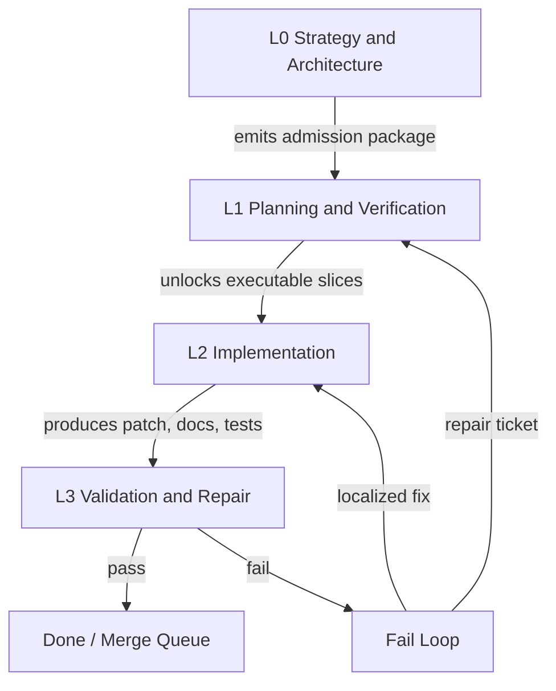
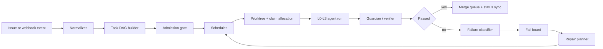

# ForgeFarm как production-ready оркестратор поверх ForgePlan

## Исполнительный обзор

На сегодня у вас уже есть сильное ядро для артефактов: ForgePlan позиционируется как local-first Rust CLI и MCP-сервер, хранит артефакты markdown-first в `.forgeplan/`, использует LanceDB как производный индекс, умеет quality scoring через `R_eff`, поддерживает evidence lifecycle, route/validate/activate цикл и нативную интеграцию с AI-агентами. Сам репозиторий ForgePlan использует собственную `.forgeplan/` директорию, CI-гейты, hook-слой и marketplace с `/smith`, агентными паками, browser viewer’ом и четырехслойной моделью `Orchestra → Forgeplan → FPF → SPARC`. Это означает, что вам не нужно перепридумывать artifact core; нужно строить **control plane** вокруг него. citeturn21view0turn13search5turn13search6turn14search2turn18search1turn23search0turn32search0turn34search2

Рекомендуемая целевая форма — **ForgeFarm** как отдельный оркестратор и control plane, а **ForgePlan** — как system of record для PRD/ADR/RFC/Spec/Evidence/Map-артефактов. В этой схеме ForgeFarm не хранит «истину» об артефактах у себя, а строит **read model / projection** для канбана, очередей, агентных запусков, метрик, fail-loop и UI. Для долгоживущих workflow, retries и human-in-the-loop лучше опираться на durable workflow engine; для собственно agent-графов и L0–L3 reasoning — на специализированный agent runtime. Из первоисточников лучше всего этому соответствуют Temporal для durable execution и LangGraph для агентной оркестрации с persistence, interrupts и subgraphs; Deep Agents стоит использовать выборочно, прежде всего для L2/L3 кодовых исполнителей с isolated context и filesystem backends. citeturn9search4turn9search8turn7search6turn7search8turn7search0turn7search3turn25search4turn25search1turn25search15

Ключевое продуктовое решение — **не превращать Forge/Git issues в единственный runtime-state**. Issues хороши как внешний трекер и входная шина, но плохи как трансакционный workflow engine: они предназначены для планирования и обсуждения, а не для лизинга задач агентам, конфликт-менеджмента worktree, частых state transition и fail-loop orchestration. Forgejo и GitHub дают issues, webhooks, scoped tokens, Actions и API, но сам runtime-state правильнее держать в отдельной projection БД, а обратно в Forge/GitHub синхронизировать лишь статус, summary, evidence links и PR references. citeturn15search0turn15search1turn15search2turn15search12turn15search14turn15search24turn33search1turn33search2turn33search3turn33search6turn33search13

Главная архитектурная рекомендация: **монорепозиторий для продукта и `.forgeplan/` в том же репозитории**, а не submodule для инстанс-артефактов. Git submodule — это вложенный репозиторий с собственным history, который суперпроект фиксирует как конкретный commit; это полезно для внешних shared packs, templates и reusable compositions, но неудобно для ежедневной атомарной связки «код + артефакт + evidence + PR». Для полиглотного монорепо у вас уже есть практическая почва: и `pnpm` workspaces, и `moon` документируют встроенную поддержку monorepo / dependency graph / topological parallel tasks. Поэтому `.forgeplan/` лучше хранить рядом с кодом, а **общие pack’и** — публиковать отдельно и подключать package/submodule/tree-mirror способом. citeturn26search6turn26search0turn26search3turn26search1turn26search2turn26search5

Итоговая ставка: **ForgeFarm = orchestrator/UI/projection plane**, **ForgePlan = artifact kernel**, **Forgejo/GitHub = ingress/egress plane**, **Temporal + LangGraph = runtime plane**, **Postgres + pgvector = control-plane storage**, **LanceDB = локальный derived index ForgePlan**, **Qdrant/LightRAG/Mem0 = опциональные memory overlays**, **Kubernetes + Argo CD + OTel/Prometheus/Tempo = ops plane**. Это дает production-ready путь без избыточной переизобретательности. citeturn17search6turn10search0turn10search2turn10search3turn10search11turn29search1turn29search4turn29search11turn9search7turn16search2turn16search19turn9search2turn9search6

## Что в текущей концепции недодумано и как это закрыть

### Перепутаны источники истины

Сейчас в описании смешаны как минимум четыре разных типа сущностей: исходные задачи в Forge issues, артефакты ForgePlan в `.forgeplan/`, досочные статусы выполнения и внутренние runtime-состояния агентных запусков. Если оставить это без разведения, вы получите постоянный drift: issue показывает одно, board — второе, artifact graph — третье, агентный ран — четвертое. ForgePlan сам явно строится вокруг git-tracked markdown artifacts и derived index, а marketplace уже разделяет «где задача», «что делать», «как думать», «как кодить». Поэтому нужен жесткий source-of-truth contract: **artifact truth = `.forgeplan/`**, **planning truth = issue/project item**, **execution truth = ForgeFarm runtime DB**, **observability truth = event/trace store**. citeturn21view0turn13search6turn32search0turn34search2

### L0–L3 пока описаны как «уровни силы модели», а не как контракт ролей

Если L0–L3 различать только по мощности модели, система очень быстро станет хаотичной. Уровни должны различаться по **допустимому типу действий, артефактам, SLA, цене ошибки и required evidence**. Рекомендуемый контракт такой: L0 делает decomposition, roadmap, PRD/RFC/ADR admission и dependency planning; L1 делает specification, reviews, map-build, policy/gate reasoning; L2 производит код и документацию в worktree; L3 валидирует, чинит, собирает evidence и замыкает fail-loop. Тогда модель — лишь параметр `capability_class`, а не сущность архитектуры. Это лучше согласуется и с ForgePlan lifecycle, и с LangGraph/Deep Agents, где важны discrete steps, isolated context и persistent state, а не просто «умнее-глупее модель». citeturn21view0turn7search11turn25search4turn25search1turn25search17

### Нет формального механизма параллельности и file-claims

В исходной концепции сказано, что оркестратор «сам определяет, где параллельно, где последовательно», но не сказано **по каким данным**. Это критическая дыра. Параллелизм должен опираться на DAG зависимостей, artifact links, code-ownership / file-claims и тип операции. Git worktree позволяет держать несколько рабочих деревьев на одном репозитории, но сам по себе не решает конфликтную запись. Поэтому ForgeFarm нужен **Claim Manager**: перед L2-run агент резервирует path-globs или ownership-зоны; если claims конфликтуют — задача либо сериализуется, либо переносится в speculative branch lane с обязательным later rebase+verify. Иначе реальный результат будет не «агенты работают параллельно», а «агенты параллельно создают merge-хаос». citeturn12search0turn12search1turn26search5turn27search6

### Fail-loop описан визуально, но не как state machine

Ваша идея с отдельной fail-доской правильная, но без четкой политики это станет свалкой. У fail-loop должны быть: `failure_class`, `retry_budget`, `repair_strategy`, `owner_level`, `human_required`, `quarantine_reason`, `reentry_condition`. Для production лучше не собирать это вручную на очередях и cron’ах: durable workflow engine нужен именно здесь, потому что retries, pauses и manual approvals — это штатный сценарий, а не edge case. Temporal прямо документирует workflow execution как durable execution; LangGraph — persistence, interrupts и resume semantics. Это хороший сигнал в пользу гибридной схемы: глобальный fail-loop на Temporal, локальные repair graphs на LangGraph. citeturn9search4turn9search8turn7search8turn7search0turn25search15

### Недостаточно продумана память

«Подрубать hindsight или gra rag light rag» — это правильное направление, но сейчас это выглядит как один общий мешок. Память надо разделить минимум на четыре слоя: **working memory** для текущего run/thread, **episodic memory** для завершенных запусков и retrospective, **semantic memory** для устойчивых фактов и project conventions, **artifact memory** для решения, которое уже фиксировано в ForgePlan. Это важно, потому что не вся память должна становиться артефактом, и не вся семантика должна жить в векторной БД. Mastra, VoltAgent, LangGraph и Mem0 все документируют memory/persistence по-разному, а Mem0 отдельно разводит factual / episodic / semantic memory. Практический вывод: ForgePlan остается носителем formal memory, working/episodic можно держать в runtime layer, а LightRAG включать только для knowledge-graph retrieval поверх extracted graph, а не как общий primary store. citeturn18search0turn7search8turn7search16turn24search15turn8search1turn8search9turn29search4turn10search3turn10search7

### Слишком рано появляется идея submodule для `.forgeplan`

Для shared packs / marketplace compositions submodule нормален, но для project instance это почти всегда ухудшает DX: отдельное обновление submodule-pointer, более сложный clone workflow, дополнительный режим ошибок в CI и сложнее code review по «task → artifact → code». Git прямо определяет submodule как embedded repository с отдельной историей, а не как folder with shared semantics. Поэтому `/.forgeplan` как instance-state лучше оставить in-repo, а reusable components — `packages/forgefarm-compositions`, `packages/forgefarm-schemas`, `marketplace/` и optional submodules только там, где реально нужен независимый lifecycle. citeturn26search6turn26search0turn26search3

### Не хватает продуктовой модели экранов и эксплуатационных сценариев

Сейчас описан «красивый UI с досками и real-time», но не сформулировано, кто и зачем туда приходит. Для production продукта нужны хотя бы семь отчетливых surface areas: **Control Room**, **Board View**, **Artifact Graph**, **Run Timeline**, **Fail Lab**, **Memory Explorer**, **Governance Console**. Иначе UI рискует остаться декоративной надстройкой над REST API. Marketplace уже указывает на browser viewer с graph exploration и time-travel; ForgeFarm должен сделать следующий шаг и объединить artifact graph с runtime graph. citeturn32search0turn32search1

### map-pack критичен, но должен быть строго отделен от общей агентной болтовни

Заданный вами pattern для `map-build` на самом деле очень зрелый: отдельные scratch-файлы для параллельных сканеров, единый `map-emitter`, deterministic guardian, append-only refresh и hash IDs. Самое слабое место здесь — человеческий соблазн «дать оркестратору тоже что-то подправить в `map.json`». Этого нельзя делать. Для `map.json` должна действовать rule-set старше любых other writes: **single writer, atomic temp-rename, stable ordering, deterministic guardian, advisory LLM only after deterministic pass**. На уровне governance это должен проверять и hook, и runtime policy, и CI. В этом месте ваша исходная идея уже сильная; ее нужно не упрощать, а сделать эталоном для всех критичных emitted artifacts.

## Референсная архитектура ForgeFarm

### Общая модель слоев

Marketplace ForgePlan уже пользуется четырехслойной ментальной моделью: `Orchestra — где задача`, `Forgeplan — что делать`, `FPF — как думать`, `SPARC — как кодить`. Для ForgeFarm это очень удачная отправная точка, если заменить Orchestra на более общий tracker/control plane. citeturn32search0turn34search2



Архитектурный смысл этой схемы такой: tracker plane поставляет события и исходные задачи; artifact plane отвечает за formalized engineering memory; control plane решает очередность, допуски, агентные пулы и конфликты; runtime plane исполняет долгие процессы и worktree-based coding; UX plane показывает людям projection, а не напрямую сырые git/issue записи. Такой разрез согласуется и с ForgePlan, и с durable workflow / agent runtime экосистемой, и с требованием reproducibility. citeturn21view0turn13search6turn9search4turn7search6turn25search4

### Канонические сущности



Практический контракт по сущностям должен быть таким. `Issue` — внешний planning item. `Artifact` — formal object в `.forgeplan/`. `Task` — нормализованная единица работ оркестратора. `TaskRun` — конкретный execution attempt с дедлайном, owner lane и policy snapshot. `AgentLease` — выделение из пула L0–L3 ресурсов. `CodeClaim` — резерв path-globs/modules. `FailureRecord` — запись о попадании в fail-loop. `MemoryRecord` — working/episodic/semantic recall. Это разрывает вредную связку «одна issue = один run = один статус = один агент». citeturn15search1turn15search2turn33search1turn21view0

### Уровни агентов



Рекомендованный operational контракт по уровням:

| Уровень | Что делает | Что не имеет права делать | Модельный профиль |
|---|---|---|---|
| L0 | Decomposition, PRD/RFC/ADR admission, sequencing, epic slicing, dependency graph | Прямо писать production code | лучшие reasoning-модели, низкая параллельность |
| L1 | Spec review, map-build, typed verification, policy reasoning, quality gates | Пушить merge-ready code без L3 | сильные модели, умеренная параллельность |
| L2 | Код, тесты, docs, migrations в isolated worktree | Менять policy, bypass gates, править critical emitted files | средний ценовой класс, высокая параллельность |
| L3 | Test, static analysis, evidence, patch review, fail classification, merge preparation | Делать архитектурные решения без артефакта | дешевые/быстрые модели + deterministic tools |

Эта модель хорошо ложится на ForgePlan cycle `Observe → Route → Shape → Build → Prove → Ship`, на SPARC/BMAD-подходы в marketplace и на agent runtimes, которые умеют isolated subagents и interrupts. citeturn21view0turn23search1turn34search2turn25search1turn25search4

### Продуктовые поверхности интерфейса

| Экран | Что показывает | Зачем нужен владельцу |
|---|---|---|
| Control Room | активные runs, utilization агентов, queue depth, SLO, token/cost burn | видеть состояние системы в реальном времени |
| Board View | backlog, ready, in-progress, review, verify, fail, done | управлять потоком работы и наблюдать bottleneck’и |
| Artifact Graph | PRD/ADR/RFC/Spec/Evidence/Map graph, supersede-chain, dependencies | проверять полноту инженерной мысли |
| Run Timeline | trace каждого task-run, tool calls, approvals, retries, outputs | дебаг и аудит |
| Fail Lab | failure classes, quarantine, retry budget, repair candidates | быстро разруливать системные сбои |
| Memory Explorer | working / episodic / semantic recall и provenance | понимать, что агент «помнит» |
| Governance Console | policies, hooks, write gates, allowed tools, signer status | управлять безопасностью и комплаенсом |

Важное продуктовое правило: board-колонки в UI должны быть **projection runtime-state**, а не прямое отображение label-ов issue tracker’а. В issue tracker можно зеркалить summary-status для человека, но machine state должен жить отдельно; это единственный способ сделать надежные leases, fail-loop и replay. citeturn15search1turn15search11turn33search13turn31search0turn24search7turn8search20

### Поток задачи



`Normalizer` обязан собрать единый task envelope из issue metadata, links на артефакты ForgePlan, текущего graph state и policy snapshot. `Admission gate` решает, можно ли задачу вообще исполнять: есть ли обязательные артефакты, пройдена ли project readiness, не заблокирована ли задача зависимостями, не пересекаются ли claims. Уже после этого задача попадает в agent pool. Такой pipeline ближе к BMAD/SPARC gating culture в marketplace, чем к «агенты сами почитают доску и как-нибудь разберутся». citeturn23search1turn18search1turn34search2

## Рекомендованный стек и библиотеки

### Базовая технологическая ставка

Ниже — не «единственно возможный» стек, а **рекомендуемый production baseline**, который лучше всего совмещает ваш Rust artifact core, нынешнюю TS-экосистему и зрелые agent-framework первоисточники.

| Слой | Рекомендация | Почему | Источник |
|---|---|---|---|
| Artifact kernel | ForgePlan CLI/MCP на Rust | markdown-first artifacts, MCP install, quality gates, local semantic search, evidence lifecycle | citeturn21view0turn13search5turn13search6turn14search2 |
| Durable workflow | Temporal | durable workflow execution, retries, pause/resume, long-running orchestration | citeturn9search4turn9search8 |
| Agent runtime | LangGraph | persistence, interrupts, subgraphs, durable execution semantics | citeturn7search6turn7search8turn7search0turn7search3 |
| High-level agents | LangChain `create_agent` | более высокий уровень поверх LangGraph для быстрых specialist agents | citeturn7search4turn7search9turn7search21 |
| Coding workers | Deep Agents selectively | subagents, filesystem backends, long-term memory, context offloading, human approval | citeturn25search4turn25search1turn25search6turn25search15 |
| UI/API in TS | Next.js App Router + server components | full-stack app router и production web app baseline | citeturn27search0turn27search8 |
| Board / graph UI | TanStack Query + React Flow + dnd-kit | server-state cache, node-based graph UI, accessible drag-drop | citeturn27search5turn27search6turn27search19 |
| Realtime/integration | WebSocket/SSE; optional reuse of `@gertsai/ws-rpc` | в `gertsai/shared` уже есть ws-rpc и API primitives | citeturn6view0 |

### Почему не делать ставку только на один агентный фреймворк

| Фреймворк | Сильные стороны | Где я бы использовал | Где не делал бы source of truth | Источник |
|---|---|---|---|---|
| LangGraph | persistence, interrupts, subgraphs, durable agent orchestration | L0/L1 reasoning graphs, repair loops, HITL checkpoints | глобальная scheduling/lease/multi-service workflow truth | citeturn7search6turn7search8turn7search0turn7search3 |
| Deep Agents | planning, skills, subagents, filesystem, isolated context | L2 coding executors, specialist reusable skills | центральный enterprise orchestrator и policy DB | citeturn25search4turn25search1turn25search6turn25search19 |
| Mastra | TypeScript-first, memory, MCP, observability, deployable server/studio | быстрые TS agents, internal tools, MCP-heavy specialists | сервер durable workflow общего уровня | citeturn24search2turn24search3turn24search7turn24search15 |
| VoltAgent | workflows, memory, RAG, guardrails, observability-first TS platform | self-hosted agent services, console-centric teams | главный workflow kernel для критичных long-running path’ов | citeturn8search0turn8search4turn8search20turn8search23turn8search25 |
| LangChain | high-level agent harness, middleware, provider portability | быстрые assistants / reviewers / adapters | низкоуровневый runtime-control при сложных graphs | citeturn7search4turn7search9turn7search18 |

Мой инженерный вывод из этой матрицы: **не выбирать один «магический» фреймворк**, а собрать стек по обязанностям. Temporal отвечает за workflow durability; LangGraph — за сложные decision/execution graphs; Deep Agents — за кодовые workers с filesystem discipline; Mastra/VoltAgent можно включать как TS-first сервисы, если вам нужен отдельный слой агентных приложений или self-hosted observability UI поверх некоторых lane’ов. citeturn9search4turn7search6turn25search4turn24search7turn8search20

### Storage и memory

| Компонент | Роль в ForgeFarm | Когда выбирать | Источник |
|---|---|---|---|
| `.forgeplan/` + LanceDB | source-of-truth artifacts + local derived semantic index | всегда, как artifact core | citeturn21view0turn13search6turn17search6turn17search9 |
| PostgreSQL + pgvector | operational DB + vector recall + joins | baseline для control plane и общей memory-проекции | citeturn10search0 |
| Qdrant | dense+sparse+multivector hybrid retrieval, advanced ranking | если общий RAG слой станет большим и search-heavy | citeturn10search2turn10search6 |
| LightRAG | graph-enhanced retrieval поверх extracted code/artifact graph | для hindsight и graph-centric recall, не как primary truth | citeturn10search3turn10search7turn10search11turn10search19 |
| Mem0 | long-term memory API / server для user/agent/entity scoped memory | если нужен выделенный memory service с REST и типами памяти | citeturn29search1turn29search4turn29search6turn29search11 |

Рекомендация по умолчанию: **держать formal truth в ForgePlan**, **operational truth в Postgres**, **vector memory сначала в pgvector**, **Qdrant включать только при росте retrieval-нагрузки**, **LightRAG — как optional graph retrieval overlay**, **Mem0 — только если нужна отдельная self-hosted memory-служба с внешним API**. Это дешевле и проще эксплуатационно, чем сразу собирать зоопарк хранилищ. citeturn10search0turn10search2turn10search3turn29search6

### Репозиторная топология

| Вариант | Плюсы | Минусы | Рекомендация | Источник |
|---|---|---|---|---|
| Один monorepo, `.forgeplan/` внутри | атомарные PR для кода и артефактов, проще CI, проще review | repo крупнее | **основной вариант** | citeturn26search1turn26search2turn26search5 |
| `.forgeplan` как git submodule | независимый lifecycle artifact repo | более сложный clone/update, split review, extra failure modes | **не для project instance** | citeturn26search6turn26search0turn26search3 |
| Shared packs как submodule/package | независимая версия marketplace/spec-pack | нужен versioning contract | **да, для reusable packs** | citeturn26search6turn18search1 |

### Что стоит переиспользовать из `gertsai/shared`

Репозиторий `gertsai/shared` уже декларирует готовые OSS-инфраструктурные пакеты: `@gertsai/queue` как BullMQ wrappers, `@gertsai/otel`, `@gertsai/pg-client`, `@gertsai/ws-rpc`, `@gertsai/hsm`, `@gertsai/auth-openfga`, `@gertsai/api-core` и готовый reference stack с Postgres + pgvector + OpenFGA + Redis + Ollama. Это очень хороший кандидат на reuse в ForgeFarm control plane, особенно если вы хотите не изобретать заново tracing bootstrap, API primitives и auth/storage abstractions. Но я бы использовал `@gertsai/queue` для **secondary jobs** — нотификации, индексеры, projection rebuilds — а не как главный engine task orchestration. citeturn6view0

### Rust-часть стека

Для низкоуровневой части ForgeFarm, которая будет взаимодействовать с git/worktree, ForgePlan CLI/MCP, scanners, guardians и atomic file writes, наиболее практична классическая Rust-сборка:

| Компонент | Рекомендация | Почему | Источник |
|---|---|---|---|
| Async runtime | Tokio | canonical async runtime, I/O, scheduling, networking | citeturn28search1turn28search17 |
| HTTP API | Axum | ergonomic modular HTTP, Tower middleware ecosystem | citeturn28search0turn28search8 |
| DB access | SQLx | async Rust SQL, compile-time checked queries | citeturn28search2turn28search10 |
| Internal RPC | Tonic | high-performance gRPC over HTTP/2 для worker control | citeturn28search3turn28search15 |

## План реализации и риск-регистр

### Фазовый план

| Фаза | Что делаем | Выход | Размер |
|---|---|---|---|
| Foundation | monorepo, control plane skeleton, Postgres schema, Forge/Git adapter, `.forgeplan/` contract, worktree manager | пустой, но runnable ForgeFarm control plane | M |
| Projection and boards | webhook ingestion, issue normalizer, board projection, UI Control Room/Board View, realtime events | живая доска и статусы run’ов | M |
| Execution kernel | Temporal workflows, claims, leases, worktree isolation, L2 coding lane, basic fail-loop | первые end-to-end automated task runs | L |
| Reasoning lanes | L0/L1 graphs, admission gates, reviewer/guardian lane, artifact readiness policies | controlled planning-to-execution pipeline | L |
| Map pack | scanners, zone-extractor, edge-verifier, map-emitter, guardian, append-refresh, deterministic tests | production-ready `map-build` pipeline | M |
| Memory and hindsight | episodic/semantic memory, provenance, LightRAG optional, hindsight UI | contextual recalls without polluting artifacts | M |
| Hardening | SLSA/Cosign, CODEOWNERS, OTel, Tempo, Prometheus, Argo CD, DR/backups, multi-tenant auth | production hardening and governance | L |

### На чем нельзя экономить

Самые критичные куски — это не UI и даже не L0 reasoning, а: **claims/worktree isolation**, **deterministic gates**, **projection design**, **artifact-source-of-truth contract**. Если эти четыре вещи сделаны слабо, все остальное будет красивой, но ненадежной оболочкой. Это особенно верно для `map-build`, где single-writer and guardian pattern должны быть соблюдены буквально. Производственные источники по durable execution, workflow retries, issue/webhook APIs и git worktrees здесь важнее любой «волшебной модели». citeturn9search8turn15search0turn15search2turn12search0turn14search2

### Основные риски и mitigation

| Риск | Почему это опасно | Mitigation |
|---|---|---|
| Drift между issue/board/artifact/run | владельцы увидят разные истины | жёсткий source-of-truth contract + projection DB |
| Merge conflicts от агентов | параллельные worktree без claims | path claims, ownership zones, merge queue |
| Бесконечный fail-loop | ремонт без budget и quarantine | retry budget, failure classes, human gate |
| Prompt/tool abuse | агент «догадывается» и обходит policy | fail-closed hooks, scoped tools, approval matrix |
| Переусложнение memory | каждая мысль превращается в knowledge base | 4 memory tiers + provenance + TTL |
| Нерепродуцируемый `map.json` | разные прогоны дают разные сетки | single writer, stable order, append-only refresh |
| Слишком ранняя ставка на submodule | ухудшение DX и CI | оставить `.forgeplan/` in-repo |
| Завязка на один agent framework | vendor/runtime lock-in | split by responsibility: Temporal + LangGraph + optional TS services |

## CI CD, безопасность и governance

### CI/CD контур

ForgePlan уже демонстрирует важную культуру: `forgeplan health`, `forgeplan validate --ci`, drift detector для MCP tool count, pre-commit hooks, rebuild index и проверка artifact quality в CI. Forgejo Actions хранит workflow в `.forgejo/workflows`, а при отсутствии директории может читать `.github/workflows`; GitHub Actions тоже декларативен через YAML workflow syntax. Это облегчает dual-target CI: один и тот же pipeline можно поддерживать под обе forge-платформы. citeturn14search2turn15search4turn15search14turn16search0

```mermaid
flowchart LR
    A[Push or PR] --> B[Format and lint]
    B --> C[Unit and integration tests]
    C --> D[ForgePlan health and validate]
    D --> E[Projection rebuild]
    E --> F[map-build scratch scanners]
    F --> G[edge verify and map emit]
    G --> H[deterministic guardian]
    H --> I[artifact diff and reproducibility test]
    I --> J[image signing and provenance]
    J --> K[Deploy to staging]
    K --> L[policy approval]
    L --> M[Argo CD production sync]
```



### Security baseline

Для ingress нужно использовать только подписанные webhooks и scoped access tokens. Forgejo документирует scoped token routes и runner selection для Actions; GitHub — webhooks, REST/GraphQL APIs и project automation. На уровне политики нужно сделать три класса действий: `read`, `safe-write`, `privileged-write`. `privileged-write` включает merge, branch protection override, deploy, secret rotation, schema migration, `map.json` final emit, destructive edits и mass updates; для него обязателен either human approval, либо deterministic guardian pass + policy rule. citeturn15search12turn15search24turn15search0turn33search3turn33search7turn33search13

Для поставки артефактов и контейнеров полезно поднять минимум до signed artifacts и provenance: SLSA описывает provenance/build levels, Cosign — container signing, а CODEOWNERS позволяет формально закрепить владение критичными каталогами и эмиттерами. Для ForgeFarm это особенно важно для `schemas/`, `hooks/`, `policies/`, `map-emitter`, `guardian` и `merge-queue`. citeturn12search2turn12search5turn12search6turn12search1

### Наблюдаемость

Для инфраструктурной наблюдаемости используйте OpenTelemetry JavaScript SDK, Prometheus Operator и Grafana Tempo. Если вы пойдете в LangGraph/LangChain lane, можно дополнительно включить LangSmith как LLM-specific observability/evals layer; если выберете Mastra lane для части сервисов, у него есть собственная observability с OTel-compatible экспортом; VoltAgent тоже делает ставку на observability-first workflow history. Хорошая практика — **двойная телеметрия**: OTel/Tempo/Prometheus для инфраструктуры и сервисов, framework-native traces для агентных решений. citeturn9search2turn9search6turn16search2turn16search19turn16search3turn31search0turn31search11turn24search1turn24search7turn8search20

### Развертывание

Статeless API/UI и агентные control services гоните как Kubernetes Deployments; stateful штуки — Postgres, vector stores, event backends — как managed services или StatefulSets. Argo CD подходит как GitOps CD слой. Для self-hosted TS agents Mastra прямо документирует deploy на Node/Bun/Deno/Cloudflare и monorepo deployment. Это дает гибкость: control plane можно держать в Kubernetes, а отдельные specialist services — как хоть serverless, хоть dedicated pod workloads. citeturn16search21turn16search1turn9search7turn24search3turn24search8turn24search12

## Полный набор документов, примерные контракты и структура архива

### Архив документов

Ниже — структура **готового архива доков**, который я бы считал достаточным для старта реализации и последующего handoff в команду.

```text
forgefarm-docs/
  README.md
  VISION.md
  DECISIONS/
    ADR-001-platform-topology.md
    ADR-002-source-of-truth.md
    ADR-003-orchestration-runtime.md
    ADR-004-memory-architecture.md
    ADR-005-map-build-single-writer.md
    ADR-006-security-and-gates.md
  PRODUCT/
    PRD-control-room.md
    PRD-board-view.md
    PRD-fail-lab.md
    PRD-memory-explorer.md
    UX-navigation-map.md
  ARCHITECTURE/
    system-overview.md
    domain-model.md
    agent-lanes.md
    workflow-engine.md
    repo-topologies.md
    storage-options.md
    map-pack-architecture.md
  API/
    openapi.yaml
    websocket-events.md
    forge-adapter-contract.md
    github-adapter-contract.md
    forgejo-adapter-contract.md
    mcp-tools-contract.md
  SCHEMAS/
    task.schema.json
    task-run.schema.json
    failure-record.schema.json
    agent-pool.schema.json
    map.schema.json
    board-projection.schema.json
  PLAYBOOKS/
    map-build.yaml
    task-execution.yaml
    fail-loop.yaml
    merge-queue.yaml
    daily-ops.yaml
  POLICIES/
    write-allowlist.yaml
    approval-matrix.yaml
    retry-policy.yaml
    memory-retention.yaml
    model-routing.yaml
  HOOKS/
    map-emitter-gate.sh
    no-code-before-plan.sh
    worktree-claim-check.sh
    merge-guard.sh
  EXAMPLES/
    .forgeplan-layout.txt
    issue-templates/
    agent-pools.yaml
    forgefarm.config.yaml
    temporal-namespaces.yaml
    argo-app.yaml
    github-actions-ci.yml
    forgejo-actions-ci.yml
  RUNBOOKS/
    incident-response.md
    drift-recovery.md
    reindex-rebuild.md
    token-rotation.md
    restore-from-backup.md
```

### Пример `.forgeplan` layout для проектного репозитория

Это layout, который хорошо сочетается с вашим сценарием и не требует submodule для instance-state:

```text
.forgeplan/
  epics/
  prds/
  rfcs/
  adrs/
  specs/
  evid/
  map/
    map.json
  state/
  links/
  templates/
  projections/
    board.json
    dag.json
  memory/
    hindsight/
    episodic/
  scans/
    last-scan.json
  configs/
    project.yaml
    artifact-policies.yaml
```

### Пример контрактов API

| Endpoint | Назначение |
|---|---|
| `POST /api/tasks/ingest` | принять webhook-normalized task envelope |
| `GET /api/boards/:repo` | вернуть board projection |
| `POST /api/task-runs/:id/lease` | выделить agent lease |
| `POST /api/task-runs/:id/approve` | human approval |
| `POST /api/task-runs/:id/retry` | перевести run в repair |
| `GET /api/artifacts/:id/graph` | artifact subgraph |
| `POST /api/map-build` | запустить map build / refresh |
| `GET /api/memory/search` | semantic/episodic recall |
| `GET /api/observability/traces/:id` | trace detail |
| `POST /api/worktrees/claim` | запросить file claim |

### Пример `playbooks/map-build.yaml`

```yaml
name: map-build
version: 1
entrypoint: orchestrate-map-build

stages:
  - name: scan
    parallel:
      - task: code-scanner
        scratch: .work/.scan.code.json
      - task: forgeplan-scanner
        scratch: .work/.scan.fpl.json
      - task: docs-scanner
        scratch: .work/.scan.docs.json
    gate: G1_scan_complete

  - name: extract
    task: zone-extractor
    input:
      scans:
        - .work/.scan.code.json
        - .work/.scan.fpl.json
        - .work/.scan.docs.json
    gate: G2_zones_valid

  - name: verify-edges
    task: edge-verifier
    gate: G3_edges_verified

  - name: emit
    task: map-emitter
    output: .forgeplan/map/map.json
    gate: G4_emitter_complete

  - name: guardian
    deterministic: map-guardian.mjs
    advisory: map-guardian-llm

retry:
  max_attempts: 3
  backoff: exponential

on_fail:
  route_to: fail-loop/map-build
```

### Пример `hooks/map-emitter-gate.sh`

```bash
#!/usr/bin/env bash
set -euo pipefail

WRITER="${FORGEFARM_WRITER_ROLE:-unknown}"
TARGET="${1:-}"

case "$TARGET" in
  .forgeplan/map/map.json)
    if [[ "$WRITER" != "map-emitter" ]]; then
      echo "DENY: only map-emitter may write .forgeplan/map/map.json" >&2
      exit 1
    fi
    ;;
  .work/*)
    exit 0
    ;;
  *)
    echo "DENY: write path is outside allowed map-build targets" >&2
    exit 1
    ;;
esac
```

### Пример `map.schema.json` фрагмента

```json
{
  "$schema": "https://json-schema.org/draft/2020-12/schema",
  "$id": "https://forgefarm.local/schemas/map.schema.json",
  "title": "forgeplan.map/v1",
  "type": "object",
  "required": ["version", "generated_at", "zones", "nodes", "edges"],
  "properties": {
    "version": { "const": "forgeplan.map/v1" },
    "generated_at": { "type": "string", "format": "date-time" },
    "zones": {
      "type": "array",
      "items": { "$ref": "#/$defs/zone" }
    },
    "nodes": {
      "type": "array",
      "items": { "$ref": "#/$defs/node" }
    },
    "edges": {
      "type": "array",
      "items": { "$ref": "#/$defs/edge" }
    }
  },
  "$defs": {
    "zone": {
      "type": "object",
      "required": ["id", "kind", "path", "col"],
      "properties": {
        "id": { "type": "string" },
        "kind": { "type": "string" },
        "path": { "type": "string" },
        "col": { "type": "integer" }
      }
    },
    "node": {
      "type": "object",
      "required": ["id", "kind", "path", "label"],
      "properties": {
        "id": { "type": "string" },
        "kind": { "type": "string" },
        "path": { "type": "string" },
        "label": { "type": "string" }
      }
    },
    "edge": {
      "type": "object",
      "required": ["from", "to", "type", "verified"],
      "properties": {
        "from": { "type": "string" },
        "to": { "type": "string" },
        "type": { "type": "string" },
        "verified": { "type": "boolean" }
      }
    }
  }
}
```

### Финальная продуктовая формула

Если свести весь анализ к нескольким decision rules, они будут такими:

1. **ForgePlan не заменять, а обернуть.** Он уже дает artifact lifecycle, evidence model, MCP-слой, local-first semantics и dogfooded governance. citeturn21view0turn13search6turn14search2  
2. **ForgeFarm строить как control plane, а не как новый artifact store.**  
3. **`.forgeplan/` держать в проектном репозитории; submodule использовать только для shared packs.** citeturn26search6turn26search1turn26search2  
4. **Global workflow kernel — Temporal; reasoning graphs — LangGraph; coding workers — Deep Agents selectively.** citeturn9search8turn7search6turn25search4  
5. **Boards — projection, а не source of truth.** Forge/GitHub остаются ingress/egress integration layer. citeturn15search0turn15search2turn33search1turn33search13  
6. **Memory — многоуровневая, с provenance и TTL; formal decisions живут в ForgePlan.** citeturn29search4turn10search3turn18search0  
7. **`map.json` и подобные критичные артефакты — только single-writer + deterministic guardian + atomic write.**

В таком виде ForgeFarm превращается не в «еще одну красивую агентную игрушку», а в реальную инженерную платформу управления decision artifacts, задачами, агентами, проверками и воспроизводимым выпуском изменений.