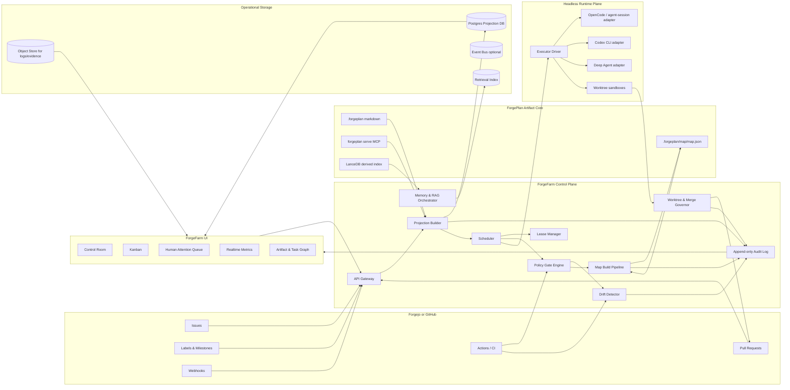
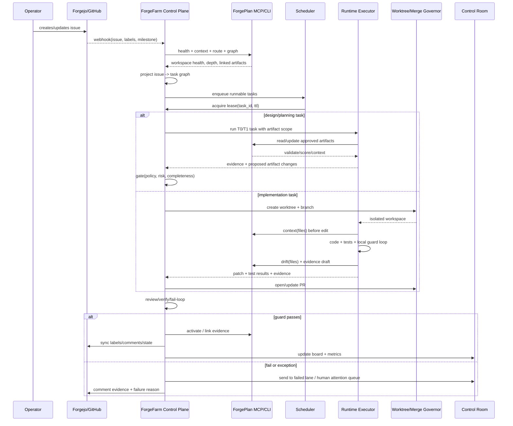
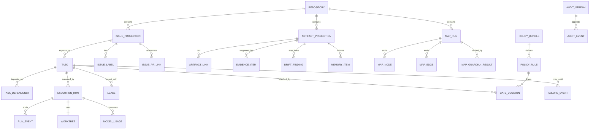

# ForgeFarm

## Executive summary

ForgeFarm имеет смысл строить не как «ещё один агентный фреймворк», а как **платформенный control plane для агентной разработки**, где **ForgePlan остаётся артефактным ядром и источником истины**, а Forgejo или GitHub выступают как трекер работы, PR-поверхность, permissions boundary и webhook/event source. Это хорошо совпадает с тем, как сам ForgePlan описывает себя: markdown-first артефакты в `.forgeplan/` — источник истины, а LanceDB — производный индекс, который можно пересобрать; полный цикл работы — `OBSERVE → ROUTE → SHAPE → BUILD → PROVE → SHIP`; здоровье workspace и evidence должны быть частью обязательного процесса, а не «nice to have». citeturn3view3turn13view2turn4view0turn6view5

Лучшее архитектурное решение для вашего кейса — **разделить систему на два уровня**. Первый уровень — **детерминированный control plane** на Rust: Projection DB, Scheduler, Lease Manager, Policy/Gate Engine, Worktree/Merge Governance, Audit Log, Drift Detector, Memory Index Orchestrator. Второй уровень — **pluggable execution/runtime plane**, где конкретные headless-агенты запускаются через адаптеры к OpenCode, Codex CLI, локальным/удалённым LLM, а также при необходимости через LangGraph/Deep Agents, Mastra или VoltAgent. То есть не фреймворк управляет вашей системой — ваша система управляет фреймворками. Это критично, потому что в вашем случае центр тяжести — не tool-calling, а **lease semantics, state machine задач, Git governance, risk routing, single-writer pipelines и аудируемые гейты**. citeturn20view0turn20view1turn25view0turn23view0turn23view8

Главный архитектурный вывод по материалам чата и присланных SDD-слайдов: **человек должен участвовать не в потоке рутинных правок, а в удержании интента, risk sign-off и exception handling**. Слайды явно продвигают идею, что масштаб достигается переносом точки человеческого суждения со «сплошного code review» на review спеки, архитектуры, высокорисковых изменений и критических гейтов; там же показаны risk-based routing, машинные гейты до человеческих, криптографический аудит и телеметрия конвейера. Это хорошо согласуется с ForgePlan-методологией: ADI reasoning обязателен для Deep/Critical, evidence must expire honestly, работа не считается завершённой без activation и proof. fileciteturn0file0 citeturn6view4turn5view2turn5view3

Самое важное плохо продуманное место в исходной концепции — попытка использовать **issues/labels как операционную БД оркестратора**. Так делать не надо. Правильнее так: **issues — это внешние work intents и human-facing workflow surface**, **`.forgeplan/` — источник истины по артефактам и решениям**, а **Projection DB — оперативная материализация состояния**, где scheduler считает очереди, блокировки, зависимости, leases, health, telemetry и runtime state. Тогда labels остаются способом визуализации и интеграции, а не низкоуровневым механизмом координации. Иначе вы почти гарантированно получите race conditions, потерю актуального состояния, неидемпотентные переходы и боль при параллельной работе агентов. Это особенно важно для вашего `map-build`-пакета, где вы уже сами сформулировали строгие требования single-writer, scratch isolation, append-only refresh и deterministic guardian flip. citeturn13view2turn12view6turn6view5turn16view0

Моя итоговая рекомендация: **ForgeFarm строить как Rust-first orchestrator, а не LangChain-first продукт**. Для L0–L3 ladder и runtime-подсистемы имеет смысл использовать: **LangGraph/Deep Agents — для сложного planning/subagents/human-in-the-loop**, **OpenCode/Codex CLI — для headless coding workers**, **Mastra или VoltAgent — для TypeScript-side integration, UI-facing orchestration и быстрых workflow POC**, но **не как основное ядро control plane**. Для MVP-команды достаточно 6 ролей: staff Rust platform engineer, senior TypeScript/fullstack engineer, AI runtime engineer, DevOps/SRE, product designer for Control Room UX, QA/policy engineer. citeturn20view0turn25view0turn23view0turn23view8

## Ключевые архитектурные принципы и где исходная идея ломается

### ForgePlan должен оставаться ядром артефактов, а не быть «одним из источников»

ForgePlan уже задаёт правильную базовую модель: артефакты живут в `.forgeplan/` как markdown source of truth, а индексы и поиск — производны; в репозитории документации отдельно выделены методология, operations, schemas, repo protection, playbook authoring и multi-agent dispatch. Это значит, что ForgeFarm должен **не заменять**, а **эксплуатировать и усиливать** существующую модель: читать артефакты, валидировать, строить проекции, запускать reason/review/drift/evidence, но не выдумывать второй независимый мир артефактов. citeturn13view2turn3view3

**Вывод:** `.forgeplan/` желательно хранить **в том же репозитории, что и код**, а не делать основным вариантом submodule. Submodule имеет смысл только как вторичный режим для межрепозиторного compliance mirror или canonical cross-product handbook. Для основного потока разработки submodule создаёт слишком много проблем: несинхронные PR, двойные merge conflicts, сложные worktree сценарии, сломанные diff/review связи и невозможность атомарно провести «код + артефакт + evidence + activation». Это не запрет, а практический архитектурный выбор.

### Нужно развести три разных сущности, которые в исходной идее смешаны

У вас сейчас в одном ведре оказались:

1. **Issue как бизнес-единица работы**  
2. **Artifact как решение, спецификация, evidence, карта контекста**  
3. **Runtime task как исполнимый шаг оркестратора**  

Эти сущности нельзя отождествлять.

Правильная модель такая:

- **Issue** = внешняя карточка работы, удобная людям, PR-связям, milestone, labels, kanban и backlog.
- **Artifact** = долговечное знание: PRD, RFC, ADR, Spec, Evidence, Problem, Solution, Note, Refresh, map.json.
- **Runtime task** = атомарная единица выполнения: `plan_issue`, `draft_prd`, `review_rfc`, `implement_diff`, `verify_edges`, `emit_map`, `run_guardian`, `merge_worktree`.

ForgePlan lifecycle и session model прямо подсказывают эту декомпозицию: есть phase, depth, active artifact, next step и health-гейты. Supervisor должен читать `forgeplan session`, `health`, `context`, `drift`, а не гадать по labels, что происходит. citeturn12view6turn6view5turn15view4

### L0–L3 naming conflict надо исправить сразу

В присланных SDD-слайдах роли обозначены как L0 executors, L1 sub-agents, L2 orchestrator, плюс verifier отдельно; в вашем описании L0 — самые сильные модели для проектирования, потом более слабые и дешёвые уровни. Это **semantic collision**. Если оставить как есть, команда очень быстро начнёт путаться. fileciteturn0file0

Решение:

- В коде и API использовать **`T0/T1/T2/T3`** для execution tiers.
- `CP` или `ControlPlane` — для самого оркестратора.
- В UI можно рендерить человекочитаемые labels `L0–L3`, но внутренние enum должны быть другими.

Рекомендуемое значение уровней:

- **T0** — Strategic/Planning tier: routing, decomposition, PRD/RFC/ADR planning, scope reasoning, conflict resolution.
- **T1** — Design/Verification tier: spec drafting, design review, dependency resolution, map zone extraction, typed edge verification.
- **T2** — Implementation tier: code generation, targeted fixes, test writing, worktree execution, artifact edits within approved scope.
- **T3** — Fast guard tier: lint/test/retry/fix, auto-review, small rewrite loops, formatting, deterministic guardians, evidence normalization.

### labels и board columns — это projection, а не state engine

И Forgejo, и GitHub хорошо подходят для issues, PR, webhooks, protected branches, repo permissions и CI checks, но они не должны быть вашим state engine. GitHub прямо рекомендует webhooks для near-real-time updates и как более масштабируемую альтернативу polling API; Forgejo предоставляет webhooks, repo permissions, branch protection и Actions/Runner, но сами runners — это уже RCE boundary, а не state machine. citeturn29view2turn29view3turn31view7turn31view9turn31view0

Правильный подход:

- Board/kanban в UI строится из Projection DB.
- Labels в Forgejo/GitHub синхронизируются как **наружное отображение состояния**: `state:backlog`, `state:in_progress`, `state:review`, `state:failed`, `risk:high`, `lease:held`, `lane:map-build`.
- Истинные переходы делают только control-plane handlers и пишут их в audit log.
- В tracker уходят уже side effects: comment, label sync, state reconcile, PR link, evidence summary.

### Human-on-exception должен быть policy-driven, а не «по ощущению»

Слайды SDD и ForgePlan enforcement guide очень сходятся в одном: машина сначала фильтрует, потом человек судит; для Standard+/Deep/Critical нельзя просто так перескакивать reasoning и governance. В enforcement guide у ForgePlan это оформлено как многоуровневая модель: instructions, skills, hooks, MCP, CI validation; отдельно подчёркнуты `Transformer Mandate`, `forgeplan_context` перед редактированием, `forgeplan_drift` после правок и CI-гейты на drift/validate/coverage. fileciteturn0file0 citeturn15view0turn15view3turn15view4

Для ForgeFarm это следует оформить жёстко:

- **Авто**: Tactical/Standard low-risk, если пройдены policy, tests, drift, evidence и нет permission boundary.
- **Human required**: новый ADR, security/data/auth/public API, policy override, repeated fail loop, destructive migrations, production deploys, privileged runner usage.
- **Human optional**: design review на Standard, если confidence высок, diff небольшой и evidence strong.
- **Human prohibited from micromanaging**: не ревьюить каждую генерацию кода, если задача low-risk и guard pipeline green.

### Memory/RAG нельзя смешивать в одну корзину

ForgePlan already hints at a layered model: session start should restore context from memory; `forgeplan health --json` can feed bots and Hindsight-style ingestion; search now uses BM25 plus Russian morphology and graph expansion; there is also explicit Hindsight memory integration (`memory_recall`, `memory_retain`, `memory_reflect`) in the guide. citeturn6view3turn6view5turn5view5turn5view7turn5view8

Для ForgeFarm надо ввести четыре памяти:

- **Artifact memory** — authoritative memory из `.forgeplan/` и map graph.
- **Execution memory** — run logs, failed branches, prior attempts, tool traces.
- **Episodic hindsight** — решения «что сработало/не сработало» по типу задач и репо-сегментам.
- **Retrieval memory** — индекс docs/code/issues/PR discussion для task-local grounding.

Приоритет должен быть именно таким. Иначе hindsight начнёт перетирать официальные артефакты.

## Архитектурные схемы

Ниже — рекомендуемые базовые схемы для ForgeFarm. Их лучше держать прямо в `docs/architecture/*.mmd` и экспортировать в SVG/PNG через Mermaid CLI.

### Компонентная схема



Ключевой смысл этой схемы: **ForgePlan и tracker не оркестрируют исполнение напрямую**; это делает control plane, который только читает authoritative artifacts и события, а затем материализует operational state. Такое разделение вытекает из markdown-first/source-of-truth модели ForgePlan, его session/health workflow и из того, что webhooks/Actions/permissions у Forgejo и GitHub — это интеграционный слой, а не бизнес-логика оркестрации. citeturn13view2turn6view5turn12view6turn29view2turn30view0

### Sequence-схема жизненного цикла задачи



Эта последовательность опирается на официальные рекомендации ForgePlan: начинать с `health`, затем route, shape, build, evidence, activate; для supervisor-модели особенно полезен `forgeplan session`, который прямо описан как “where am I?” command для multi-agent setups; интеграция с MCP сервером ForgePlan также официально поддержана через `forgeplan serve`. citeturn4view0turn12view6turn5view6

### ER-схема данных



Эта ER-модель нужна, чтобы формально разделить work intent, operational task, artifact projection, run, lease и audit. Без этого система начнёт «прятать» критическую логику в labels/comments и быстро станет недетерминированной.

### SVG и PNG экспорт

```bash
npx @mermaid-js/mermaid-cli -i docs/architecture/component.mmd -o docs/architecture/component.svg
npx @mermaid-js/mermaid-cli -i docs/architecture/component.mmd -o docs/architecture/component.png

npx @mermaid-js/mermaid-cli -i docs/architecture/sequence.mmd -o docs/architecture/sequence.svg
npx @mermaid-js/mermaid-cli -i docs/architecture/er.mmd -o docs/architecture/er.svg
```

## Подробная архитектура компонентов и контрактов

### Artifact core и проекция состояния

**Authoritative plane**:

- `.forgeplan/` markdown artifacts  
- `.forgeplan/map/map.json`
- Git history
- issue tracker state
- PR state and commit evidence

**Operational plane**:

- Projection DB
- run state
- leases
- gate decisions
- metrics
- long-term retrieval and hindsight indexes

Это следует из того, что ForgePlan сам разделяет markdown source of truth и derived LanceDB index. Следовательно, ForgeFarm должен строить **projection pipeline**, а не собственный authoring store. citeturn13view2turn3view3

Рекомендованный projection ingest pipeline:

1. **Webhook ingest** из Forgejo/GitHub по issue, PR, push, label, milestone, comment.
2. **Workspace scan ingest** из `.forgeplan/` и git diff.
3. **ForgePlan CLI/MCP enrich**: `health`, `context`, `route`, `graph`, `search`, `drift`, `validate`, `score`, `session`.
4. **Projection write** в Postgres с upsert по stable IDs.
5. **Event append** в audit log.
6. **Derived views**: kanban lanes, dependency graph, attention queue, map registry, drift board, metrics views.

### Control plane

Ниже — рекомендуемый состав control plane и его чёткие обязанности.

| Компонент | Ответственность | Что не должен делать |
|---|---|---|
| Projection Builder | материализует состояние из Git/tracker/ForgePlan | не запускает агентов |
| Scheduler | выбирает runnable tasks, учитывая DAG, risk, capacity | не пишет в Git напрямую |
| Lease Manager | честная блокировка задач и файловых областей | не синхронизирует labels напрямую |
| Policy/Gate Engine | применяет YAML policies и deterministic checks | не принимает product decisions |
| Runtime Broker | выбирает executor/model/tier | не хранит canonical state |
| Worktree Governor | ветки, worktrees, rebase, PR discipline | не решает приоритеты |
| Drift Detector | artefact↔code divergence, map drift, workflow drift | не исправляет автоматически без policy |
| Audit Service | append-only журнал, evidence links, signatures | не заменяет tracker comments |
| Memory Orchestrator | hindsight, retrieval, memory scopes | не становится source of truth |

### Нормализованная state machine для задач

Рекомендую такую state machine для `task_instance`:

- `queued`
- `leased`
- `preflight`
- `planning`
- `designing`
- `implementing`
- `verifying`
- `review_pending`
- `merge_pending`
- `completed`
- `failed_retryable`
- `failed_policy`
- `failed_human`
- `blocked_dependency`
- `expired_lease`
- `cancelled`

События перехода:

- `lease_acquired`
- `lease_expired`
- `gate_passed`
- `gate_failed`
- `runtime_started`
- `runtime_finished`
- `runtime_error`
- `human_approved`
- `human_rejected`
- `drift_detected`
- `pr_opened`
- `pr_merged`

**Инварианты**:

- transition может делать только control plane;
- transition всегда пишет `audit_event`;
- labels и UI-колонки — только projection of state;
- один task_instance может иметь только один активный lease;
- write access к файлам идёт только через approved execution run;
- high-risk transitions требуют explicit policy path.

Это прямо усиливает идеи со слайдов про signed state transitions, fail loops и human-at-gates, но переводит их в исполнимую модель. fileciteturn0file0

### Lease model

Самое недооценённое место почти всех самодельных агентных оркестраторов — lease semantics. ForgeFarm нужен **двухконтурный lease**:

**Task lease**
- ключ: `task_id`
- TTL: 10–30 минут
- владелец: `run_id`
- heartbeat interval: 30–60 секунд
- policy on expiry: `requeue | fail_human | kill_runtime`

**Scope lease**
- ключ: `repo_id + scope_hash`
- scope может быть:
  - files glob
  - bounded context
  - artifact subtree
  - map zone
- нужен для предотвращения конфликтных параллельных правок

Для map-build это особенно важно: вы уже заданием требуете отдельные scratch файлы для параллельных сканеров и single writer для `map.json`. Значит, `map-emitter` должен брать **exclusive writer lease** на `.forgeplan/map/map.json`, а scanner-задачи — только свои `scratch_scope` leases.

### Runtime adapter contract

Поскольку OpenCode/agent-session и конкретные headless runtimes в доступных первоисточниках подробно не описаны, **внешний runtime надо изолировать адаптером**. Точные протоколы OpenCode здесь — **не указано**.

Минимальный внутренний контракт `ExecutorDriver`:

```ts
interface ExecutorDriver {
  createRun(input: {
    taskId: string;
    tier: "T0" | "T1" | "T2" | "T3";
    repo: RepoRef;
    worktree?: WorktreeRef;
    artifactScope: string[];
    fileScope: string[];
    policies: PolicySnapshot;
    memoryContext: MemoryContext;
    promptBundle: PromptBundle;
    budget: BudgetEnvelope;
  }): Promise<{ runId: string }>;

  streamEvents(runId: string): AsyncIterable<RunEvent>;

  cancelRun(runId: string, reason: string): Promise<void>;

  collectOutcome(runId: string): Promise<RunOutcome>;
}
```

`RunEvent` должен быть типизирован:

- `status_changed`
- `tool_called`
- `file_read`
- `file_write_attempted`
- `patch_generated`
- `test_result`
- `artifact_proposed`
- `gate_request`
- `memory_write`
- `error`
- `heartbeat`

### API и контракты control plane

Рекомендованный northbound API:

```http
POST   /api/webhooks/forge
GET    /api/tasks
GET    /api/tasks/:id
POST   /api/tasks/:id/requeue
POST   /api/tasks/:id/approve
POST   /api/tasks/:id/reject
GET    /api/artifacts
GET    /api/artifacts/:id
GET    /api/graph
GET    /api/boards
GET    /api/runs
GET    /api/runs/:id/events
GET    /api/metrics
GET    /api/attention-queue
POST   /api/map-build
GET    /api/map-build/:runId
```

Рекомендованный internal API между control plane сервисами:

```http
POST /internal/scheduler/tick
POST /internal/leases/acquire
POST /internal/leases/heartbeat
POST /internal/leases/release
POST /internal/gates/evaluate
POST /internal/worktrees/create
POST /internal/worktrees/merge
POST /internal/projections/rebuild
POST /internal/memory/query
POST /internal/memory/retain
POST /internal/audit/append
```

### Storage schema

Ниже — минимальный стартовый набор таблиц Postgres.

| Таблица | Ключевые поля |
|---|---|
| `repositories` | `id`, `host`, `owner`, `name`, `default_branch` |
| `issue_projection` | `issue_id`, `repo_id`, `title`, `body_hash`, `state`, `labels_json`, `milestone`, `assignee`, `updated_at` |
| `artifact_projection` | `artifact_id`, `repo_id`, `kind`, `path`, `status`, `title`, `content_hash`, `valid_until`, `r_eff`, `links_json`, `active` |
| `tasks` | `task_id`, `issue_id`, `kind`, `tier`, `risk`, `priority`, `scope_json`, `status`, `depends_on_json` |
| `task_instances` | `instance_id`, `task_id`, `attempt`, `status`, `scheduler_reason`, `budget_json` |
| `leases` | `lease_id`, `resource_type`, `resource_key`, `holder_run_id`, `expires_at`, `heartbeat_at` |
| `execution_runs` | `run_id`, `task_instance_id`, `executor_type`, `model_profile`, `status`, `started_at`, `ended_at` |
| `run_events` | `event_id`, `run_id`, `seq`, `event_type`, `payload_json`, `created_at` |
| `gate_decisions` | `gate_id`, `task_instance_id`, `policy_bundle`, `gate_type`, `decision`, `reasons_json` |
| `drift_findings` | `finding_id`, `artifact_id`, `scope`, `severity`, `payload_json`, `status` |
| `memory_items` | `memory_id`, `scope_type`, `scope_key`, `kind`, `importance`, `payload_json`, `embedding_ref` |
| `audit_events` | `audit_id`, `entity_type`, `entity_id`, `event_type`, `actor`, `hash_prev`, `hash_self`, `payload_json` |
| `map_runs` | `map_run_id`, `repo_id`, `mode`, `scope`, `status`, `output_hash`, `guardian_status` |
| `map_nodes` | `node_id`, `map_run_id`, `kind`, `path`, `zone_id`, `position_json`, `content_hash` |
| `map_edges` | `edge_id`, `map_run_id`, `src`, `dst`, `edge_type`, `verified_by`, `confidence` |

### Memory, RAG, hindsight и light RAG

Я рекомендую такую иерархию контекста для любого исполнения:

1. **Task packet**  
   Issue summary, accepted artifact scope, file scope, risk policy, local budget.

2. **Artifact context**  
   `forgeplan context`, `graph`, `health`, relevant PRD/RFC/ADR/Spec/Evidence.

3. **Retrieval context**  
   Search over project docs, code map, related issues, old PR discussions.

4. **Hindsight context**  
   Prior failures, successful remediation patterns, reviewer complaints, flaky modules.

5. **Model-local summary context**  
   Session summaries and compressed tool traces.

Это хорошо согласуется с ForgePlan smart search, graph expansion и Hindsight integration, а также с тем, как Mastra и LangGraph разделяют short/long-term memory, resource-scoped sharing и durable resumable workflows. citeturn5view5turn5view7turn5view8turn20view0turn23view6turn24view3

Рекомендуемая практическая модель памяти для ForgeFarm:

- **authoritative memory**: `.forgeplan/*`
- **retrieval store**:
  - PoC: LanceDB embedded per repo
  - Scale: Qdrant or pgvector
- **hindsight store**: Postgres JSONB + embeddings
- **session memory**: run summary + tool trace summary
- **cross-agent sharing key**: `resource_id = repo + milestone + issue group`

### Drift detection

Нужно сразу заложить 5 drift-контуров:

1. **Code vs artifact drift**  
   Использовать `forgeplan drift` после каждой имплементации и в CI. ForgePlan enforcement docs прямо рекомендуют `forgeplan_context` перед редактированием и `forgeplan_drift` после. citeturn15view3turn15view4

2. **Artifact completeness drift**  
   `validate`, `health`, `blind spots`, `orphans`, `stale`, `at_risk`. `forgeplan health --ci` уже умеет проваливать пайплайн при заданных thresholds; `--json` делает это пригодным для дашбордов и ботов. citeturn6view5

3. **Issue ↔ projection drift**  
   labels/comments/PR links в tracker разошлись с внутренним состоянием control plane.

4. **Execution drift**  
   run завис, lease expired, worktree уехал от target branch, PR contains unexpected file scope.

5. **Map drift**  
   `map.json` не соответствует workspace after change, или зона изменилась без refresh append-run.

### Специальный дизайн для map-build marketplace spec

Ваш `map-build` — это не «ещё один агент». Это **детерминированный, safety-critical pipeline**, и его надо проектировать как отдельную lane с особыми write constraints.

Рекомендуемая модель:

**Роли pipeline**
- `map-orchestrator` — дирижёр, не пишет `map.json`, только stage control, gate state, retries.
- `code-scanner`, `forgeplan-scanner`, `docs-scanner` — параллельные, изолированные scratch writers.
- `zone-extractor` — строит зоны/слои/узлы/mega-nodes.
- `edge-verifier` — принимает только typed-link high-trust + grep-gated deps.
- `map-emitter` — **единственный writer** `map.json`.
- `map-guardian.mjs` — deterministic acceptance gate.
- `map-guardian-llm` — advisory only.

**Инварианты**
- `generator != verifier`
- `map.json` пишет только `map-emitter`
- сканеры пишут только в `.work/.scan.*.json`
- proposed → confirmed flip делает только guardian
- append refresh mode never rewrites unaffected nodes
- position determinism required for stable reruns
- pipeline transcripts не переносятся между этапами, только hashes, paths, structured findings

**State machine для map-run**
- `scan_pending`
- `scan_parallel`
- `zones_pending`
- `edges_pending`
- `emit_pending`
- `guardian_pending`
- `confirmed`
- `failed_retryable`
- `failed_deterministic`
- `failed_human`

**Acceptance gates**
- **G1**: scratch isolation check
- **G2**: schema and node-id determinism
- **G3**: edge trust enforcement
- **G4**: guardian checks + flip

**Append mode**
- `map-build --refresh --scope <zone>`
- detect touched zones by content hash
- append-only node history
- stable IDs for unaffected nodes
- byte-identical positions for untouched graph regions

Это полностью соответствует вашей постановке и крайне правильно с инженерной точки зрения: именно этот pipeline должен быть самым детерминированным во всей системе.

## Рекомендуемые технологии и сравнение опций

### Главный выбор

**Итоговая рекомендация**:

- **Control plane**: Rust
- **UI / operator console**: TypeScript/React
- **Execution adapters**: TypeScript и/или Rust wrappers, в зависимости от runtime
- **Primary DB**: Postgres
- **Audit and artifacts**: Git + Postgres append-log + object store
- **Retrieval**:
  - local/mono-repo first: LanceDB + fastembed
  - scaled multi-repo: Qdrant or pgvector
- **Message bus**:
  - PoC: Postgres + SKIP LOCKED
  - later: NATS JetStream for fan-out telemetry/events

### Сравнение agent framework options

| Опция | Где хорошо подходит | Где не должна быть ядром ForgeFarm | Мой вывод |
|---|---|---|---|
| LangGraph | durable stateful agents, HITL, persistence, low-level orchestration | нет встроенной доменной модели leases/worktrees/Git governance | лучший кандидат для сложных T0/T1 runtimes |
| LangChain | minimal agent harness, tools, middleware, retrieval, MCP | слишком общий слой для системного control plane | использовать как building blocks, не как платформу |
| Deep Agents | file systems, planning, subagents, permissions, memory, context offloading | opinionated harness, но всё ещё не control plane | сильный runtime слой для research/design agents |
| Mastra | TS agents + workflows + suspend/resume + memory + observability | меньше фокус на строгой Git/task governance | хорош для UI-side orchestration и workflow POC |
| VoltAgent | TS-first, supervisor/subagents, workflows, MCP, RAG, observability | enterprise platform bias, меньше доказанной пригодности для deterministic governance core | хорош как TS runtime/edge integrations, не ядро |
| Custom Rust core | строгие leases, policies, worktrees, audit, fail-loop semantics | требует больше своей разработки | это и есть правильное ядро |

Этот вывод опирается на официальные docs: LangGraph позиционируется как low-level orchestration runtime для long-running stateful agents с persistence, human-in-the-loop и memory; LangChain — как minimal configurable harness `create_agent`; Deep Agents — как harness с planning, subagents, filesystem, memory, summarization и permissions; Mastra — как agents/workflows/memory platform с resumable workflows; VoltAgent — как TypeScript framework с memory, workflows, supervisor coordination, MCP, RAG и observability. citeturn20view0turn20view1turn25view0turn23view0turn24view3turn23view8turn23view9

**Практический выбор для ForgeFarm**:

- **Core orchestration**: custom Rust
- **Complex planning/design runtime**: LangGraph или Deep Agents
- **TS-side automation/UI workflows**: Mastra
- **Alternative TS runtime layer**: VoltAgent
- **Do not choose**: LangChain-only architecture

### Сравнение retrieval и vector options

| Опция | Плюсы | Минусы | Рекомендация |
|---|---|---|---|
| LanceDB | уже близко к ForgePlan stack, embedded, same model locally, vector/full-text/SQL style access | не лучший выбор как отдельный глобальный distributed service | лучший PoC/default |
| Qdrant | хорошая документация для vectors, payload, hybrid queries, multitenancy, BM25/FastEmbed ecosystem | отдельный сервис и ops overhead | лучший scale-out вариант |
| pgvector | всё внутри Postgres, exact/ANN, HNSW | tuning и recall/ops тоньше, retrieval UX беднее чем специализированные DB | лучший «одна БД на всё» вариант |
| Neo4j/graph DB as primary retrieval | удобно для graph queries | лишняя сложность, а у вас graph уже можно материализовать из ForgePlan links | не нужен на старте |

Это соответствует официальным возможностям: LanceDB заявляет embedded OSS mode, table versioning, schema evolution, vector/full-text/SQL access и одинаковую модель от local к managed; Qdrant документирует collections/payload/indexing/hybrid queries/text search/multitenancy/FastEmbed; pgvector поддерживает exact и approximate nearest neighbor search, HNSW и несколько типов векторов прямо в Postgres. citeturn32view0turn32view1turn33view0turn33view1turn33view2

**Мой выбор**:
- PoC и mono-repo: **LanceDB + fastembed-rs**
- Multi-repo/team scale: **Postgres + Qdrant**
- Если хотите максимально простой ops footprint: **Postgres + pgvector**

fastembed-rs особенно логичен, потому что это Rust library для локальной генерации embeddings и reranking, работающая через ONNX stack и без обязательного Tokio; это хорошо ложится на Rust-first toolchain ForgePlan/ForgeFarm. citeturn33view3turn33view5turn33view6

### Rust и Node стек

**Rust** рекомендую для:
- scheduler
- lease manager
- policy engine
- map guardian deterministic path
- git/worktree governance
- projection ingest
- audit pipeline

**TypeScript** рекомендую для:
- control room UI
- tracker adapters, если есть web-first SDK преимущества
- runtime adapters к headless JS-native tools
- lightweight operator workflows
- agent-side helper packages и generated contracts

### Конкретные библиотеки

**Rust**
- `axum` — API
- `tokio` — async runtime
- `sqlx` — Postgres доступ
- `serde`, `schemars` — schemas/json
- `uuid`, `time`, `sha1`/`sha2`, `blake3`
- `tracing` + `tracing-subscriber`
- `notify` — file watch
- `git2` или subprocess-based git wrapper
- `jsonschema` — deterministic guardian validation
- `nats` later, optional
- `tantivy` only if хотите отдельный lexical index вне ForgePlan

**TypeScript**
- `Next.js`
- `React`
- `TanStack Query`
- `Zustand`
- `React Flow` для graph/map/task DAG
- `shadcn/ui` или Radix primitives
- `zod` для shared contracts
- `Hono` или `Fastify` для thin adapter services
- `BullMQ` только если решите вынести некоторые JS background tasks, но это не основной scheduler

**Generated contracts**
- OpenAPI + JSON Schema
- codegen в Rust/TS
- если `gertsai/shared` в итоге содержит shared DTO/SDK, нужно встроить его именно сюда; пока его точное содержимое не указано и не было надёжно доступно из публичного fetch в этой сессии.

## План реализации, риски, CI/CD и security model

### Phased delivery plan

| Этап | Цель | Основные задачи | Оценка |
|---|---|---|---|
| Foundation | поднять source-of-truth и control plane skeleton | repo layout, Postgres schema, webhook ingest, projection sync, audit log | L |
| Task graph | запустить basic orchestration | task model, scheduler, lease manager, kanban projections, attention queue | L |
| Runtime plane | подключить headless executors | executor driver, worktrees, run events, diff/evidence capture | L |
| ForgePlan deep integration | сделать artifact-aware execution | context/health/session/drift/validate pipelines, policy rules, evidence flows | M/L |
| Map-build lane | реализовать marketplace-grade deterministic pipeline | scanners, zone extractor, edge verifier, emitter, guardian, append mode | L |
| Product UI | operator experience | Control Room, graph, metrics, HAQ, run inspector, policy views | M/L |
| Security hardening | подготовка к real workloads | scopes, runner isolation, branch protections, OIDC, signed audit | M |
| Scale & optimization | многорепо и больший throughput | event bus, sharding by repo, queue analytics, model routing optimization | M/L |

### Более детальный execution roadmap

#### Этап Alpha

Собрать минимальный «живой позвоночник»:

- `forgefarm-api`
- `forgefarm-scheduler`
- `forgefarm-ui`
- `forgefarm-exec-opencode`
- `forgefarm-exec-codex`
- `forgefarm-map`
- Postgres schema
- webhook receiver
- projection sync from issues + `.forgeplan/`

**Definition of done**:
- issue → task projection
- kanban в UI
- lease acquisition/release
- run creation
- status sync into tracker
- audit events visible in UI

#### Этап Beta

Встроить методологические гейты ForgePlan:

- `forgeplan health` на start/finish;
- `forgeplan session` как phase oracle;
- `forgeplan context` перед file edits;
- `forgeplan drift` после file edits;
- `forgeplan validate` перед Done;
- `forgeplan score` и evidence linking перед activation. citeturn6view5turn12view6turn15view4

**Definition of done**:
- PR не открывается без preflight policy
- PR не merge’ится при artifact drift
- task нельзя закрыть без evidence path
- UI показывает blind spots/orphans/stale/at risk

#### Этап Gamma

map-build как отдельный hardened lane.

**Definition of done**:
- три сканера пишут разные scratch-файлы
- `map-emitter` — единственный writer
- guardian deterministic flip делает `confirmed`
- re-run после `+1` node сохраняет байт-стабильность позиций для untouched nodes
- append refresh работает на zone scope

### Риски и mitigation

| Риск | Почему опасно | Mitigation |
|---|---|---|
| Labels become runtime DB | race conditions и ложное состояние | labels only as projection; transitions only in control plane |
| Submodule artifacts | неатомарные PR и merges | хранить `.forgeplan/` рядом с кодом |
| Runtime writes outside scope | неожиданные diffs и governance breach | scope leases, path gates, worktree sandbox, post-edit drift |
| Self-hosted runner compromise | runners = remote code execution boundary | container isolation, no host mode by default, no privileged containers |
| Model-cost explosion | T0/T1 reasoning дорогие | explicit budget envelopes, risk-tier routing, cache, hindsight reuse |
| Memory pollution | hindsight спорит с canonical artifacts | precedence rules: artifacts > policy > retrieval > hindsight |
| Map pipeline nondeterminism | impossible stable diffs, flaky guardian | single writer, scratch isolation, deterministic layout, content-hash-based append |
| Human queue overload | вы снова делаете человека bottleneck | human-on-exception policy with strict triggers |

### CI/CD модель

Для любого PR в `dev` или `main` рекомендую такой mandatory pipeline:

1. `fmt/lint/test`
2. `forgeplan scan-import`
3. `forgeplan health --ci`
4. `forgeplan validate --ci`
5. `forgeplan drift --ci`
6. `map-build --check` если изменены карты/архитектурные зоны
7. policy bundle evaluation
8. PR evidence summary
9. preview deploy
10. merge gate

ForgePlan docs уже показывают `health --ci`, `validate` и drift/coverage/score checks как CI pattern. Protected branches в GitHub и Forgejo поддерживают required status checks, reviews, signed commits, linear history и merge requirements. citeturn6view5turn15view4turn26view0turn31view6

### Security и permissions model

Здесь надо быть жёстким.

**Repo permissions**
- Люди: `Admin`/`Write` по необходимости.
- Оркестратор-бот: минимум на comment/labels/branch/PR; admin не давать без необходимости.
- Агенты напрямую в tracker не ходят; только через control plane service account.
- Sensitive repos — отдельные runner groups / runner labels. Forgejo permissions и runner labels это поддерживают. citeturn31view9turn31view3

**Branch protection**
- forbid force-push
- require PR
- require status checks
- require conversation resolution
- require signed commits
- require latest reviewer or stale review dismissal
- restrict who can push to protected branches

GitHub и Forgejo оба поддерживают protected branches и merge restrictions. citeturn26view0turn31view6

**Webhooks over polling**
- webhook-first ingest
- polling only as reconciliation fallback
- signature validation mandatory

GitHub docs прямо рекомендуют webhooks как более масштабируемый и near-real-time путь по сравнению с API polling; Forgejo docs показывают webhook setup c secret/signature verification. citeturn29view2turn29view3turn31view7

**Self-hosted runners**
- не использовать `host` execution mode по умолчанию
- не включать privileged containers без отдельного security sign-off
- сохранять job isolation networks
- выделять отдельные runners для risky repos/jobs

Forgejo docs прямо предупреждают, что runner выполняет remote code execution; host mode убирает изоляцию, а network=`host` даёт серьёзные риски для хоста и внутренней сети. citeturn31view0turn31view5

**Cloud deploy credentials**
- GitHub Actions: OIDC only, short-lived tokens, no long-lived cloud secrets
- Forgejo: если OIDC path не готов, минимально scoped robot tokens + short TTL + secret rotation

GitHub OIDC docs прямо поясняют преимущества short-lived tokens и отказа от long-lived secrets. citeturn28view0

## Product spec, UX, documentation pack и стартовая структура репозитория

### Product UX

ForgeFarm нужен не как «dashboard ради dashboard», а как **операционный пульт**. Я бы заложил три главных экрана.

### Control Room

Главный вид для оператора.

Показывает:

- throughput по задачам и по tieres
- queue depth по lane
- active agents / busy agents / idle agents
- retries, fail-loop count, lease expirations
- drift incidents
- evidence coverage
- artifact health
- среднее время по этапам
- cost by tier/model/provider

Это полностью согласуется с идеями телеметрии конвейера на слайдах и с `forgeplan health --json`, который уже пригоден для dashboards и bots. fileciteturn0file0 citeturn6view5

### Kanban

Нужны как минимум такие lane’ы:

- `intake`
- `backlog`
- `ready`
- `planning`
- `design`
- `implementation`
- `verification`
- `review`
- `merge`
- `failed`
- `human_attention`
- `blocked`

Важно: это **не просто labels**. Это projection from task states.

Каждая карточка должна показывать:

- issue key
- related artifacts
- tier
- risk class
- active lease
- current run
- last gate result
- next action
- file scope
- evidence state

### Human Attention Queue

Это отдельный продуктовый контур, а не «failed lane №2».

Туда попадают только задачи, где нужно человеческое действие:

- approve ADR / policy override
- resolve security/data/public API decision
- merge conflict outside auto-resolve policy
- repeated fail loop > N
- privileged runner request
- insufficient evidence with high risk
- disagreement between verifier and implementer

Это критично для вашей цели «чтобы человек участвовал меньше». Не меньше везде, а меньше **в рутине**, больше — **в исключениях и стратегии**.

### Acceptance criteria для продукта

ForgeFarm можно считать успешно спроектированным, если выполняются такие критерии:

- задача из issue автоматически проектируется в task graph;
- control plane умеет различать planning/design/implementation/verification;
- worktree и merge governance не допускают unsafe parallel writes;
- любой run имеет audit trail;
- любой high-risk transition объясним policy rule;
- любой completed task имеет путь до evidence;
- любой artifact drift поднимается как signal, а не теряется в PR comments;
- human queue остаётся bounded и не становится новым bottleneck;
- map-build детерминированно выдаёт `confirmed` карту;
- source of truth всегда можно реконструировать из Git + `.forgeplan/`.

### Набор документации, который нужен на старте проекта

Ниже — минимальный, но уже **достаточный для запуска** documentation pack.

```text
forgefarm/
├── .forgeplan/
│   ├── epics/
│   ├── prds/
│   ├── rfcs/
│   ├── adrs/
│   ├── specs/
│   ├── evidence/
│   ├── problems/
│   ├── solutions/
│   ├── notes/
│   ├── memory/
│   └── map/
│       └── map.json
├── apps/
│   ├── control-room/
│   ├── api-gateway/
│   └── runtime-adapters/
│       ├── opencode/
│       ├── codex/
│       └── langgraph/
├── crates/
│   ├── ff-core/
│   ├── ff-projection/
│   ├── ff-scheduler/
│   ├── ff-leases/
│   ├── ff-policy/
│   ├── ff-gitops/
│   ├── ff-audit/
│   ├── ff-memory/
│   ├── ff-map/
│   └── ff-telemetry/
├── packages/
│   ├── shared-contracts/
│   ├── shared-ui/
│   └── shared-config/
├── docs/
│   ├── README.md
│   ├── architecture/
│   │   ├── component.mmd
│   │   ├── sequence.mmd
│   │   ├── er.mmd
│   │   ├── component.svg
│   │   └── sequence.svg
│   ├── product/
│   │   ├── CONTROL-ROOM-UX.md
│   │   ├── HUMAN-ATTENTION-QUEUE.md
│   │   ├── POLICY-MODEL.md
│   │   └── METRICS-CATALOG.md
│   ├── runtime/
│   │   ├── EXECUTOR-DRIVER.md
│   │   ├── WORKTREE-GOVERNANCE.md
│   │   ├── FAIL-LOOP.md
│   │   └── MODEL-ROUTING.md
│   ├── integrations/
│   │   ├── FORGEJO.md
│   │   ├── GITHUB.md
│   │   ├── FORGEPLAN.md
│   │   ├── HINDSIGHT.md
│   │   └── RAG.md
│   ├── security/
│   │   ├── THREAT-MODEL.md
│   │   ├── PERMISSIONS.md
│   │   ├── RUNNER-ISOLATION.md
│   │   └── SECRETS-OIDC.md
│   └── marketplace/
│       └── MAP-BUILD-SPEC.md
├── playbooks/
│   ├── task-run.yaml
│   ├── issue-intake.yaml
│   ├── design-review.yaml
│   ├── implementation-loop.yaml
│   └── map-build.yaml
├── policies/
│   ├── risk-policy.yaml
│   ├── human-exception-policy.yaml
│   ├── write-scope-policy.yaml
│   ├── runner-policy.yaml
│   └── map-build-policy.yaml
├── hooks/
│   ├── write-path-gate.sh
│   ├── pre-commit-forge.sh
│   ├── map-emitter-gate.sh
│   └── pr-evidence-check.sh
├── schemas/
│   ├── task.schema.json
│   ├── run-event.schema.json
│   ├── policy.schema.json
│   ├── gate-decision.schema.json
│   └── map.schema.json
├── prompts/
│   ├── tier-t0-system.md
│   ├── tier-t1-system.md
│   ├── tier-t2-system.md
│   ├── tier-t3-system.md
│   ├── verifier-system.md
│   └── human-escalation.md
├── .forgejo/
│   └── workflows/
│       ├── ci.yml
│       ├── forgefarm.yml
│       └── map-build.yml
└── docker-compose.yml
```

### Обязательные стартовые документы

**Artifact and methodology**
- `EPIC-001-forgefarm-platform.md`
- `PRD-001-control-plane.md`
- `PRD-002-control-room-ux.md`
- `RFC-001-runtime-and-lease-model.md`
- `RFC-002-task-state-machine.md`
- `RFC-003-map-build-pipeline.md`
- `ADR-001-source-of-truth-model.md`
- `ADR-002-human-on-exception-policy.md`
- `ADR-003-retrieval-and-memory-architecture.md`
- `SPEC-001-control-plane-api.md`
- `SPEC-002-projection-db-schema.md`
- `SPEC-003-map-schema.md`
- `EVID-001-poc-flow-happy-path.md`

**Operations**
- `RUNNER-ISOLATION.md`
- `WORKTREE-GOVERNANCE.md`
- `FAIL-LOOP.md`
- `PROMPT-GOVERNANCE.md`
- `POLICY-BUNDLES.md`

**Product**
- `CONTROL-ROOM-UX.md`
- `KANBAN-STATES.md`
- `HUMAN-ATTENTION-QUEUE.md`
- `METRICS-CATALOG.md`

### Примеры критических файлов

#### `playbooks/map-build.yaml`

```yaml
id: map-build
version: 1
max_attempts: 3

stages:
  - id: scan_parallel
    strategy: parallel
    tasks:
      - role: code-scanner
        output: .work/.scan.code.json
      - role: forgeplan-scanner
        output: .work/.scan.fpl.json
      - role: docs-scanner
        output: .work/.scan.docs.json
    gates:
      - id: G1
        type: scratch_isolation

  - id: zone_extract
    strategy: serial
    task:
      role: zone-extractor
    gates:
      - id: G2
        type: deterministic_node_ids

  - id: edge_verify
    strategy: serial
    task:
      role: edge-verifier
    gates:
      - id: G3
        type: typed_edge_trust

  - id: emit
    strategy: serial
    task:
      role: map-emitter
      write_target: .forgeplan/map/map.json
    gates:
      - id: single_writer

  - id: guardian
    strategy: serial
    task:
      role: map-guardian.mjs
    gates:
      - id: G4
        type: guardian_acceptance

on_fail:
  retryable: scan_parallel
  deterministic: guardian
  human: human_attention_queue
```

#### `policies/risk-policy.yaml`

```yaml
version: 1

risk_classes:
  low:
    human_required: false
    allowed_tiers: [T2, T3]
  standard:
    human_required: false
    allowed_tiers: [T1, T2, T3]
  high:
    human_required: true
    allowed_tiers: [T0, T1, T2]
    mandatory_gates:
      - design_review
      - drift_clean
      - evidence_present
  critical:
    human_required: true
    mandatory_artifacts:
      - epic
      - prd
      - spec
      - rfc
      - adr
    mandatory_gates:
      - architecture_signoff
      - security_signoff
      - evidence_present
      - activation_gate
```

#### `hooks/hooks.json`

```json
{
  "writeRules": [
    {
      "matcher": ".forgeplan/map/map.json",
      "allowedActors": ["map-emitter"],
      "mode": "fail-closed"
    },
    {
      "matcher": ".work/**",
      "allowedActors": [
        "code-scanner",
        "forgeplan-scanner",
        "docs-scanner",
        "zone-extractor",
        "edge-verifier",
        "map-orchestrator"
      ],
      "mode": "allow"
    }
  ]
}
```

#### `schemas/map.schema.json`

```json
{
  "$schema": "https://json-schema.org/draft/2020-12/schema",
  "$id": "https://forgefarm.dev/schemas/map.schema.json",
  "type": "object",
  "required": ["version", "status", "zones", "nodes", "edges", "meta"],
  "properties": {
    "version": { "const": "forgeplan.map/v1" },
    "status": { "enum": ["proposed", "confirmed"] },
    "zones": {
      "type": "array",
      "items": { "$ref": "#/$defs/zone" }
    },
    "nodes": {
      "type": "array",
      "items": { "$ref": "#/$defs/node" }
    },
    "edges": {
      "type": "array",
      "items": { "$ref": "#/$defs/edge" }
    },
    "meta": {
      "type": "object",
      "required": ["content_hash", "generated_at", "guardian"],
      "properties": {
        "content_hash": { "type": "string" },
        "generated_at": { "type": "string", "format": "date-time" },
        "guardian": { "type": "string" }
      }
    }
  },
  "$defs": {
    "zone": {
      "type": "object",
      "required": ["id", "name", "kind"]
    },
    "node": {
      "type": "object",
      "required": ["id", "kind", "path", "zone_id", "position"]
    },
    "edge": {
      "type": "object",
      "required": ["id", "src", "dst", "type", "verified_by"]
    }
  }
}
```

### Приоритет интеграций

Рекомендую такой порядок:

| Приоритет | Интеграция | Зачем |
|---|---|---|
| P0 | ForgePlan CLI/MCP | артефакты, health, drift, validate, session, graph |
| P0 | Forgejo/GitHub webhooks | task/event ingest |
| P0 | Git/worktree management | безопасная параллельная реализация |
| P1 | OpenCode / Codex CLI adapters | headless execution |
| P1 | LanceDB/fastembed | local retrieval и artifact-aware context |
| P1 | Control Room websockets/SSE | realtime observability |
| P2 | Hindsight memory | повторное использование опыта |
| P2 | Qdrant/pgvector | multi-repo memory/retrieval scale |
| P3 | External MCP ecosystem | docs, infra, ticketing beyond forge |
| P3 | `gertsai/shared` | shared contracts/UI/helpers, если содержимое подтвердится |

### Инструкции по развёртыванию и тестированию PoC

#### Инфраструктура PoC

- Forgejo или GitHub test repo
- Postgres
- object store optionally MinIO
- Forgejo Runner или GitHub Actions
- ForgeFarm API
- ForgeFarm Scheduler
- ForgeFarm UI
- one runtime adapter
- ForgePlan CLI installed in execution environments

#### Порядок запуска

```bash
docker compose up -d postgres minio forgejo
cargo run -p ff-api
cargo run -p ff-scheduler
pnpm --filter control-room dev
```

В тестовом репозитории:

```bash
forgeplan init
forgeplan setup-skill
forgeplan health
```

Подключение MCP для локального агента:

```json
{
  "mcpServers": {
    "forgeplan": {
      "command": "forgeplan",
      "args": ["serve"]
    }
  }
}
```

Это соответствует официальной ForgePlan guide по MCP server configuration. citeturn5view6

#### Настройка webhook

- Repository settings → Webhooks
- events: issues, issue_comment, pull_request, push, label
- secret required
- target: `/api/webhooks/forge`

И GitHub, и Forgejo документируют создание webhook с action-on-delivery semantics; GitHub отдельно подчёркивает почти real-time nature webhooks и преимущества перед polling. citeturn29view2turn31view7

#### PoC test cases

**Happy path**
- создать issue low-risk
- projection строит task
- scheduler запускает T2 worker
- создаётся worktree
- пишется код + тест
- drift clean
- evidence linked
- PR opened
- board updated

**Policy escalation**
- issue про auth/public API
- route → high/critical
- mandatory human gate raised
- without approval task stays in HAQ

**Fail loop**
- runtime debt or test failure
- task → failed_retryable
- automatic retry up to N
- then failed_human

**Map-build**
- `/map-build`
- parallel scanners produce separate scratch files
- only emitter writes `map.json`
- guardian flips to `confirmed`
- rerun deterministic

### Ключевые источники и явно не указанное

Ключевыми первоисточниками для этого проекта являются официальный сайт и гайды ForgePlan, README и docs-индекс репозитория ForgePlan, админские и пользовательские docs Forgejo по Actions/webhooks/protection/permissions, официальные docs LangChain/LangGraph/Deep Agents, Mastra и VoltAgent, а также присланные SDD-слайды, которые задают philosophy of operation: risk routing, machine-first gating, signed audits, review of specs instead of raw code, и телеметрию потока. citeturn2view0turn3view3turn4view0turn13view2turn30view0turn31view6turn20view0turn25view0turn20view3turn22view3 fileciteturn0file0

Что в доступных первоисточниках **не указано** или не было надёжно подтверждено:
- точный публичный API/OpenCode protocol для `agent-session`;
- детальное содержимое репозитория `gertsai/shared` в этой сессии;
- точная конечная taxonomy ваших label namespaces;
- окончательный provider mix моделей и бюджеты по tier.

Поэтому эти части в отчёте спроектированы как **адаптируемые интерфейсы**, а не как жёсткая привязка к одной реализации.