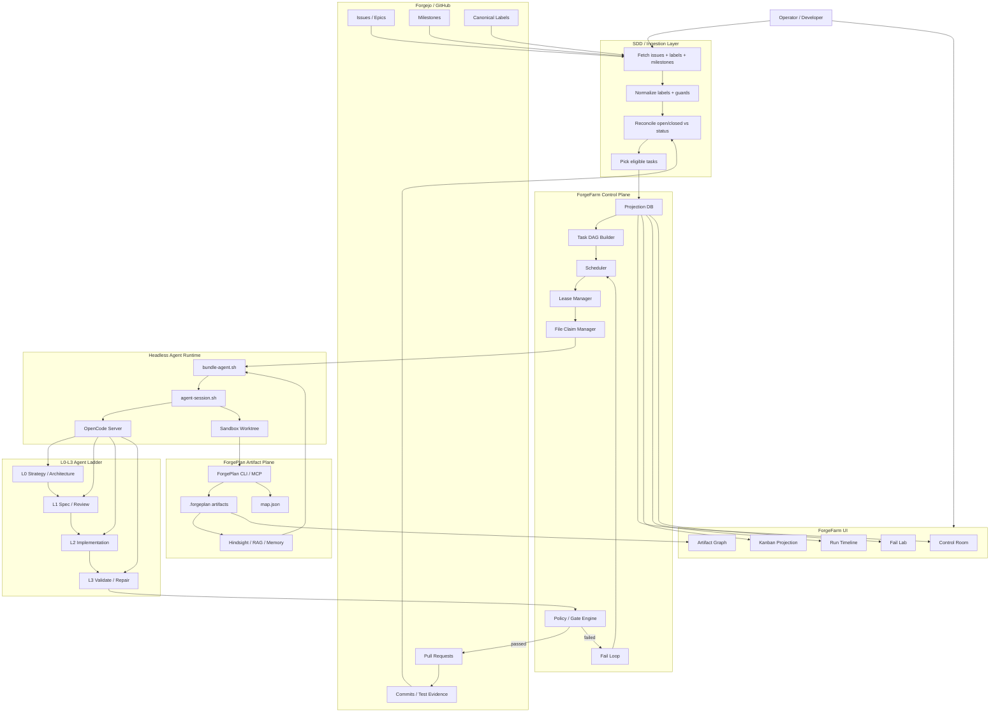

Отвечу как архитектор distributed agent systems и platform engineering с практикой построения CI/CD-orchestrator’ов для multi-agent разработки.

TL;DR: у человека схема по сути такая: **Gitea = task ledger**, **SDD scripts = batch/reconcile/picker**, **agent-session.sh + OpenCode = headless runtime**, **L0/L1/L2 = лестница моделей/исполнителей**, **Git commits/PRs = evidence**. Для ForgeFarm я бы не копировал это 1-в-1, а нормализовал: **Forgejo/GitHub остаётся tracker’ом**, **ForgePlan остаётся artifact kernel**, а **ForgeFarm становится control plane + projection DB + runtime orchestration**.

Вот собранная диаграмма:


Файлы:
[SVG архитектуры](sandbox:/mnt/data/forgefarm-sdd-architecture.svg) · [PNG архитектуры](sandbox:/mnt/data/forgefarm-sdd-architecture.png)

И отдельно sequence-поток:


Файлы:
[SVG sequence](sandbox:/mnt/data/forgefarm-sdd-sequence.svg) · [PNG sequence](sandbox:/mnt/data/forgefarm-sdd-sequence.png)

## Как я это прочитал

У него сейчас не «магический оркестратор», а довольно понятная схема:

```text
Operator
  ↓
make sdd-run
  ↓
fetch issues / labels / milestone
  ↓
normalize + reconcile state
  ↓
pick eligible issues
  ↓
lease issue / workflow label
  ↓
agent-session.sh
  ↓
OpenCode headless session
  ↓
L0 / L1 / L2 model or Codex lane
  ↓
commit / PR / evidence
  ↓
update issue labels / comments / state
```

Главная сильная идея: **issues не просто задачи, а внешний ledger**, а агенты не «читают чат», а получают нормализованный task envelope.

Главная слабость, если копировать напрямую: **Gitea labels начинают превращаться в runtime database**. Это нормально для скриптовой системы, но для ForgeFarm лучше сделать иначе:

```text
Forgejo/GitHub labels = внешнее зеркало статуса
ForgeFarm DB = настоящая runtime truth
ForgePlan artifacts = engineering truth
Git commits/PRs = evidence truth
```

## Нормализованная Mermaid-схема для ForgeFarm



## Что надо забрать из его системы в ForgeFarm

Первое: **batch runner**. Команда уровня:

```bash
forgefarm run --milestone M2 --batch 20 --dry-run
forgefarm run --milestone M2 --batch 20
forgefarm status --milestone M2
```

Второе: **reconcile слой**. Это прям обязательно. Нельзя слепо верить labels. Нужно сверять:

```text
issue.state
issue.labels
linked PR state
commit evidence
ForgePlan artifact state
ForgeFarm runtime state
```

Третье: **lease перед запуском агента**. Перед тем как агент начнёт работу, ForgeFarm должен забрать задачу в lease:

```text
task_run_id
agent_level
lease_owner
expires_at
workflow_label
claimed_paths
worktree_path
```

Четвёртое: **evidence-first close**. Задача не закрывается просто потому что агент сказал «готово». Нужны:

```text
commit hash
PR link
tests result
changed files
linked ForgePlan artifact
review/verifier result
```

Пятое: **fail board как отдельный first-class поток**, а не просто колонка. У fail-задачи должны быть:

```text
failure_class
retry_count
retry_budget
repair_strategy
human_required
reentry_condition
```

## Главное отличие ForgeFarm от его SDD-системы

У него схема больше похожа на:

```text
Gitea + make scripts + OpenCode + labels
```

У нас должна быть схема:

```text
ForgePlan artifact kernel
+
Forgejo/GitHub task ingress
+
ForgeFarm control plane
+
headless agent runtime
+
worktree/evidence/merge governance
```

То есть ForgeFarm — не просто `sdd-run` на стероидах. Это **панель управления агентной фабрикой разработки**, где issues, artifacts, PR, CI, memory и agents сведены в один управляемый runtime.
