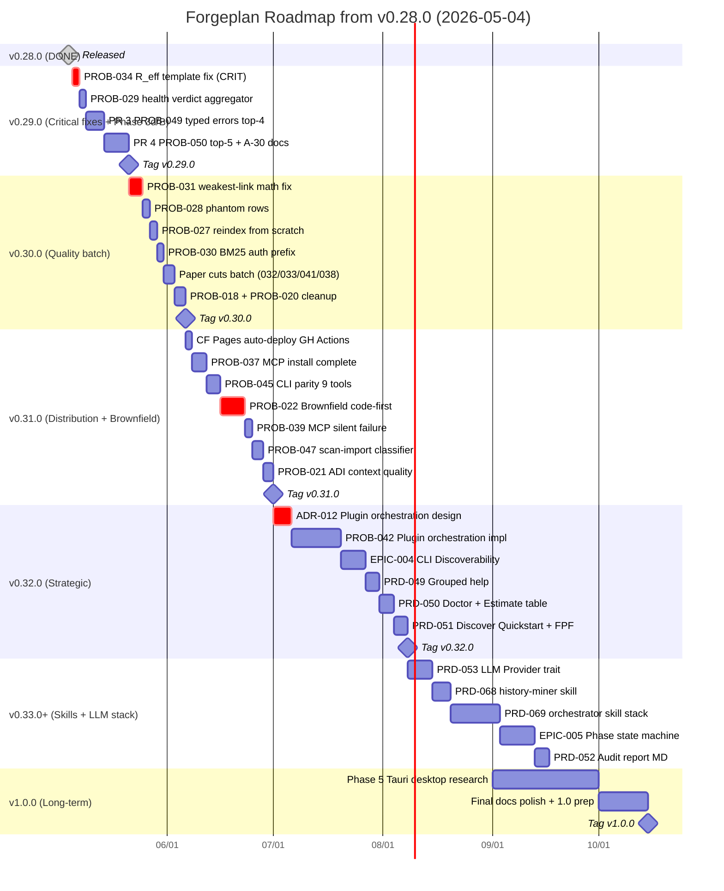

# Forgeplan Roadmap — 2026-05-04 snapshot

> Состояние **сразу после релиза v0.28.0** (4 May 2026). Снимок открытых
> работ: PROB'ы, PRD'ы, EPIC'и + предлагаемый порядок выполнения для
> следующих ~6 месяцев.

---

## Executive summary

| Метрика | Value |
|---------|------:|
| **Open PROBs** (active + draft) | **23** (15 active + 8 draft) |
| **Open PRDs** | **44** (34 active работают + 10 draft в backlog) |
| **EPICs** | **8** (6 active + 2 draft) |
| **RFCs** | **6 active** + 1 superseded |
| Live на forgeplan.dev | v0.28.0 (через CF Pages, manual deploy) |
| Brew formula | 0.28.0 |
| Tests | 1940+ |
| MCP tools | 63 |
| CLI commands | 76 |

---

## Текущий критический долг (CRITICAL — нельзя откладывать)

| ID | Что | Почему срочно | Effort |
|----|-----|---------------|--------|
| **PROB-034** | Multi-line HTML comments в evidence template **тенью перекрывают** структурные поля `verdict:`/`congruence_level:`/`evidence_type:` | Каждый existing evidence pack потенциально имеет CL0 (penalty 0.9) вместо реальных значений. R_eff scoring молча врёт по всему корпусу артефактов | S (1-2 дня) |
| **PROB-031** | R_eff rollup показывает 1.00 когда weakest evidence = CL0 = 0.1 | Math bug — нарушение weakest-link формулы (фундамент всей trust calculus) | M (3-5 дней) |
| **PROB-029** | `forgeplan health` сообщает «healthy» несмотря на active stubs/duplicates warnings | Verdict logic врёт о готовности — health gate теряет ценность | S (1-2 дня) |

---

## Tiered priority list

### Tier 1 — v0.29.0 (already planned, ~2 weeks)

| Item | Что | Effort |
|------|-----|--------|
| **PROB-034 fix** | Template HTML-comment shadow исправление + sweep all existing evidence | S+M |
| **PR 3 — PROB-049** (Phase 3d typed errors) | StoreError split, MutationContext, # Errors rustdoc, let-else (4 of 14 AC) | M-L |
| **PR 4 — PROB-050** top-5 (Phase B follow-ups) | SPEC-003 1.2 doc, claude_print::invoke() extract, ENV lock, API tighten, integration test | L |
| **A-30** drift detector documentation | `docs/operations/QUALITY-GATES.ru.md` + CLAUDE.md + release-workflow refs + CHANGELOG retroactive | S |
| **PROB-029** health verdict aggregator | Verdict logic refactor | S |

### Tier 2 — v0.30.0 (quality + paper cuts, ~2 weeks)

| Item | Что | Effort |
|------|-----|--------|
| **PROB-031** R_eff weakest-link math fix | Core trust calculus correctness | M |
| **PROB-028** phantom rows after .md delete | LanceDB orphan cleanup | S |
| **PROB-027** reindex from scratch (draft) | Restore `lance/` dir capability | S |
| **PROB-030** BM25 search regression | `auth` prefix → 0 results bug | S |
| **PROB-032** score display 0.0 breakdown | UI display bug | XS |
| **PROB-033** new evidence blocked on fresh ws | Session state machine fix | S |
| **PROB-041** dotenvy walk-up | CLI loads `.forgeplan/.env` | XS |
| **PROB-038** validator false-positive on tech names (draft) | HTML template comment scoping | XS |
| **PROB-018** E2E smoke 3 bugs | Cleanup batch | M |
| **PROB-020** graph integrity (deprecated/phantom links) | Cleanup batch | M |

### Tier 3 — v0.31.0 (Distribution + brownfield, ~3 weeks)

| Item | Что | Effort |
|------|-----|--------|
| **CF Pages auto-deploy** (no PROB# yet) | `.github/workflows/deploy-website.yml` triggered by main push, CF API token secret | S |
| **PROB-037** MCP install/brew distribution | embed/install commands + complete brew | M |
| **PROB-045** CLI parity (9 MCP-only tools) | Add CLI commands for undo, activity, dispatch, phase | M |
| **PROB-022** Brownfield code-first protocol (draft) | Discovery protocol + source tier priority | L (potentially RFC needed) |
| **PROB-039** MCP silent failure (draft) | Capabilities + transport field fix | S |
| **PROB-047** scan-import false-positive | Document classifier improvement | M |
| **PROB-021** ADI quality (context handling) | Reasoning improvement | M |

### Tier 4 — v0.32.0+ (Strategic + EPICs, ~4 weeks)

| Item | Что | Effort |
|------|-----|--------|
| **PROB-042** Plugin orchestration architecture | **Big strategic**: Forgeplan-as-orchestrator vs Forgeplan-as-monolith. Likely requires new ADR-012 | XL |
| **EPIC-004** CLI Discoverability + Enterprise Readiness | Open umbrella for grouped help, doctor, discover quickstart | XL |
| **EPIC-005** Phase state machine (draft) | Workflow-aware methodology | L |
| **PRD-049** Grouped help (draft) | CLI navigation improvement | M |
| **PRD-050** Doctor + Estimate table default (draft) | UX polish | M |
| **PRD-051** Discover Quickstart + FPF Explain (draft) | Onboarding improvement | M |
| **PRD-052** Audit Report MD (draft) | Audit output format | M |
| **PRD-053** LLM Provider Trait (draft) | Driver abstraction | L |
| **PRD-068** forge-history-miner skill (draft) | git log → inferred ADR drafts | M |
| **PRD-069** forge-orchestrator + ingest + scaffolder (draft) | Multi-agent skill stack | XL |

### Tier 5 — Long-term (v1.0+, deferred)

| Item | Что | Notes |
|------|-----|-------|
| **PRD-025** Nx monorepo migration | Polyglot workspace | Deferred per memory — not blocking |
| **Phase 5 — Tauri Desktop** | GUI app | Backlog Epic, no PRD yet |
| **Cleanup batch** | PROB-026, 044 (draft historical findings) | Drain when capacity allows |

---

## Sprint plan (proposed)

---

## Reading the Gantt

**Каждый PR не блокирует другой PR**, но связан темой:
- `v0.29.0` = critical fixes блок-out для всего остального (R_eff трасты должны быть честными)
- `v0.30.0` = quality batch (paper cuts быстро закрываются параллельно)
- `v0.31.0` = distribution + brownfield (большая работа, требует RFC если PROB-022 решено decisively)
- `v0.32.0` = strategic — `PROB-042 plugin orchestration` это самый большой single decision проекта (architectural identity)
- `v0.33+` = skill stack + EPIC-005 phase state machine
- `v1.0.0` = Tauri desktop + final polish

**Realistic timeline** (с учётом ~2 PR'ов в неделю sustainable pace):
- v0.29.0 → ~2 weeks (mid-May 2026)
- v0.30.0 → ~2 weeks (end-May 2026)
- v0.31.0 → ~3-4 weeks (June 2026)
- v0.32.0 → ~4-6 weeks (July 2026 — strategic refactor)
- v0.33-0.35 → ~2-3 months (Aug-Oct 2026)
- v1.0.0 → ~Q4 2026 / Q1 2027

---

## Risk / known unknowns

| Risk | Impact | Mitigation |
|------|--------|------------|
| **PROB-042 plugin orchestration** требует strategic decision о identity Forgeplan (orchestrator vs monolith) | Может развернуть scope v0.32.0 на 2-3× | Начать с ADR-012 explicitly — let user weigh in |
| **PROB-034 R_eff template** может invalidate **существующие evidence packs** | Все scoring backsweep — потенциально неделя дополнительной работы | Backsweep script + grep audit на all evidence/* при fix |
| **CF Pages no Git Provider** (manual deploy) | Каждый release требует ручного wrangler run | `.github/workflows/deploy-website.yml` в v0.31 закрывает navсегда |
| **22+ open PROBs** | Risk of analysis paralysis при выборе priority | Tier system выше — фокус на critical + planned, остальное rolling |
| **EPIC-008 Business Logic Extraction (Factum Intent Methodology)** active но малый momentum | Может остаться draft-state долго | Re-evaluate at v0.32.0 — drop or activate fully |

---

## What's NOT in roadmap (out of scope)

- **PRD-025 Nx monorepo** — deferred per memory; не blocking; revisit when polyglot needed
- **Phase 5 Tauri** — explicitly scheduled для Q4 2026
- **PROB-026 / PROB-044** — historical handoff resolution records (drain at capacity)

---

## Update cadence

Этот roadmap — snapshot 2026-05-04. **Re-generate** перед каждым sprint planning meeting (~each release):
1. Run `forgeplan list` для PROB/PRD/EPIC актуальных counts
2. Update Gantt sections
3. Save under new dated filename (`ROADMAP-YYYY-MM-DD.md`) — не overwrite previous

---

## Source artifacts

Полный список открытых работ (для cross-reference):

**Active PROBs (15)**: PROB-018, 020, 021, 028, 029, 030, 031, 032, 033, 034, 037, 041, 042, 045, 047
**Draft PROBs (8)**: PROB-022, 026, 027, 038, 039, 044, 049, 050
**Active PRDs (34)** + **Draft PRDs (10)**: PRD-025, 049, 050, 051, 052, 053, 055, 056, 068, 069
**EPICs (6 active + 2 draft)**: EPIC-001..008
**RFCs (6 active)**: RFC-001, 003, 004, 005, 006, 007

Cross-reference в .forgeplan/ workspace через `forgeplan get <ID>`.
