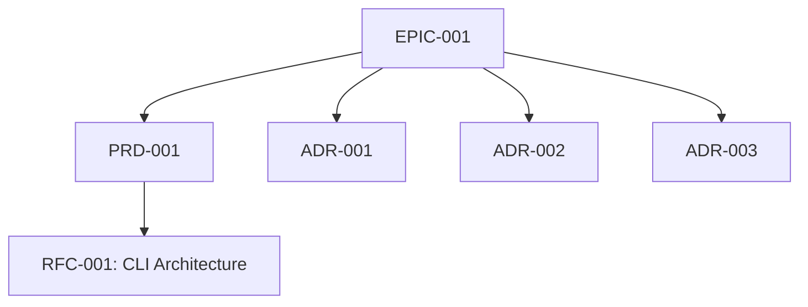

# EPIC-001: Build Forgeplan — Rust CLI + Desktop App

## Progress (Aggregated)

```
PRD-001  ██████████░░░░░░░░░░░░░░  4/10  ( 40%) In Progress
RFC-001  ████████████████████████  5/5   (100%) Phase A DONE
ADR-001  ████████████████████████  1/1   (100%) DONE
ADR-002  ████████████████████████  1/1   (100%) DONE
ADR-003  ████████████████████████  1/1   (100%) DONE
─────────────────────────────────────────────────
TOTAL                              12/18 (66.7%)
```

---

## Vision

Forgeplan --- универсальная платформа для ведения проектов от идеи до реализации. CLI `forgeplan` (alias `fpl`) + Desktop App (Tauri + React) с quality scoring, semantic search и evidence tracking.

## Outcomes (Measurable)

1. **Time to first artifact**: `forgeplan init` -> первый артефакт < 30 секунд
2. **Покрытие типов артефактов**: 10 типов с шаблонами и валидацией
3. **Quality scoring**: R_eff quality scoring по evidence (weakest link)
4. **Скорость поиска**: semantic search < 500ms на 1000 артефактов
5. **Размер бинарника**: CLI binary < 15MB

## Problem Space

Документы (PRD, RFC, ADR) создаются ad-hoc без стандартов. Нет связей между артефактами. Нет quality scoring. Каждый проект изобретает процесс заново. Решения теряются, контекст забывается, evidence устаревает незаметно.

## Scope

### In Scope
- CLI на Rust (single binary, `forgeplan` / `fpl`)
- Desktop App (Tauri 2.0 + React, shared Rust core)
- LanceDB (embedded DB: structured tables + vector embeddings)
- 10 типов артефактов с Markdown шаблонами
- Валидация артефактов (BMAD 13-step rules)
- R_eff quality scoring (weakest link)
- Semantic search (ONNX local embeddings, BGE-M3)
- Dependency graph (mermaid)

### Out of Scope
- NOT project management (не Jira/Linear)
- NOT CI/CD
- NOT SaaS
- NOT code generator
- NOT real-time collaboration

## Children (PRDs, RFCs, ADRs)

| Type | ID | Title | Status | Progress |
|------|------|-------|--------|----------|
| PRD | PRD-001 | Forgeplan CLI | In Progress | 40% |
| RFC | RFC-001 | CLI Architecture | Active | 100% (Phase A) |
| ADR | ADR-001 | Rust вместо Go | Accepted | 100% |
| ADR | ADR-002 | LanceDB вместо SQLite | Accepted | 100% |
| ADR | ADR-003 | DEC merged into ADR | Accepted | 100% |

## Dependency Graph



## Phases

### Phase 1: Schemas & Templates (DONE)
- Формальные схемы артефактов (PRD-SCHEMA, EPIC-SCHEMA, SPEC-SCHEMA)
- Markdown шаблоны для всех типов
- Документация модели артефактов

### Phase 2: Workflow Integration
- Decision tree: какой документ создать
- Depth calibration rules
- Adversarial review process

### Phase 3: Rust CLI + LanceDB
- `forgeplan init`, `new`, `list`, `status`, `validate`
- R_eff scoring, dependency graph
- LanceDB storage + Markdown projections

### Phase 4: Desktop App + AI
- Tauri 2.0 + React frontend
- Shared Rust core (forgeplan-core)
- AI-assisted artifact generation

### Phase 5: MCP Server
- MCP server (rmcp) для интеграции с AI-инструментами
- Slash commands для Claude Code / Cursor

## Risks

| Risk | Impact | Mitigation |
|------|--------|------------|
| LanceDB Rust SDK immature --- возможны breaking changes и неполная документация | High | Fallback to SQLite; pin версии; абстракция storage layer |
| ONNX Runtime binary size --- увеличивает размер бинарника > 15MB | Medium | Optional feature flag; download on first use |
| Scope creep (Desktop App too early) --- распыление ресурсов до готовности CLI | High | CLI-first подход; Phase 4 начинается только после стабильного CLI |

## Timeline

| Phase | Start | End | Status |
|-------|-------|-----|--------|
| Phase 1: Schemas & Templates | 2026-01-15 | 2026-03-15 | Done |
| Phase 2: Workflow Integration | 2026-03-16 | 2026-04-15 | In Progress |
| Phase 3: Rust CLI + LanceDB | 2026-03-21 | 2026-06-30 | In Progress |
| Phase 4: Desktop App + AI | 2026-07-01 | 2026-09-30 | Not Started |
| Phase 5: MCP Server | 2026-10-01 | 2026-11-30 | Not Started |

## Implementation Log

<!-- Add entries as phases complete:

### Phase 1 Complete --- 2026-03-15
| Artifact | Status | Key Outcome |
|----------|--------|-------------|
| PRD-SCHEMA | Done | Обязательные секции PRD, depth calibration, validation rules |
| EPIC-SCHEMA | Done | Aggregated progress, children rules |
| SPEC-SCHEMA | Done | API contracts, data models, versioning |
| Templates (5 типов) | Done | PRD, Epic, Spec, RFC, ADR шаблоны |
-->

## Related

- PLAN.md: 49 задач, 5 фаз с progress bars
- TODO.md: Текущие приоритеты P0/P1/P2
- VISION.md: Архитектура, data model, tech stack
