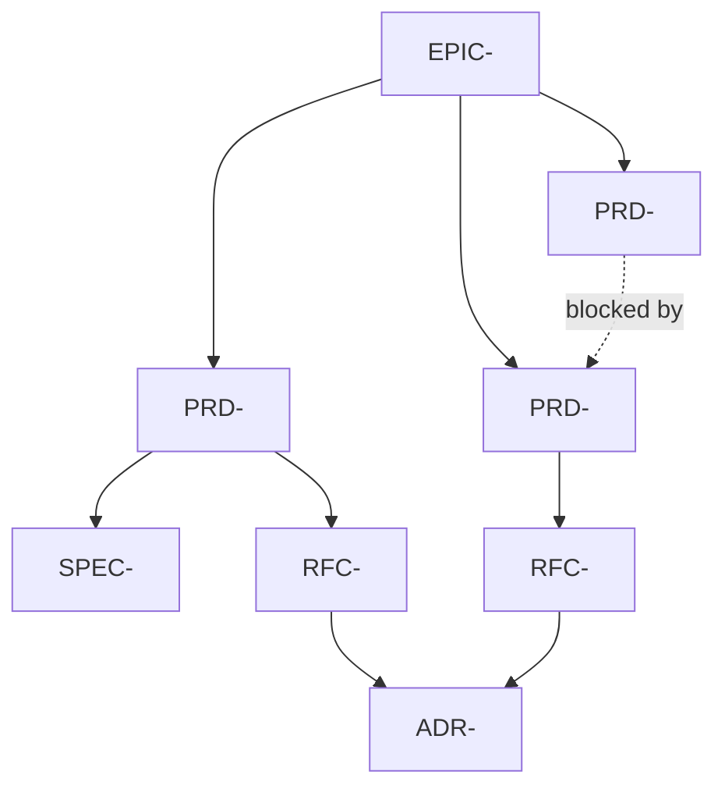

# EPIC-{NNN}: {Initiative Name}

## Progress (Aggregated)

```
PRD-<id-a>  ████████████████████████  8/8   (100%) DONE
PRD-<id-b>  ██████████████░░░░░░░░░░  7/12  ( 58%)
PRD-<id-c>  ░░░░░░░░░░░░░░░░░░░░░░░░  0/6   (  0%)
─────────────────────────────────────────────────
TOTAL                              15/26 (57.7%)
```

---

## Vision

Одно предложение — что хотим достичь этой инициативой.

## Outcomes (Measurable)

1. **Outcome 1**: metric -> target value
2. **Outcome 2**: metric -> target value
3. **Outcome 3**: metric -> target value

## Problem Space

Какие проблемы объединяет этот эпик. Почему их нужно решать вместе.

## Scope

### In Scope
- ...

### Out of Scope
- ...

## Children (PRDs, RFCs, ADRs)

| Type | ID | Title | Status | Owner |
|------|------|-------|--------|-------|
| PRD | PRD-<id> | ... | Approved | ... |
| PRD | PRD-<id> | ... | Draft | ... |
| SPEC | SPEC-<id> | ... | Approved | ... |
| RFC | RFC-<id> | ... | Implemented | ... |
| RFC | RFC-<id> | ... | Draft | ... |
| ADR | ADR-<id> | ... | Accepted | ... |

## Dependency Graph



## Phases

### Phase 1: Foundation
- PRD-<id-a> -> SPEC-<id> -> RFC-<id-a>
- ADR-<id>

### Phase 2: Core
- PRD-<id-b> -> RFC-<id-b>

### Phase 3: Enhancement
- PRD-<id-c> (depends on Phase 2)

## Risks

| Risk | Impact | Mitigation |
|------|--------|------------|
| ... | High | ... |

## Timeline

| Phase | Start | End | Status |
|-------|-------|-----|--------|
| Phase 1 | YYYY-MM-DD | YYYY-MM-DD | Done |
| Phase 2 | YYYY-MM-DD | YYYY-MM-DD | In Progress |
| Phase 3 | YYYY-MM-DD | YYYY-MM-DD | Not Started |

## Implementation Log

<!-- Add entries as phases complete:

### Phase 1 Complete — YYYY-MM-DD
| Artifact | Status | Key Outcome |
|----------|--------|-------------|
| PRD-<id-a> | Done | Requirements locked |
| RFC-<id-a> | Done | Architecture implemented |
-->

## Related

- Epic-<id>: {link}
- Roadmap: {link}
