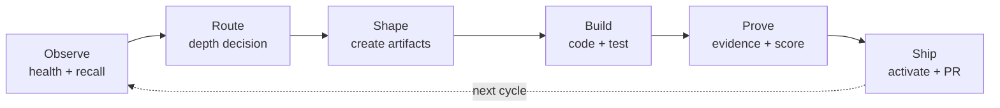

## The Full Cycle

Every non-trivial task follows this lifecycle:

```
OBSERVE → ROUTE → SHAPE → BUILD → PROVE → SHIP
```

| Phase | What happens | Forgeplan commands |
|-------|-------------|-------------------|
| **Observe** | Understand current state | `forgeplan health`, `memory_recall` |
| **Route** | Determine depth + pipeline | `forgeplan route "task"` |
| **Shape** | Create artifacts, fill requirements | `forgeplan new prd`, `forgeplan validate` |
| **Build** | Implement + test | `cargo test`, `pytest`, `pnpm test` |
| **Prove** | Create evidence, score | `forgeplan new evidence`, `forgeplan score` |
| **Ship** | Activate, commit, PR, merge | `forgeplan activate`, `gh pr create` |



## Phase 0: Observe

Before doing anything — understand what's happening:

```bash
# 1. Restore context from memory
memory_recall("project name")

# 2. Check project health
forgeplan health
# → Shows: blind spots, orphans, stale artifacts

# 3. Check current tasks
# Orchestra: mcp__orch__query_entities(status: "in_progress")
# Or: check TODO.md
```

**Rule**: if health shows blind spots or orphans — **fix them FIRST**, before starting new work.

## Phase 1: Route

Determine the right level of rigor:

```bash
forgeplan route "add payment processing"
# → Depth: Deep
# → Pipeline: PRD → Spec → RFC → ADR
# → Confidence: 92%
```

| Depth | What to do | Time |
|-------|-----------|------|
| Tactical | Just code, no artifacts | Minutes |
| Standard | PRD → RFC → code → evidence | Hours |
| Deep | PRD → Spec → RFC → ADR → code → evidence | Days |
| Critical | Epic → PRD[] → Spec[] → RFC[] → ADR[] | Weeks |

**Tactical = skip to Build.** Everything else = continue to Shape.

## Phase 2: Shape

Create the right artifacts and fill them:

```bash
# Create artifact
forgeplan new prd "Payment Processing"

# Fill MUST sections: Problem, Goals, Non-Goals, Target Users, FR
# Each FR: "[Actor] can [capability]" — no tech names

# Validate
forgeplan validate PRD-001
# → PASS (0 MUST errors)
```

### ADI Reasoning (Standard+)

Before coding — reason through alternatives:

```bash
forgeplan reason PRD-001
# → 3+ hypotheses
# → Predictions for each
# → Evidence check
```

If all hypotheses converge → code with confidence.
If competing approaches → discuss with team before coding.

**Deep/Critical: ADI is MANDATORY.** Skipping it is a methodology violation.

## Phase 3: Build

Implement the solution:

```bash
# 1. Create branch
git checkout dev && git pull origin dev
git checkout -b feat/payment-processing

# 2. Code
# - Test every new public function IMMEDIATELY
# - Don't move to next function without test

# 3. Format + lint
cargo fmt && cargo fmt -- --check   # Rust
ruff format && ruff check           # Python
pnpm exec tsc --noEmit              # TypeScript

# 4. Test
cargo test        # Rust
pytest             # Python
pnpm test          # TypeScript
```

### Audit (Standard+)

```bash
# Run multi-expert audit (4 agents: logic, architecture, security, tests)
/audit

# Fix all HIGH/CRITICAL findings
# Then RE-RUN tests after fixes — don't trust previous run
```

## Phase 4: Prove

Create evidence that the solution works:

```bash
# Create evidence pack
forgeplan new evidence "Payment: 15 tests pass, Stripe benchmark 200ms"

# Add structured fields to body (REQUIRED):
# verdict: supports
# congruence_level: 3
# evidence_type: test

# Link to decision
forgeplan link EVID-001 PRD-001 --relation informs

# Check score
forgeplan score PRD-001
# → R_eff = 1.00
```

:::caution
Without structured fields (verdict, congruence_level, evidence_type), R_eff parser assigns CL0 = 0.9 penalty. **Always add them.**
:::

## Phase 5: Ship

Activate the artifact and create PR:

```bash
# 1. Review + activate
forgeplan review PRD-001
forgeplan activate PRD-001

# 2. Push + PR
git push origin feat/payment-processing
gh pr create --base dev --title "[PRD-001] Payment Processing"

# 3. After merge — sync
git checkout dev && git pull origin dev

# 4. Save to memory
memory_retain("Payment processing: implemented, 15 tests, R_eff=1.00")

# 5. Update progress
# - RFC checkboxes: [x]
# - TODO.md: move to Done
```

## Pipeline Types

### Greenfield (new module from scratch)

```
Research → PRD → Spec → RFC → ADR → Build → Audit → Evidence
```

Everything is unknown. Need all artifacts. Start with Research.

### Brownfield (existing code)

```
Explore → Identify → {
  feature:   PRD → RFC → Build
  bug:       Problem → Fix
  refactor:  Audit → Problem → RFC → Build
  migration: Research → ADR → RFC → Build
}
```

Code already exists. Start with **Explore** (understand what's there).

### Mixed

```
New bounded context  → Greenfield pipeline
Existing module      → Brownfield pipeline
```

Choose pipeline **by context**, not by project.

## Forge-Cycle Command

The `/forge-cycle` command runs all phases automatically:

```
/forge-cycle PRD-001

Phase 0: OBSERVE   → forgeplan health
Phase 1: ROUTE     → forgeplan route
Phase 2: SPRINT    → /sprint (plan waves)
Phase 3: BUILD     → /team-up (implement)
Phase 4: AUDIT     → /audit (adversarial review)
Phase 5: FIXES     → fix HIGH/CRITICAL
Phase 6: EVIDENCE  → forgeplan new evidence + score
Phase 7: COMMIT    → git commit + PR
Phase 8: NEXT      → forgeplan health → next task
```

## Scope Lock

| Session type | Do | Don't |
|-------------|-----|-------|
| **Tactical** (concrete task) | Code, test, commit | Don't drift into planning |
| **Strategic** (research, planning) | Research, create artifacts | Don't start coding |

If you notice scope drift → bookmark progress → start a new session of the right type.

## Checklist: Is the Work Done?

- [ ] Artifact filled (MUST sections)
- [ ] Validation PASS
- [ ] ADI reasoning done (Standard+)
- [ ] Code implemented
- [ ] Tests pass
- [ ] Format + lint clean
- [ ] Audit: 0 HIGH/CRITICAL
- [ ] Evidence created with structured fields
- [ ] R_eff > 0
- [ ] Artifact activated
- [ ] PR created and merged
- [ ] Progress updated (RFC checkboxes, TODO.md)
- [ ] Memory retained (if significant)
