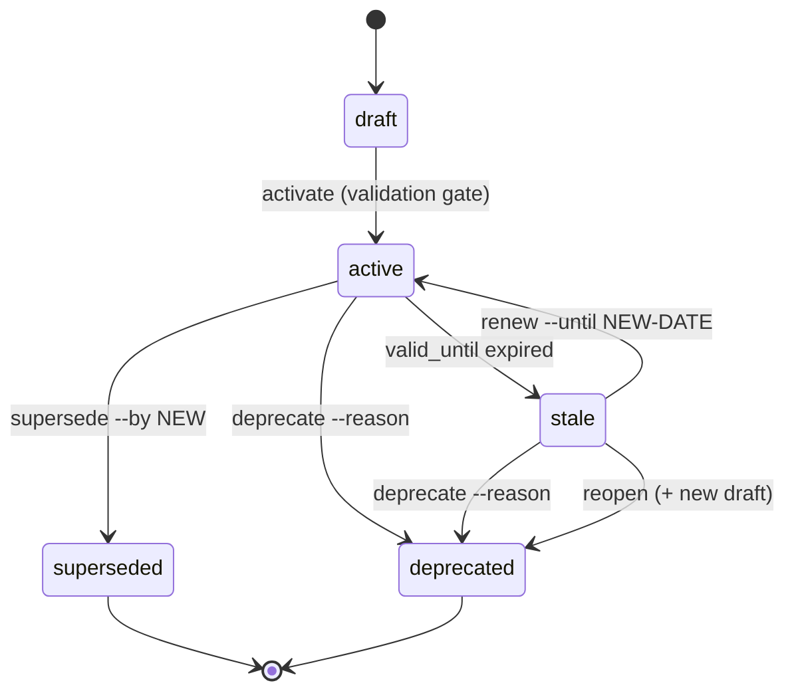

Forgeplan artifacts are not just files — they are **decisions with a lifetime**.
A PRD that was correct six months ago may be wrong today. An ADR that
captured your architecture may be superseded by a better one. Evidence that
justified a choice may expire as the world changes.

Lifecycle v2 (shipped in v0.12 as [ADR-005](#related)) gives every artifact
a well-defined state machine so you can answer three questions at any time:

1. **Is this artifact still in force?**
2. **If it's gone, what replaced it?**
3. **If it's stale, should we renew it or reopen the decision?**

This guide walks through the full state machine, explains terminal states,
and shows four practical flows from real Forgeplan usage.

## Why a lifecycle, not just `draft` / `active`?

Early versions of Forgeplan had only two states. That was enough to ship a
PRD, but it was not enough to answer "what happened to PRD-014?" six months
later. You need to distinguish:

- A PRD that was **replaced** by a better one (`superseded`, with a pointer).
- A PRD that was **abandoned** for a reason (`deprecated`, with a reason).
- A PRD that **expired** but may still be correct (`stale`, needs review).
- A PRD that was stale and got **renewed** vs. **re-evaluated from scratch**.

Without those distinctions you end up with a graveyard of "old" artifacts
and no idea which ones are still load-bearing. Lifecycle v2 fixes that.

## State machine



Transitions in plain text:

```
draft → active → superseded   (terminal)
               → deprecated   (terminal)
               → stale → active                 (renew)
                       → deprecated             (deprecate)
                       → deprecated + NEW draft (reopen, lineage)
```

## Each state explained

### `draft`

The initial state of every artifact. `forgeplan new prd "..."` creates a
draft from a template. Drafts can be freely edited.

- **Notes and Problems**: no validation gate — you can activate immediately.
- **PRD, RFC, ADR, Epic, Spec**: MUST rules from the validator must pass
  before activation. Run `forgeplan validate PRD-001` to check.

To move forward:

```bash
forgeplan review PRD-001      # dry-run: is it ready?
forgeplan activate PRD-001    # draft → active
```

### `active`

The artifact is in force. Other artifacts can link to it, `forgeplan health`
counts it as a live decision, and `forgeplan score` computes its R_eff based
on linked evidence.

An active artifact can leave this state in three ways: `supersede`,
`deprecate`, or by becoming `stale` when its `valid_until` date passes.

### `superseded` — terminal

The artifact was replaced by a more recent one. You **must** point to the
replacement:

```bash
forgeplan supersede ADR-003 --by ADR-007
```

The old artifact keeps all its history and links, but it's no longer in
force. `forgeplan health` will not flag it as missing evidence — it's done.

### `deprecated` — terminal

The artifact is no longer applicable, and there is no single replacement.
You must give a reason:

```bash
forgeplan deprecate PRD-014 --reason "Feature cut from v1 scope"
```

Use `deprecate` when the decision is retired entirely (e.g. a feature is
cancelled), not when it is replaced by another artifact (use `supersede`
for that).

### `stale`

An artifact becomes `stale` automatically when its `valid_until` frontmatter
date passes. It is still available for reading and linking, but Forgeplan
will flag it so you consciously choose what to do next.

Stale is the **only non-terminal exit** from `active`. It exists precisely
so you are forced to revisit old decisions instead of silently trusting them.

From `stale` you have three options: `renew`, `deprecate`, or `reopen`.

### `renew` — stale back to active

Use `renew` when the decision is still correct and you just want to extend
its validity window:

```bash
forgeplan renew PRD-005 \
  --reason "Re-validated after Q2 review, still matches product direction" \
  --until 2026-10-01
```

The artifact returns to `active` with a new `valid_until`. Nothing else
changes — same ID, same history, same links.

### `reopen` — stale/active to a new draft (lineage)

Use `reopen` when the old decision needs to be **re-made from scratch**.
The original artifact moves to `deprecated` (terminal), and Forgeplan
creates a **new draft** linked as its lineage continuation:

```bash
forgeplan reopen PRD-005 \
  --reason "Underlying assumptions changed after PROB-021 findings"
```

This gives you a clean slate (new draft, empty evidence, new `valid_until`)
while preserving the audit trail of what came before.

## Why `superseded` and `deprecated` are terminal

Both states are **final**. You cannot un-supersede an artifact, and you
cannot un-deprecate one. The only way to "bring something back" is to
create a new artifact.

This is a deliberate design choice:

- **Auditability.** If a deprecated ADR could silently become active again,
  every linked decision would need to be re-verified. Terminal states mean
  "this decision has left the graph."
- **Lineage.** `reopen` already covers "re-evaluate this decision" — it
  creates a new draft as a clear continuation. Resurrecting the old
  artifact would erase the history of the break.
- **Trust.** When you read a `superseded` PRD, you know exactly what
  happened: it was replaced by the artifact in `--by`. No ambiguity.

If you want a soft "paused" state, use a `stale` artifact with a far-future
`valid_until` — it stays live and reviewable.

## Practical flows

### Flow 1 — Normal PRD lifecycle

The happy path for any Standard+ depth task:

```bash
# 1. Shape
forgeplan new prd "Auth System"
# edit .forgeplan/prds/PRD-018-auth-system.md — fill all MUST sections

# 2. Validate
forgeplan validate PRD-018
# → PASS (0 MUST errors)

# 3. Review + activate
forgeplan review PRD-018
forgeplan activate PRD-018        # draft → active

# 4. Implement, add evidence
forgeplan new evidence "Integration tests for auth middleware"
forgeplan link EVID-042 PRD-018 --relation informs
forgeplan score PRD-018           # R_eff > 0
```

Пример сценария: типичный спринт для фичи 1-3 дня. Артефакт живёт в
`active` столько, сколько актуально его решение.

### Flow 2 — Replacing an ADR

You wrote ADR-003 ("SQLite storage") a year ago. Now you are moving to
LanceDB and need to capture the new decision without losing history.

```bash
# 1. Write the new ADR first
forgeplan new adr "LanceDB as primary store"
# fill context, decision, consequences → PRD-validate → activate
forgeplan activate ADR-007

# 2. Supersede the old one, pointing at the replacement
forgeplan supersede ADR-003 --by ADR-007
```

Now `forgeplan list --status active` hides ADR-003, and anyone reading
ADR-003 sees "superseded by ADR-007" at the top. The DAG stays consistent.

### Flow 3 — Renewing a stale PRD

A PRD from six months ago had `valid_until: 2026-04-01`. It's now April 11
and `forgeplan health` flags it as stale:

```bash
forgeplan health
# → Stale: PRD-012 (valid_until 2026-04-01, 10 days ago)
```

You read it. The product direction hasn't changed, the PRD is still
correct, you just forgot to extend the date:

```bash
forgeplan renew PRD-012 \
  --reason "Re-validated after Q2 planning — scope unchanged" \
  --until 2026-10-01
```

Back to `active`. The reason is recorded in the artifact history so future
readers know **why** you trusted it.

### Flow 4 — Reopening a stale decision

Same starting point: PRD-012 is stale. But this time you find that
PROB-021 uncovered a flawed assumption. The PRD is not just out of date —
it is **wrong in its current form** and needs re-thinking from scratch.

```bash
forgeplan reopen PRD-012 \
  --reason "Assumption about user concurrency invalidated by PROB-021"
```

Result:

- `PRD-012` → `deprecated` (terminal), with the reason recorded.
- `PRD-019` (new draft) is created as the lineage continuation.
- You now shape PRD-019 from scratch, validate, review, activate.

The audit trail is: PRD-012 existed, became stale, was reopened with a
specific reason, and was succeeded by PRD-019. Every reader can reconstruct
that story months later.

## Anti-patterns

Things to avoid — each one breaks an assumption the rest of Forgeplan
makes about the artifact graph.

- **Activating without evidence.** `activate` doesn't require linked
  evidence, but an active PRD with `R_eff = 0` is a "blind spot" that
  `forgeplan health` will flag. Create an EvidencePack and `forgeplan link`
  it before trusting the decision.
- **Superseding without `--by`.** The CLI requires `--by` for a reason:
  an orphaned `superseded` status hides **which** artifact took over. Use
  `deprecate --reason "..."` if there is no single replacement.
- **Reopening an active artifact lightly.** `reopen` is for re-evaluation
  when the underlying assumptions have changed. If the artifact is still
  correct and just needs a fresh date, use `renew` — it's lossless.
- **Deleting instead of superseding.** Deleting a file loses the history,
  the links, and the audit trail. Always transition through the lifecycle.
  Files are the source of truth (see [ADR-003](#related)), but the state
  transitions are what make them trustworthy over time.
- **Editing a terminal artifact.** Once `superseded` or `deprecated`, an
  artifact is frozen for history. If you need to say something new, create
  a new draft and link it.
- **Skipping self-link checks.** PROB-019 (self-link guard) was added to
  block `forgeplan link X X` and similar cycles. Don't work around the
  guard — fix the link direction instead.

## DerivedStatus — quality, orthogonal to lifecycle

Alongside the lifecycle state, every artifact has a **DerivedStatus**
computed from its evidence and validation state:

```
UNDERFRAMED → FRAMED → EXPLORING → COMPARED → DECIDED → APPLIED
```

This quality progression (inherited from Quint-code) is **orthogonal** to
the lifecycle state machine:

- Lifecycle answers "is this decision in force?"
- DerivedStatus answers "how well-grounded is this decision?"

An `active` PRD can be `UNDERFRAMED` (active but missing evidence — a
blind spot). A `draft` PRD can already be `COMPARED` (rich evidence, not
yet activated). Both dimensions matter, and `forgeplan health` surfaces
mismatches between them.

## Related

- **[ADR-005](https://github.com/ForgePlan/forgeplan/blob/main/.forgeplan/adrs/ADR-005-lifecycle-v2.md)** — the decision record introducing lifecycle v2.
- **[ADR-003](https://github.com/ForgePlan/forgeplan/blob/main/.forgeplan/adrs/ADR-003-markdown-source-of-truth.md)** — markdown files are the source of truth, LanceDB is a derived index.
- **PROB-019** — self-link guard, added while hardening the lifecycle transitions.
- **PR #85** — Sprint 1 lifecycle cleanup: canonical transitions and terminal enforcement.

## See also

- [`forgeplan activate`](/docs/cli/activate/) — draft → active (with validation gate)
- [`forgeplan supersede`](/docs/cli/supersede/) — active → superseded, requires `--by`
- [`forgeplan deprecate`](/docs/cli/deprecate/) — active/stale → deprecated, requires `--reason`
- [`forgeplan renew`](/docs/cli/renew/) — stale → active, extends `valid_until`
- [`forgeplan reopen`](/docs/cli/reopen/) — stale/active → deprecated + new draft (lineage)
