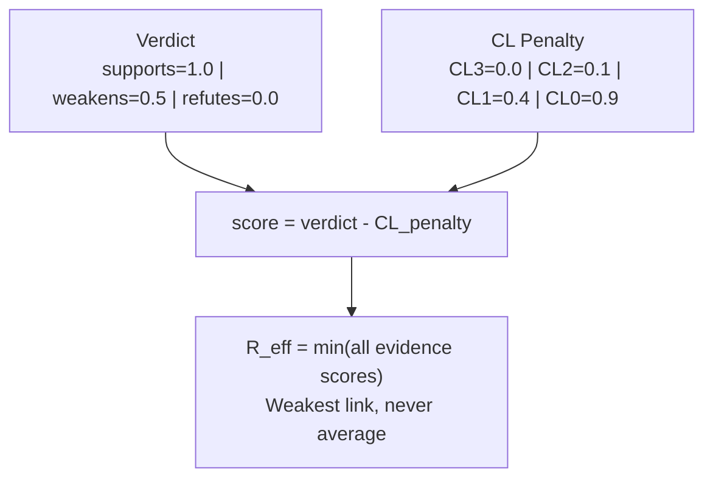

## Why This Matters

Most teams make decisions based on intuition, experience, or authority ("the senior engineer said so"). This works until it does not. When a production incident happens and someone asks "why did we think this would work?", the answer is usually "we just... thought it would."

Evidence-based decision making replaces "trust me" with "here is the data." It is not about bureaucracy -- it is about knowing which of your decisions are solid and which are standing on untested assumptions. Forgeplan's R_eff score gives you a single number that answers: **how much should I trust this decision?**

The most valuable insight is not a high score -- it is finding a low one. A decision with R_eff = 0.1 tells you exactly where your risk lives, before it becomes a production incident.

## The Principle

**Trust is not a feeling. It's a measurement.**

Every decision in Forgeplan has an R_eff score -- a number that tells you how reliable it is, based on actual evidence.

## R_eff Formula

```
R_eff = min(evidence_scores)
```

**Not average -- minimum.** Your decision is only as strong as your weakest evidence. Three strong proofs + one untested assumption = untested decision.



This design choice is deliberate. Averaging would let strong evidence mask weak spots. Imagine a bridge: if three pillars are solid but one is cracked, you do not average the pillar strength. You fix the cracked one.

## Evidence Score Calculation

```
evidence_score = max(0, verdict_score - CL_penalty)
```

### Verdict Scores

| Verdict | Score | Meaning |
|---------|-------|---------|
| `supports` | 1.0 | Evidence confirms the decision |
| `weakens` | 0.5 | Evidence raises concerns |
| `refutes` | 0.0 | Evidence contradicts the decision |

### Congruence Level Penalties

How close is the evidence to your actual context? Evidence from your own project is worth more than evidence from a blog post.

| Level | Penalty | Example |
|-------|---------|---------|
| **CL3** | 0.0 | Benchmark run in this project, unit test in this codebase |
| **CL2** | 0.1 | PoC in a related module, test in a sibling project |
| **CL1** | 0.4 | External documentation, someone else's blog post, conference talk |
| **CL0** | 0.9 | Stack Overflow answer from a different language/context, opposing domain |

**Why this matters**: A blog post saying "Redis is fast" (CL1, penalty 0.4) is worth far less than your own benchmark showing Redis handles your workload (CL3, penalty 0.0). The penalty system forces you to value direct evidence over hearsay.

### A Worked Example

You are deciding whether to use LanceDB for artifact storage. You gather three pieces of evidence:

1. **Your benchmark on 10K records**: supports (1.0) at CL2 (tested in a PoC, not production) -> score = 1.0 - 0.1 = **0.9**
2. **LanceDB Rust SDK documentation**: supports (1.0) at CL1 (external docs) -> score = 1.0 - 0.4 = **0.6**
3. **A Hacker News comment about production use**: weakens (0.5) at CL1 (external, unverified) -> score = 0.5 - 0.4 = **0.1**

```
R_eff = min(0.9, 0.6, 0.1) = 0.1 -- AT RISK
```

The weak link is the unverified production concern. To improve R_eff, you need either stronger evidence about production readiness (run your own production test, CL3) or remove that concern from your evidence set if it is not relevant to your use case.

## Evidence Decay

Evidence has a TTL (`valid_until` field). When it expires:

- Evidence is **not deleted** -- it becomes **stale**
- Score drops to **0.1** (stale is not the same as absent)
- `forgeplan stale` detects expired evidence
- `forgeplan renew` extends validity with new evidence

Decay exists because the world changes. Your benchmark from six months ago was run on a different version of the library, different hardware, different data volume. Stale evidence is not worthless -- it tells you something was true once. But it should not give you full confidence in the present.

## Creating Evidence

```bash
# Create evidence pack
forgeplan new evidence "Auth benchmark -- JWT 2ms, 12 tests pass"

# Link to the decision it supports
forgeplan link EVID-001 PRD-001 --relation informs

# Check the impact
forgeplan score PRD-001
# -> R_eff = 1.00
```

### Required Structured Fields

Every evidence pack MUST contain in its body:

```markdown
## Structured Fields

verdict: supports
congruence_level: 3
evidence_type: measurement
```

| Field | Values | Description |
|-------|--------|-------------|
| `verdict` | supports / weakens / refutes | Does this evidence confirm or contradict the decision? |
| `congruence_level` | 0-3 | How close is the evidence context to your actual context? |
| `evidence_type` | measurement / test / benchmark / audit | What kind of evidence is this? |

Without these fields, the R_eff parser cannot extract scoring data and defaults to CL0 (0.9 penalty). This is the single most common reason for unexpectedly low R_eff scores.

### What Makes Good Evidence

- **Tests that pass in CI** -- CL3, evidence_type: test. The most reliable form because they run in your actual codebase.
- **Benchmarks on your data** -- CL3, evidence_type: benchmark. Measures performance in your real context.
- **PoC in a related module** -- CL2, evidence_type: measurement. Good but not as strong as production evidence.
- **External documentation** -- CL1, evidence_type: measurement. Useful but carries a 0.4 penalty. Supplement with your own testing.

## Trust Thresholds

| R_eff | Status | Action |
|-------|--------|--------|
| >= 0.5 | Adequate | Decision can be accepted |
| < 0.5 | Needs Review | Add evidence or reconsider |
| < 0.3 | AT RISK | Decision unreliable, re-evaluate |
| 0.0 | Blind Spot | No evidence at all |

A **blind spot** (R_eff = 0.0) is the most dangerous state. It means you made a decision with zero supporting evidence. `forgeplan health` prominently flags these because they represent unknown risk.

## Commands

```bash
forgeplan score PRD-001     # Show R_eff + evidence breakdown
forgeplan decay             # Show evidence decay impact
forgeplan blindspots        # Find decisions without evidence
forgeplan health            # Full project health dashboard
```

## Gotchas

- **Forgetting structured fields in evidence body.** This is the number one mistake. Without `verdict`, `congruence_level`, and `evidence_type`, the parser assigns CL0 and your R_eff drops to near zero.
- **Over-claiming CL3.** A benchmark you ran once on your laptop is not CL3. CL3 means the evidence was gathered in the same context where the decision will be applied -- same codebase, same environment, same scale.
- **Ignoring "weakens" evidence.** If you find evidence that a chosen approach has problems, record it with `verdict: weakens`. Hiding inconvenient evidence does not make it go away; it just makes your R_eff dishonest.
- **Never refreshing evidence.** Benchmarks and test results have shelf lives. Set `valid_until` to 90-180 days and address stale evidence when `forgeplan health` flags it.
- **Linking evidence to the wrong artifact.** Evidence should be linked to the decision it supports, not to the Epic or to an unrelated PRD. A mislinked evidence pack provides no R_eff benefit.

## Gotchas and migration notes

### PROB-034 (v0.17.2) — multi-line HTML comment trap

The default evidence template ships with a multi-line HTML help comment:

```markdown
<!--
     verdict: supports | weakens | refutes
     congruence_level: 0 | 1 | 2 | 3 (CL3=same context, CL0=opposed)
-->
```

Before v0.17.2, `extract_field` did not track multi-line comment state. The
placeholder line `congruence_level: 0 | 1 | 2 | 3 (CL3=...)` was matched
as if it were a real structured field, the non-numeric value failed to parse,
`explicit_cl` became `None`, and the parser silently defaulted to CL3 (no
penalty). This meant **every evidence artifact created via the default template
since v0.17.0 had its real `congruence_level` shadowed** — R_eff was
artificially inflated across the workspace.

v0.17.2 implements a proper multi-line comment state machine that skips all
lines between `<!--` and `-->`.

**If you have evidence created before v0.17.2**, re-run scoring after upgrade:

```bash
forgeplan score --all
```

Old R_eff values may drop — this is correct. The previous values were silently
wrong. Any evidence that explicitly set `congruence_level` in the Structured
Fields section will now be honored, and low CL values will properly penalize
R_eff.

### SourceTier precedence — conservative `min()` rule

When an artifact has both a `source_tier` tag and an explicit
`congruence_level` in its Structured Fields, the system takes
`min(tier_cl, explicit_cl)` — the **more conservative** value wins. A tag can
never upgrade trust beyond what the structured fields claim.

This protects against CL upgrade attacks via tag manipulation: tagging an
artifact `source_tier=T1` does not override an explicit `congruence_level: 0`
in the body. See [`forgeplan tag` — Source Tier and CL mapping](/docs/cli/tag/#source-tier-and-cl-mapping-v0170-prd-035)
for the full tier-to-CL table and examples.

## Related

- [CLI: forgeplan score](/docs/cli/score/), [forgeplan blindspots](/docs/cli/blindspots/), [forgeplan decay](/docs/cli/decay/), [forgeplan health](/docs/cli/health/)
- [CLI: forgeplan new](/docs/cli/new/), [forgeplan link](/docs/cli/link/)
- [Artifact Lifecycle](/docs/methodology/lifecycle/) — stale evidence and renew
- [ADI Reasoning](/docs/methodology/adi/) — induction phase consumes evidence
- [First Artifact Tutorial](/docs/guides/first-artifact/) — creating evidence hands-on
