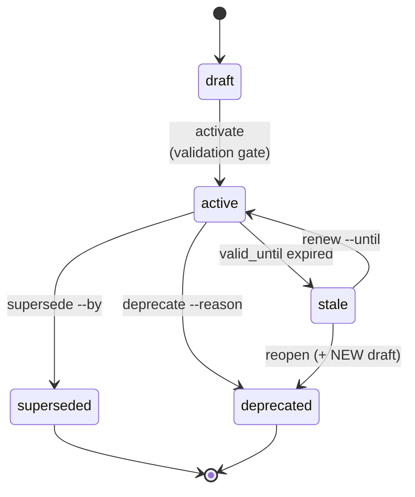

## Why This Matters

Artifacts are not static documents that you write once and forget. They evolve: a draft PRD becomes a validated plan, an active decision eventually gets replaced by a better one. Without clear lifecycle management, you end up with zombie documents -- outdated specs that nobody trusts but nobody deletes, active decisions that were never actually validated, and stale evidence that gives false confidence.

The lifecycle model gives every artifact a clear status so you always know: is this current? Is this validated? Has this been replaced? Should I still trust this?

## State Machine



**Terminal states** (superseded, deprecated) never transition out. The only
way "back" is to create a new artifact that supersedes the terminal one, so
decision history is preserved.

## States

| State | Meaning | Can transition to |
|-------|---------|-------------------|
| **draft** | Work in progress, not validated | active |
| **active** | Validated, in use | superseded, deprecated, stale |
| **stale** | expired `valid_until` | active (renew), deprecated (reopen) |
| **superseded** | Replaced by newer artifact | *(terminal)* |
| **deprecated** | No longer relevant | *(terminal)* |

Every artifact starts as **draft**. It stays there until you explicitly validate and activate it. This is intentional -- there is no automatic promotion. You have to earn the "active" status by passing validation gates.

## Lifecycle Commands

```bash
# Validate before activating
forgeplan review PRD-001
# -> Review PASSED -- ready to activate

# Activate (draft -> active)
forgeplan activate PRD-001
# -> Validation gate checks MUST rules

# Supersede (active -> superseded)
forgeplan supersede PRD-001 --by PRD-002
# -> Creates link: PRD-002 supersedes PRD-001

# Deprecate (active/stale -> deprecated)
forgeplan deprecate PRD-001 --reason "No longer needed"

# Renew (stale -> active)
forgeplan renew PRD-001 --reason "Re-validated" --until 2026-12-31

# Reopen (stale -> deprecated + NEW draft)
forgeplan reopen PRD-001 --reason "Needs major revision"
# -> PRD-001 deprecated, new draft created (e.g., PRD-NNN)
```

### When to Use Each Transition

**Activate** when the artifact is complete, validated, and you are ready to build from it. This is the "green light" that says "this plan is approved."

**Supersede** when a better version exists. Your original auth PRD (PRD-001) called for basic JWT. Six months later, requirements changed and you wrote PRD-002 with OAuth2 federation. Supersede PRD-001 with PRD-002 so anyone looking at the old one is redirected to the new one.

**Deprecate** when the artifact is no longer relevant at all. The feature was cancelled, the module was removed, or the context changed so much that the decision does not apply anymore.

**Renew** when a stale artifact is still valid. Your ADR chose LanceDB a year ago and it expired. You re-evaluated and LanceDB is still the right choice. Renew it with a new expiration date.

**Reopen** when a stale artifact needs a major rethink. The old version is deprecated but you need a fresh take. This creates a new draft with lineage back to the original.

## Terminal States

**Superseded** and **deprecated** are terminal -- no transitions out.

- Superseded: the replacement artifact should be used instead
- Deprecated: use `forgeplan reopen` to create a new draft if needed

### Why Terminal Means Terminal

Once an artifact reaches superseded or deprecated, it never comes back. This is intentional. If you decided to replace your auth system (ADR-001 superseded by ADR-002), re-activating ADR-001 would create confusion about which decision is actually in effect. Instead, if circumstances change, create a new artifact with its own lineage.

**Example**: You chose JWT (ADR-001), then switched to sessions (ADR-002, supersedes ADR-001). A year later, you want JWT again. Do not reactivate ADR-001. Create ADR-003 that supersedes ADR-002 -- this preserves the full decision history: JWT then Sessions then JWT-again, with reasons documented at each step.

## Validation Gates

PRD, RFC, ADR, Epic, Spec require validation before activation:

```bash
forgeplan validate PRD-001
# Checks 30+ rules per artifact type:
# - MUST sections present (Problem, Goals, FR...)
# - No implementation leakage in requirements
# - Information density (no filler)
# - Measurability (SMART criteria)
```

Notes and Problems can be activated without validation gate. This is by design -- Notes are quick captures (90-day auto-expiry) and Problems are observations that need to be recorded fast without friction.

### What Validation Actually Checks

Validation is not just "are the sections present." It inspects content quality:

- **Information density**: filler phrases like "it is important to note that" are flagged. Every sentence should carry meaning.
- **Implementation leakage**: naming specific frameworks or libraries in requirements (e.g., "Use Redis for caching") gets flagged. Requirements describe capabilities, not implementations.
- **Measurability**: vague requirements like "system should be fast" fail. Good requirements have numbers: "API response time < 200ms at p95 under 1000 RPS."
- **Traceability**: requirements should trace back to goals, and goals should trace back to the problem statement.

## Stale: The Forgotten State

Stale is the state most teams ignore -- and it is the most dangerous. When an artifact's `valid_until` date expires, it becomes stale. This does not mean it is wrong; it means nobody has verified it is still right.

**Example**: You created an ADR six months ago choosing LanceDB because it had the best Rust SDK at the time. The `valid_until` was set to 180 days. Now it is stale. Maybe LanceDB is still the right choice -- or maybe a better option emerged. The stale status forces you to explicitly re-evaluate rather than silently assuming.

```bash
# Find all stale artifacts
forgeplan stale

# Re-validate and extend
forgeplan renew ADR-001 --reason "Re-evaluated, still best option" --until 2027-06-30

# Or acknowledge it needs rethinking
forgeplan reopen ADR-001 --reason "New alternatives available, needs fresh evaluation"
```

## Common Mistakes

- **Activating a PRD before writing any code.** Active means "validated and in use." If the code does not exist yet, the PRD is not in use -- it is still a plan. Keep it in draft until implementation begins and evidence exists.
- **Never superseding, only creating new artifacts.** If ADR-002 replaces ADR-001 but you do not mark the supersession, both appear active and nobody knows which is current.
- **Ignoring stale warnings.** When `forgeplan health` reports stale artifacts, address them. Stale evidence means your R_eff scores are silently degrading to 0.1.
- **Treating draft as "done enough."** Draft artifacts show up as incomplete in health checks. Either finish them and activate, or delete the stub if you decided against it.
- **Forgetting `valid_until` on ADRs.** Every architecture decision has a shelf life. Set realistic expiration dates (90-180 days) so stale detection works.

## Related

- [Lifecycle v2 deep-dive](/docs/guides/lifecycle-v2/) — full state machine walkthrough with four real-world flows
- [CLI: review](/docs/cli/review/), [activate](/docs/cli/activate/), [supersede](/docs/cli/supersede/), [deprecate](/docs/cli/deprecate/), [renew](/docs/cli/renew/), [reopen](/docs/cli/reopen/), [stale](/docs/cli/stale/)
- [Evidence & R_eff](/docs/methodology/evidence/) — why stale evidence degrades trust scores
- [Routing & Depth](/docs/methodology/routing/) — validation gates differ by depth
