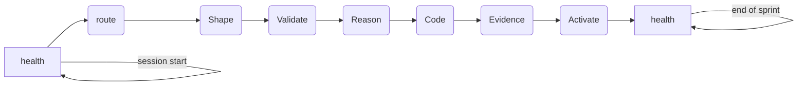

`forgeplan health` — это команда для начала сессии. Она сканирует каждый артефакт в рабочем пространстве и сообщает о четырёх категориях проблем: **слепые пятна** (активные артефакты без доказательств), **сироты** (артефакты без входящих или исходящих связей), **просроченные** (с истёкшим `valid_until`) и **рискованные** (с низким R_eff или не прошедшие валидацию). Если проблем нет, выводится сообщение "Project looks healthy!"

**Единый протокол рабочего процесса** делает `forgeplan health` обязательной командой в начале каждой сессии — прежде чем вы напишете код, выполните роутинг задачи или откроете новый PR. Если проверка состояния показывает наличие задолженности, вы устраняете её, прежде чем приступать к новой работе. Не накапливайте задолженность.

## Когда использовать

- **Начало сессии** — всегда, без исключений. Часть стандартного протокола.
- Перед созданием PR — убедитесь, что ваша ветка не внесла новую задолженность.
- В CI/CD — используйте режим `--ci`, чтобы блокировать конвейеры при регрессиях.
- После `forgeplan scan-import` или любого массового импорта.
- Еженедельный обзор спринта — проверяйте общие тенденции состояния проекта.
- Перед релизом — `--ci --fail-on "orphans=0,blind_spots=0"` в качестве гейта релиза.

## Когда НЕ использовать

- В плотном цикле редактирования-компиляции — слишком много шума для запусков при каждом сохранении.
- Для одного артефакта — используйте `forgeplan context <ID>` или `forgeplan validate <ID>`.
- В качестве замены `forgeplan status` — `health` отмечает проблемы; `status` даёт необработанные счётчики.

## Использование

```text
forgeplan health [OPTIONS]
```

## Опции

```text
      --compact            Сокращённый однострочный вывод для хуков/скриптов
      --json               Вывод в формате JSON для машинной обработки
      --ci                 Режим CI: код выхода 1, если найдены проблемы (для гейтов конвейера)
      --fail-on <FAIL_ON>  Пороги сбоя для --ci (например, "orphans=5,blind_spots=3,stale=2")
  -h, --help               Вывести справку
  -V, --version            Вывести версию
```

## Примеры

### Пример 1: Проверка в начале сессии

```bash
forgeplan health
```

Типичный здоровый вывод:

```
Project Health
==============
  Artifacts:    147 (PRD: 42, RFC: 18, ADR: 12, Evidence: 56, ...)
  Active:       98
  Blind spots:  0
  Orphans:      0
  Stale:        0
  At risk:      0

Project looks healthy!
```

### Пример 2: Состояние с задолженностью — устраните её перед новой работой

```bash
forgeplan health
```

```
Project Health
==============
  Blind spots:  2
    - PRD-019 (active, 0 evidence, R_eff=0.00)
    - RFC-007 (active, 0 evidence, R_eff=0.00)
  Orphans:      1
    - NOTE-033 (no parent, no children, no links)
  Stale:        3
    - ADR-004 (valid_until 2026-03-01, expired 41 days ago)
  At risk:      0

Next actions:
  1. Create EvidencePack for PRD-019 and RFC-007
  2. Link NOTE-033 to its parent or deprecate
  3. Review and renew/supersede ADR-004
```

Устраните каждую проблему, прежде чем приступать к новой работе.

### Пример 3: Гейт конвейера CI

```bash
forgeplan health --ci --fail-on "orphans=0,blind_spots=0,stale=5"
```

Выходит с кодом 1, если в рабочем пространстве есть какие-либо сироты, слепые пятна или более 5 просроченных артефактов. Добавьте это в GitHub Actions после `forgeplan scan-import`, чтобы предотвратить попадание задолженности по состоянию в `dev`.

### Пример 4: Машиночитаемый вывод

```bash
forgeplan health --json
```

Выводит `{ "artifacts": 147, "blind_spots": [...], "orphans": [...], "stale": [...], "at_risk": [...] }` для дашбордов, ботов или для импорта в память Hindsight.

### Пример 5: Компактный режим для командных строк

```bash
forgeplan health --compact
# -> Forgeplan: 147 artifacts, 0 issues
```

Используйте в командной строке zsh/bash или в строке состояния tmux, чтобы состояние было всегда видно.

## Режим CI (`--ci`)

Добавленный в Спринте 11.3 (PRD-034, гейты целостности методологии), `forgeplan health --ci` завершается с ненулевым кодом, когда рабочее пространство превышает настроенные пороги задолженности. Это превращает панель мониторинга состояния в **гейт PR** или **блокировщик конвейера**, а не просто в рекомендательную проверку в начале сессии.

### Поведение

- `forgeplan health --ci` → выход с кодом 1, если найдены **любые** сироты, слепые пятна, просроченные или рискованные артефакты.
- `forgeplan health --ci --fail-on <spec>` → пороги для каждой метрики, в форме `метрика=N`, разделённые запятыми. Поддерживаемые метрики: `orphans`, `blind_spots`, `stale` и `at_risk`. Выход с кодом 1, если **любая** метрика превышает свой порог.

### Фрагмент GitHub Actions

Добавьте это в `.github/workflows/ci.yml` после вашей задачи `cargo test`:

```yaml
- name: Forgeplan health gate
  run: |
    forgeplan scan-import
    forgeplan health --ci --fail-on "blind_spots=0,orphans=0"
```

Самая строгая конфигурация — `blind_spots=0,orphans=0` — означает, что **ни один** активный PRD/RFC/ADR без доказательств и **ни один** несвязанный артефакт не может попасть в `dev`. Ослабьте пороги, если вам нужен льготный период при миграции существующего рабочего пространства.

Совместите это с [`forgeplan validate --ci`](/docs/cli/validate/#ci-mode---ci), чтобы охватить как методологическую задолженность (health), так и структурную полноту (validate) в одном конвейере.

## Интерпретация вывода

- **Слепые пятна** — `status=active`, но R_eff=0 (нет связанных доказательств). Это означает, что вы активировали артефакт, полагаясь только на доверие. Исправление: создайте EvidencePack с полями `verdict`, `congruence_level`, `evidence_type` и свяжите его.
- **Сироты** — нет входящих или исходящих связей. Либо незавершённые, либо забытые. Исправление: свяжите с родительским/дочерним артефактом или отмените.
- **Просроченные** — истёк срок `valid_until`. Исправление: `forgeplan renew <ID>` для продления или `forgeplan reopen <ID>` для замещения новым черновиком.
- **Рискованные** — низкий R_eff (<0.3), не прошедшие валидацию или с несоответствием глубины. Исправление: запустите `forgeplan context <ID>` и устраните конкретную проблему.

Пороги для беспокойства:

- Любые слепые пятна = немедленное исправление (вы заявляете об активных решениях без доказательств).
- Сироты > 3 = утечка в рабочем процессе, найдите, где артефакты остаются без внимания.
- Просроченные > 5 = проблема устаревания, запустите `forgeplan refresh` для очистки.

## Как это вписывается в рабочий процесс



- **Начало сессии**: всегда запускайте первым. Устраните задолженность перед новой работой.
- **Перед PR**: запустите снова, чтобы убедиться, что ваша ветка чиста.
- **Гейт релиза**: режим CI со строгими порогами `--fail-on`.

## Смотрите также

- [`forgeplan status`](/docs/cli/status/) — необработанные счётчики без анализа состояния.
- [`forgeplan blindspots`](/docs/cli/blindspots/) — только вид слепых пятен.
- [`forgeplan gaps`](/docs/cli/gaps/) — обнаружение отсутствующих артефактов.
- [`forgeplan refresh`](/docs/cli/stale/) — массовый обзор просроченных артефактов.
- [`forgeplan context`](/docs/cli/context/) — глубокий анализ каждого артефакта.
- [Методология: гейты качества](/docs/methodology/overview/)
