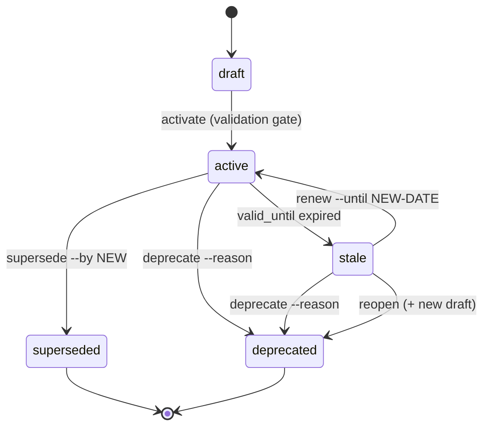

Артефакты Forgeplan — это не просто файлы, это **решения с жизненным циклом**.
PRD, который был верен полгода назад, сегодня может быть ошибочным. ADR,
описывающий вашу архитектуру, может быть замещён более совершенным. Доказательство,
обосновывающее выбор, может утратить актуальность по мере изменения мира.

Жизненный цикл v2 (выпущенный в версии v0.12 как [ADR-005](#связанные-материалы)) предоставляет каждому артефакту
чётко определённую конечную машину состояний, чтобы вы могли в любой момент ответить на три вопроса:

1. **Действует ли этот артефакт до сих пор?**
2. **Если он исчез, что его заменило?**
3. **Если он просроченный, следует ли его продлить или переоткрыть решение?**

Это руководство описывает полную конечную машину состояний, объясняет терминальные состояния
и демонстрирует четыре практических сценария из реального использования Forgeplan.

## Почему жизненный цикл, а не просто `draft` / `active`?

Ранние версии Forgeplan имели только два состояния. Этого было достаточно для выпуска
PRD, но недостаточно, чтобы ответить на вопрос "что случилось с PRD-014?" полгода
спустя. Необходимо различать:

- PRD, который был **заменён** более совершенным (`superseded`, с указателем).
- PRD, который был **отменён** по определённой причине (`deprecated`, с указанием причины).
- PRD, который **истёк**, но всё ещё может быть верным (`stale`, требует пересмотра).
- PRD, который был просроченным и был **продлён** против **переоценён с нуля**.

Без этих различий вы получаете кладбище "старых" артефактов и не имеете представления,
какие из них всё ещё несут функциональную нагрузку. Жизненный цикл v2 это исправляет.

## Конечная машина состояний



Переходы в текстовом виде:

```
draft → active → superseded   (terminal)
               → deprecated   (terminal)
               → stale → active                 (renew)
                       → deprecated             (deprecate)
                       → deprecated + NEW draft (reopen, lineage)
```

## Описание каждого состояния

### `draft`

Начальное состояние каждого артефакта. `forgeplan new prd "..."` создаёт
черновик из шаблона. Черновики можно свободно редактировать.

- **Note и Problem**: нет гейта валидации — вы можете активировать немедленно.
- **PRD, RFC, ADR, Epic, Spec**: правила MUST из валидатора должны быть пройдены
  перед активацией. Выполните `forgeplan validate PRD-001`, чтобы проверить.

Чтобы продолжить:

```bash
forgeplan review PRD-001      # dry-run: is it ready?
forgeplan activate PRD-001    # draft → active
```

### `active`

Артефакт действует. Другие артефакты могут ссылаться на него, `forgeplan health`
считает его действующим решением, а `forgeplan score` вычисляет его R_eff на основе
связанных доказательств.

Активный артефакт может покинуть это состояние тремя способами: `supersede`,
`deprecate` или став `stale` по истечении даты `valid_until`.

### `superseded` — терминальное

Артефакт был заменён более новым. Вы **должны** указать на замену:

```bash
forgeplan supersede ADR-003 --by ADR-007
```

Старый артефакт сохраняет всю свою историю и связи, но больше не действует.
`forgeplan health` не будет помечать его как артефакт с отсутствующими доказательствами — он завершён.

### `deprecated` — терминальное

Артефакт больше не применим, и нет единой замены.
Вы должны указать причину:

```bash
forgeplan deprecate PRD-014 --reason "Feature cut from v1 scope"
```

Используйте `deprecate`, когда решение полностью отменяется (например, функция
отменяется), а не когда оно заменяется другим артефактом (для этого используйте `supersede`).

### `stale`

Артефакт автоматически становится `stale` по истечении даты `valid_until` во фронтматтере.
Он всё ещё доступен для чтения и связывания, но Forgeplan пометит его, чтобы вы сознательно
выбрали, что делать дальше.

`stale` — это **единственный нетерминальный выход** из `active`. Он существует именно для того,
чтобы вы были вынуждены пересматривать старые решения вместо того, чтобы молча им доверять.

Из состояния `stale` у вас есть три варианта: `renew`, `deprecate` или `reopen`.

### `renew` — просроченный обратно в активный

Используйте `renew`, когда решение всё ещё верно, и вы просто хотите продлить срок его действия:

```bash
forgeplan renew PRD-005 \
  --reason "Re-validated after Q2 review, still matches product direction" \
  --until 2026-10-01
```

Артефакт возвращается в `active` с новой датой `valid_until`. Ничего больше
не меняется — тот же ID, та же история, те же связи.

### `reopen` — просроченный/активный в новый черновик (линия наследования)

Используйте `reopen`, когда старое решение необходимо **переделать с нуля**.
Исходный артефакт переходит в `deprecated` (терминальное), и Forgeplan создаёт
**новый черновик**, связанный как его продолжение по линии наследования:

```bash
forgeplan reopen PRD-005 \
  --reason "Underlying assumptions changed after PROB-021 findings"
```

Это даёт вам чистый лист (новый черновик, пустые доказательства, новая дата `valid_until`),
сохраняя при этом журнал аудита того, что было раньше.

## Почему `superseded` и `deprecated` являются терминальными

Оба состояния **конечны**. Вы не можете отменить `supersede` артефакта, и вы
не можете отменить `deprecate`. Единственный способ "вернуть что-то" — это
создать новый артефакт.

Это преднамеренный выбор дизайна:

- **Аудируемость.** Если бы отменённый ADR мог незаметно снова стать активным,
  каждое связанное решение потребовало бы повторной проверки. Терминальные состояния
  означают: "это решение покинуло граф".
- **Происхождение.** `reopen` уже охватывает "переоценку этого решения" — он
  создаёт новый черновик как чёткое продолжение. Воскрешение старого
  артефакта стёрло бы историю разрыва.
- **Доверие.** Когда вы читаете `superseded` PRD, вы точно знаете, что произошло:
  он был заменён артефактом, указанным в `--by`. Никакой двусмысленности.

Если вам нужно мягкое состояние "приостановлено", используйте `stale` артефакт
с датой `valid_until` в далёком будущем — он останется действующим и доступным для пересмотра.

## Практические сценарии

### Сценарий 1 — Нормальный жизненный цикл PRD

Типичный сценарий для любой задачи глубины Standard+:

```bash
# 1. Shape
forgeplan new prd "Auth System"
# edit .forgeplan/prds/PRD-018-auth-system.md — заполните все обязательные разделы

# 2. Validate
forgeplan validate PRD-018
# → PASS (0 ошибок MUST)

# 3. Review + activate
forgeplan review PRD-018
forgeplan activate PRD-018        # draft → active

# 4. Implement, add evidence
forgeplan new evidence "Integration tests for auth middleware"
forgeplan link EVID-042 PRD-018 --relation informs
forgeplan score PRD-018           # R_eff > 0
```

Типичный сценарий: обычный спринт для функции на 1-3 дня. Артефакт остаётся
в `active` столько, сколько актуально его решение.

### Сценарий 2 — Замещение ADR

Вы написали ADR-003 ("Хранилище на SQLite") год назад. Теперь вы переходите на
LanceDB и хотите зафиксировать новое решение без потери истории.

```bash
# 1. Сначала напишите новый ADR
forgeplan new adr "LanceDB as primary store"
# заполните контекст, решение, последствия → валидация → активация
forgeplan activate ADR-007

# 2. Заместите старый, указав на замену
forgeplan supersede ADR-003 --by ADR-007
```

Теперь `forgeplan list --status active` скрывает ADR-003, и любой читающий
ADR-003 видит "superseded by ADR-007" в заголовке. DAG остаётся согласованным.

### Сценарий 3 — Продление просроченного PRD

PRD полугодовой давности имел `valid_until: 2026-04-01`. Сейчас 11 апреля,
и `forgeplan health` помечает его как просроченный:

```bash
forgeplan health
# → Stale: PRD-012 (valid_until 2026-04-01, 10 days ago)
```

Вы перечитали его. Направление продукта не изменилось, PRD по-прежнему
корректен, вы просто забыли продлить дату:

```bash
forgeplan renew PRD-012 \
  --reason "Re-validated after Q2 planning — scope unchanged" \
  --until 2026-10-01
```

Снова `active`. Причина записана в истории артефакта, чтобы будущие
читатели знали, **почему** вы ему доверяете.

### Сценарий 4 — Переоткрытие просроченного решения

Та же отправная точка: PRD-012 просрочен. Но на этот раз вы обнаружили, что
PROB-021 выявила ошибочное допущение. PRD не просто устарел —
он **неверен в текущем виде** и требует переосмысления с нуля.

```bash
forgeplan reopen PRD-012 \
  --reason "Assumption about user concurrency invalidated by PROB-021"
```

Результат:

- `PRD-012` → `deprecated` (терминальное), с записанной причиной.
- `PRD-019` (новый черновик) создан как продолжение по линии наследования.
- Теперь вы оформляете PRD-019 с нуля, валидируете, проверяете, активируете.

Журнал аудита: PRD-012 существовал, стал просроченным, был переоткрыт с
указанием конкретной причины и заменён PRD-019. Любой читатель сможет
восстановить эту историю спустя месяцы.

## Антипаттерны

Вещи, которых следует избегать — каждый из них нарушает допущение,
на котором основан остальной Forgeplan.

- **Активация без доказательств.** `activate` не требует связанных
  доказательств, но активный PRD с `R_eff = 0` является «слепым пятном»,
  которое `forgeplan health` пометит. Создайте EvidencePack и `forgeplan link`
  его, прежде чем доверять решению.
- **Замещение без `--by`.** CLI требует `--by` не просто так:
  осиротевший статус `superseded` скрывает, **какой** артефакт его заменил. Используйте
  `deprecate --reason "..."`, если единой замены нет.
- **Легкомысленное переоткрытие активного артефакта.** `reopen` предназначен для переоценки,
  когда изменились базовые допущения. Если артефакт по-прежнему корректен
  и просто нуждается в свежей дате, используйте `renew` — он безопасен.
- **Удаление вместо замещения.** Удаление файла теряет историю,
  связи и журнал аудита. Всегда выполняйте переход через жизненный цикл.
  Файлы являются источником истины (см. [ADR-003](#связанные-материалы)), но именно
  переходы состояний делают их надёжными со временем.
- **Редактирование терминального артефакта.** Когда артефакт `superseded` или `deprecated`,
  он заморожен для истории. Если вам нужно сказать что-то новое, создайте
  новый черновик и свяжите его.
- **Обход проверки самоссылок.** PROB-019 (защита от самоссылок) была добавлена для
  блокировки `forgeplan link X X` и подобных циклов. Не обходите
  защиту — исправьте направление связи.

## DerivedStatus — качество, ортогональное жизненному циклу

Помимо состояния жизненного цикла, каждый артефакт имеет **DerivedStatus**,
вычисляемый на основе его доказательств и состояния валидации:

```
UNDERFRAMED → FRAMED → EXPLORING → COMPARED → DECIDED → APPLIED
```

Эта прогрессия качества (унаследованная от Quint-code) **ортогональна**
конечной машине жизненного цикла:

- Жизненный цикл отвечает на вопрос: «Действует ли это решение?»
- DerivedStatus отвечает на вопрос: «Насколько обосновано это решение?»

`active` PRD может быть `UNDERFRAMED` (активен, но без доказательств —
слепое пятно). `draft` PRD может уже быть `COMPARED` (богатые доказательства,
ещё не активирован). Оба измерения важны, и `forgeplan health` выявляет
несоответствия между ними.

## Связанные материалы

- **[ADR-005](https://github.com/ForgePlan/forgeplan/blob/main/.forgeplan/adrs/ADR-005-lifecycle-v2.md)** — запись решения, вводящая жизненный цикл v2.
- **[ADR-003](https://github.com/ForgePlan/forgeplan/blob/main/.forgeplan/adrs/ADR-003-markdown-source-of-truth.md)** — markdown-файлы являются источником истины, LanceDB — производный индекс.
- **PROB-019** — защита от самоссылок, добавленная при укреплении переходов жизненного цикла.
- **PR #85** — Sprint 1: очистка жизненного цикла: канонические переходы и принудительное соблюдение терминальности.

## См. также

- [`forgeplan activate`](/docs/cli/activate/) — draft → active (с гейтом валидации)
- [`forgeplan supersede`](/docs/cli/supersede/) — active → superseded, требует `--by`
- [`forgeplan deprecate`](/docs/cli/deprecate/) — active/stale → deprecated, требует `--reason`
- [`forgeplan renew`](/docs/cli/renew/) — stale → active, продлевает `valid_until`
- [`forgeplan reopen`](/docs/cli/reopen/) — stale/active → deprecated + новый черновик (линия наследования)