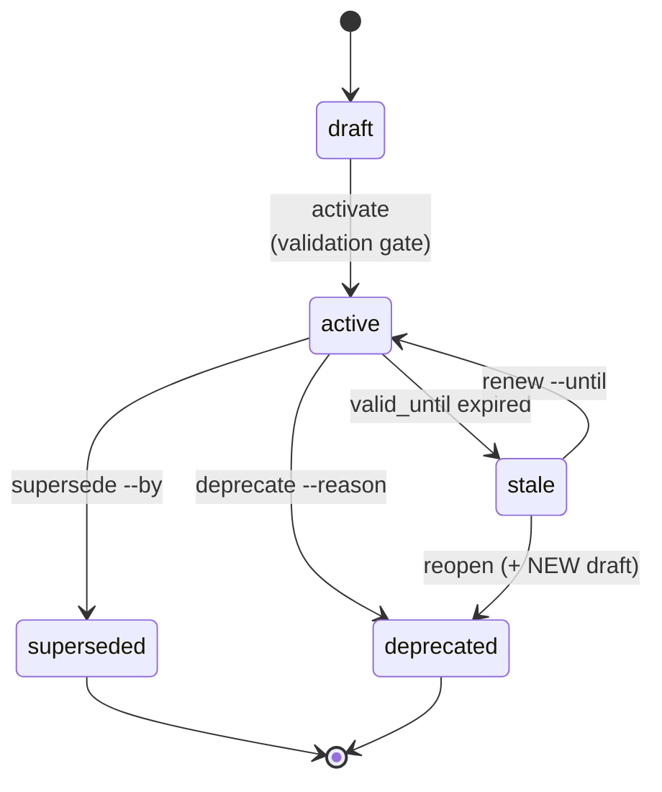

## Почему это важно

Артефакты — это не статические документы, которые вы пишете один раз и забываете. Они развиваются: черновик PRD становится валидированным планом, активное решение в конечном итоге замещается лучшим. Без чёткого управления жизненным циклом вы получаете «зомби-документы» — устаревшие спецификации, которым никто не доверяет, но никто не удаляет; активные решения, которые так и не были валидированы; и просроченные доказательства, создающие ложное чувство уверенности.

Модель жизненного цикла присваивает каждому артефакту чёткий статус, чтобы вы всегда знали: актуален ли он? Валидирован ли он? Был ли он замещён? Стоит ли ему доверять?

## Конечный автомат



**Терминальные состояния** (замещённый, устаревший) никогда не переходят в другие состояния.
Единственный способ «вернуться» — создать новый артефакт, который замещает терминальный, чтобы сохранить историю решений.

## Состояния

| Состояние | Значение | Может перейти в |
|---|---|---|
| **черновик** | В работе, не валидирован | активный |
| **активный** | Валидирован, используется | замещённый, устаревший, просроченный |
| **просроченный** | истёк срок `valid_until` | активный (продлить), устаревший (переоткрыть) |
| **замещённый** | Замещён новым артефактом | *(терминальное)* |
| **устаревший** | Больше не актуален | *(терминальное)* |

Каждый артефакт начинается как **черновик**. Он остаётся в этом состоянии, пока вы явно не валидируете и не активируете его. Это сделано намеренно — автоматического повышения статуса нет. Вы должны заслужить статус «активный», пройдя гейты валидации.

## Команды жизненного цикла

```bash
# Валидация перед активацией
forgeplan review PRD-001
# -> Проверка ПРОЙДЕНА — готово к активации

# Активация (черновик -> активный)
forgeplan activate PRD-001
# -> Гейт валидации проверяет правила MUST

# Замещение (активный -> замещённый)
forgeplan supersede PRD-001 --by PRD-002
# -> Создаёт ссылку: PRD-002 замещает PRD-001

# Отмена (активный/просроченный -> устаревший)
forgeplan deprecate PRD-001 --reason "Больше не нужен"

# Продление (просроченный -> активный)
forgeplan renew PRD-001 --reason "Повторно валидирован" --until 2026-12-31

# Переоткрытие (просроченный -> устаревший + НОВЫЙ черновик)
forgeplan reopen PRD-001 --reason "Требует серьёзного пересмотра"
# -> PRD-001 отменён, создан новый черновик (например, PRD-NNN)
```

### Когда использовать каждый переход

**Активируйте**, когда артефакт завершён, валидирован и вы готовы использовать его для разработки. Это «зелёный свет», означающий: «этот план одобрен».

**Замещайте**, когда существует лучшая версия. Ваш исходный PRD по аутентификации (PRD-001) предусматривал базовый JWT. Шесть месяцев спустя требования изменились, и вы написали PRD-002 с федерацией OAuth2. Заместите PRD-001 с помощью PRD-002, чтобы любой, кто обращается к старому, перенаправлялся на новый.

**Отменяйте**, когда артефакт больше не актуален. Функция была отменена, модуль удалён, или контекст изменился настолько, что решение больше не применимо.

**Продлевайте**, когда просроченный артефакт всё ещё действителен. Ваш ADR выбрал LanceDB год назад, и его срок действия истёк. Вы переоценили, и LanceDB по-прежнему является правильным выбором. Продлите его с новой датой истечения срока действия.

**Переоткрывайте**, когда просроченный артефакт требует серьёзного переосмысления. Старая версия устарела, но вам нужен свежий взгляд. Это создаёт новый черновик с прослеживаемостью до оригинала.

## Терминальные состояния

**Замещённый** и **устаревший** являются терминальными — из них нет переходов.

- Замещённый: вместо него следует использовать замещающий артефакт
- Устаревший: используйте `forgeplan reopen` для создания нового черновика, если это необходимо

### Почему терминальное означает терминальное

Как только артефакт достигает состояния «замещённый» или «устаревший», он никогда не возвращается. Это сделано намеренно. Если вы решили заменить свою систему аутентификации (ADR-001 замещён ADR-002), повторная активация ADR-001 создаст путаницу относительно того, какое решение фактически действует. Вместо этого, если обстоятельства меняются, создайте новый артефакт с собственной историей.

**Пример**: Вы выбрали JWT (ADR-001), затем перешли на сессии (ADR-002, замещает ADR-001). Год спустя вы снова хотите использовать JWT. Не активируйте ADR-001 повторно. Создайте ADR-003, который замещает ADR-002 — это сохранит полную историю решений: JWT, затем Сессии, затем снова JWT, с задокументированными причинами на каждом шаге.

## Гейты валидации

PRD, RFC, ADR, Epic, Spec требуют валидации перед активацией:

```bash
forgeplan validate PRD-001
# Проверяет более 30 правил для каждого типа артефакта:
# - Присутствие разделов MUST (Problem, Goals, FR...)
# - Отсутствие утечки реализации в требованиях
# - Плотность информации (без «воды»)
# - Измеримость (критерии SMART)
```

Note и ProblemCard могут быть активированы без гейта валидации. Это сделано намеренно — Note представляют собой быстрые записи (автоматическое истечение срока через 90 дней), а ProblemCard — это наблюдения, которые необходимо быстро зафиксировать без лишних препятствий.

### Что на самом деле проверяет валидация

Валидация — это не просто «присутствуют ли разделы». Она проверяет качество контента:

- **Плотность информации**: фразы-«заполнители», такие как «важно отметить, что», помечаются. Каждое предложение должно нести смысл.
- **Утечка реализации**: упоминание конкретных фреймворков или библиотек в требованиях (например, «Использовать Redis для кеширования») помечается. Требования описывают возможности, а не реализации.
- **Измеримость**: расплывчатые требования, такие как «система должна быть быстрой», не проходят. Хорошие требования содержат числа: «Время ответа API < 200 мс на p95 при 1000 RPS».
- **Прослеживаемость**: требования должны прослеживаться до целей, а цели — до формулировки проблемы.

## Просроченный: забытое состояние

Просроченный — это состояние, которое большинство команд игнорирует, и оно самое опасное. Когда срок действия `valid_until` артефакта истекает, он становится просроченным. Это не означает, что он неверен; это означает, что никто не проверил, что он всё ещё верен.

**Пример**: Вы создали ADR шесть месяцев назад, выбрав LanceDB, потому что на тот момент у него был лучший Rust SDK. Срок `valid_until` был установлен на 180 дней. Теперь он просрочен. Возможно, LanceDB по-прежнему является правильным выбором — или, возможно, появилась лучшая альтернатива. Статус «просроченный» заставляет вас явно переоценивать, а не молча предполагать.

```bash
# Найти все просроченные артефакты
forgeplan stale

# Повторно валидировать и продлить
forgeplan renew ADR-001 --reason "Переоценено, по-прежнему лучший вариант" --until 2027-06-30

# Или признать, что требуется переосмысление
forgeplan reopen ADR-001 --reason "Доступны новые альтернативы, требуется свежая оценка"
```

## Распространённые ошибки

- **Активация PRD до написания какого-либо кода.** «Активный» означает «валидирован и используется». Если код ещё не существует, PRD не используется — это всё ещё план. Держите его в черновике, пока не начнётся реализация и не появятся доказательства.
- **Никогда не замещать, только создавать новые артефакты.** Если ADR-002 заменяет ADR-001, но вы не отмечаете замещение, оба артефакта кажутся активными, и никто не знает, какой из них актуален.
- **Игнорирование предупреждений о просроченных артефактах.** Когда `forgeplan health` сообщает о просроченных артефактах, займитесь ими. Просроченные доказательства означают, что ваши показатели R_eff незаметно снижаются до 0.1.
- **Отношение к черновику как к «достаточно завершённому».** Черновики артефактов отображаются как незавершённые при проверках состояния. Либо завершите их и активируйте, либо удалите заглушку, если вы отказались от идеи.
- **Забывать `valid_until` для ADR.** Каждое архитектурное решение имеет срок годности. Установите реалистичные даты истечения срока действия (90-180 дней), чтобы обнаружение просроченных артефактов работало.

## Связанные материалы

- [Жизненный цикл v2: глубокое погружение](/docs/guides/lifecycle-v2/) — полный обзор конечного автомата с четырьмя реальными сценариями
- [CLI: review](/docs/cli/review/), [activate](/docs/cli/activate/), [supersede](/docs/cli/supersede/), [deprecate](/docs/cli/deprecate/), [renew](/docs/cli/renew/), [reopen](/docs/cli/reopen/), [stale](/docs/cli/stale/)
- [Доказательства и R_eff](/docs/methodology/evidence/) — почему просроченные доказательства снижают показатели доверия
- [Роутинг и глубина](/docs/methodology/routing/) — гейты валидации различаются по глубине