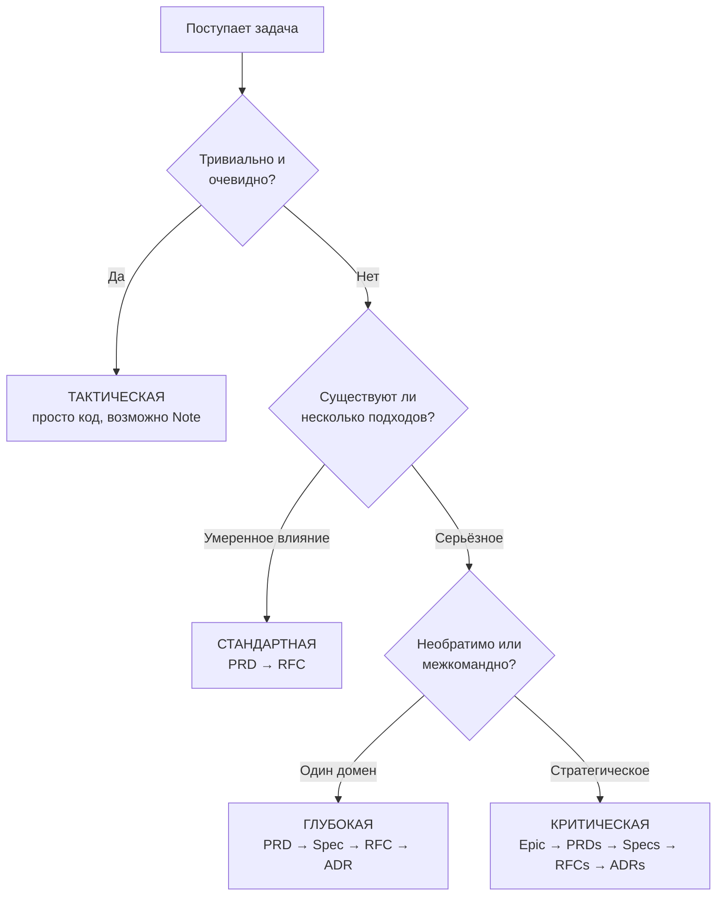

## Почему это важно

Не каждая задача заслуживает одинакового уровня строгости. Исправление опечатки и переработка платёжной системы принципиально различаются — одинаковый подход к ним либо утопит вас в бумажной работе для незначительных изменений, либо оставит критические решения без документации. Роутинг решает эту проблему, задавая один вопрос заранее: **насколько всё может пойти не так?**

Правильное определение глубины экономит реальное время. Избыточное проектирование простого исправления с полным конвейером PRD-Spec-RFC-ADR тратит часы. Недостаточное документирование необратимого архитектурного решения означает, что вы будете пересматривать его через три месяца, когда никто не вспомнит, почему оно было принято.

## Обзор

Прежде чем писать какой-либо код, Forgeplan определяет **глубину** — сколько структуры требуется вашему решению.

```bash
forgeplan route "добавить платёжную систему"
# -> Глубина: Deep
# -> Конвейер: PRD -> Spec -> RFC -> ADR
# -> Уверенность: 92%
```

## Четыре уровня глубины

| Уровень | Когда | Артефакты | Время |
|---|---|---|---|
| **Тактическая** | Быстрое исправление, 1 файл, легко обратимо | Note или ничего | Минуты |
| **Стандартная** | Функция 1-3 дня, несколько подходов | PRD -> RFC | Часы |
| **Глубокая** | Новый модуль, 1-2 недели, необратимо | PRD -> Spec -> RFC -> ADR | Дни |
| **Критическая** | Межкомандная, стратегическая инициатива | Epic -> PRD[] -> Spec[] -> RFC[] -> ADR[] | Недели |

### Примеры из реального мира

**Тактическая**: Исправление ошибки парсинга, при которой не обнаруживается закрывающий `---` в YAML frontmatter. Один файл, один тест, выпускаем. Артефакт не требуется.

**Стандартная**: Добавление входа через OAuth2 в ваше приложение. Есть два подхода (JWT против сессий), это занимает 2-3 дня, и выбор влияет на дизайн API. Создайте PRD для требований и RFC для архитектуры.

**Глубокая**: Создание нового модуля обработки платежей. Он затрагивает финансовые данные пользователей, включает сторонние интеграции, и неправильный выбор поставщика платежей дорого обойдётся для отмены. Полный конвейер: PRD, Spec для контрактов API, RFC для архитектуры, ADR для решения Stripe-vs-PayPal.

**Критическая**: Миграция монолита на микросервисы. Задействовано несколько команд, месяцы работы, затрагивает всю систему. Epic для группировки всего, несколько PRD для каждой границы сервиса, Specs для межсервисных контрактов, RFC для стратегии миграции, ADR для каждого крупного решения.

## Дерево решений

Решение о роутинге сводится к двум последовательно задаваемым вопросам:



Первый вопрос («Это тривиально?») отсеивает 60-70% ежедневной работы. Большинство задач, которые вы выполняете, являются тактическими. Система роутинга разработана таким образом, чтобы вы могли пропускать структурирование для большинства задач и инвестировать в него только тогда, когда ставки оправдывают это.

## Триггеры автоэскалации

Независимо от первоначальной оценки, глубина эскалируется, когда:

| Триггер | Минимальный уровень |
|---|---|
| Трудно откатить (>2 недель влияния) | Standard+ |
| Затрагивает несколько команд | Standard+ |
| Проблема неясна, требует исследования | Standard+ |
| Требования безопасности или соответствия | Deep+ |
| Затрагивает публичный API | Deep+ |
| Затрагивает пользовательские данные | Deep+ |
| Решение уровня дорожной карты | Critical |

:::tip
**Эскалация безопасна, деэскалация рискованна.** В случае сомнений выбирайте более высокий уровень. Вы всегда можете пропустить необязательные артефакты в глубоком конвейере, но вы не можете ретроактивно добавить строгости тактическому решению, которое пошло не так.
:::

Например, вы можете начать роутинг «добавления слоя кеширования» как Standard (просто оптимизация). Но если кеш влияет на согласованность данных, видимых пользователям, это уже Deep проблема. Триггер автоэскалации «затрагивает пользовательские данные» автоматически повышает уровень.

## Команда Route

```bash
# Интеллектуальный роутинг — LLM, если настроен, иначе ключевые слова
forgeplan route "добавить аутентификацию OAuth2"
```

Пример вывода:

```
Задача: добавить аутентификацию OAuth2
Глубина: Deep
Конвейер: PRD → Spec → RFC → ADR
Уверенность: 88%
Сигналы:
  + ключевое слово безопасности (auth)
  + затрагивает публичный API (поток аутентификации)
  + необратимый выбор (привязка к провайдеру)
Рекомендация:
  1. forgeplan new prd "Аутентификация OAuth2"
  2. Заполните обязательные разделы (Проблема, Цели, Функциональные требования)
  3. forgeplan reason PRD-XXX  # ADI обязателен для Deep
```

Маршрутизатор анализирует ключевые слова (безопасность, API, миграция) и индикаторы области действия, чтобы предложить правильную глубину. Если вы не согласны, вы принимаете решение — маршрут является рекомендацией, а не принуждением.

### Интеллектуальный роутинг v2: Три уровня

Маршрутизатор Forgeplan (PRD-020) работает на трёх уровнях, корректно переключаясь на предыдущие, если последующие уровни недоступны:

| Уровень | Движок | Когда запускается | Стоимость |
|---|---|---|---|
| **L0** | На основе правил (ключевые слова, регулярные выражения, определение области) | Всегда | Бесплатно, ~1мс |
| **L1** | Классификатор LLM (Gemini / Claude / локальный) | В `.forgeplan/config.yaml` настроен LLM | ~1 вызов API |
| **L2** | Рассуждения, обогащённые FPF (контекст базы знаний + ADI) | Флаг `--fpf`, только для Deep+ | ~1-2 вызова API |

L0 обрабатывает 70% очевидных случаев (исправление ошибок, опечаток, функций). L1 включается для неоднозначных задач, где ключевые слова не дают однозначного ответа. L2 задействует базу знаний FPF (Trust Calculus, ограниченная рациональность) для решений с высокими ставками. Каждый уровень может работать автономно — отсутствие настроенного LLM означает чистый L0.

### Что ищет маршрутизатор

Маршрутизатор проверяет наличие определённых сигналов, указывающих на сложность:

- **Ключевые слова безопасности** (auth, encryption, credentials) подталкивают к Deep+
- **Ключевые слова данных** (migration, schema, user data) подталкивают к Deep+
- **Индикаторы области действия** (несколько команд, публичный API, межсервисное взаимодействие) подталкивают к Critical
- **Индикаторы простоты** (fix, typo, rename, bump) сохраняют уровень Tactical

Если маршрутизатор указывает Tactical, но ваше чутьё подсказывает Standard, доверьтесь своему чутью и выберите более высокий уровень. Эскалация всегда безопасна; деэскалация несёт риск.

## Подводные камни

- **«Добавление новой команды CLI» часто маршрутизируется как Tactical**, хотя должно быть Standard. Если команда вводит новое поведение или поверхность API, переопределите на Standard.
- **Рефакторинг может быть обманчиво глубоким.** «Простой рефакторинг», который изменяет границы модулей или публичные интерфейсы, является Standard или Deep, а не Tactical.
- **Не выполняйте роутинг после того, как вы уже начали кодировать.** Сначала выполните роутинг. Если вы пропустили роутинг и в середине реализации поняли, что это сложнее, чем ожидалось, остановитесь и создайте соответствующие артефакты, прежде чем продолжить.
- **Маршрутизатор не знает историю вашей кодовой базы.** Он не может сказать, что «добавление кеширования» тривиально в одном проекте и занимает неделю в другом. Вы предоставляете контекст, которого ему не хватает.
- **Остерегайтесь ловушки «это всего лишь небольшое изменение».** Изменения схемы базы данных, модификации публичного API и потоки аутентификации никогда не бывают небольшими — даже если разница в коде минимальна. Выполняйте роутинг на основе последствий, а не количества строк кода.

## Связанные материалы

- [CLI: forgeplan route](/docs/cli/route/)
- [Рассуждения ADI](/docs/methodology/adi/) — обязательны для Deep/Critical
- [Жизненный цикл артефактов](/docs/methodology/lifecycle/) — гейты качества различаются по глубине
- [Быстрый старт](/docs/getting-started/quick-start/) — см. роутинг в полном цикле
